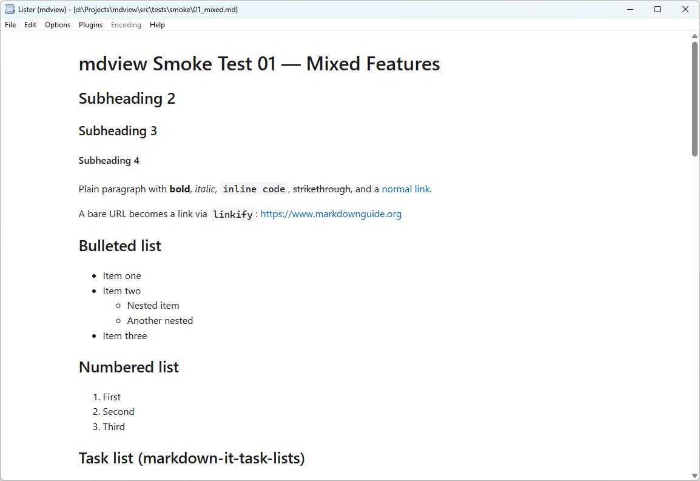
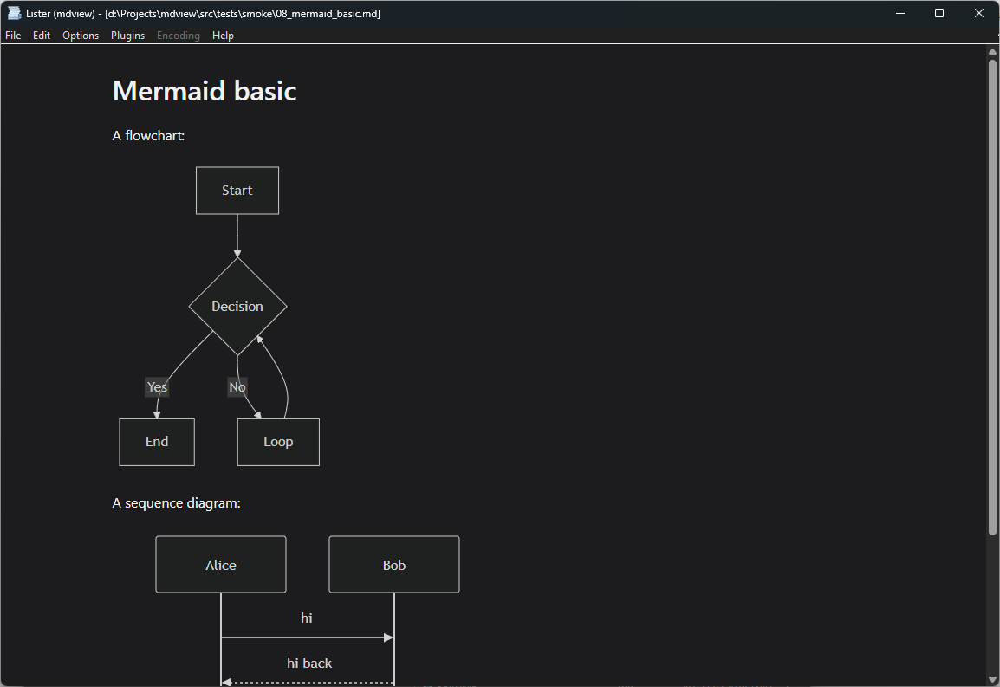
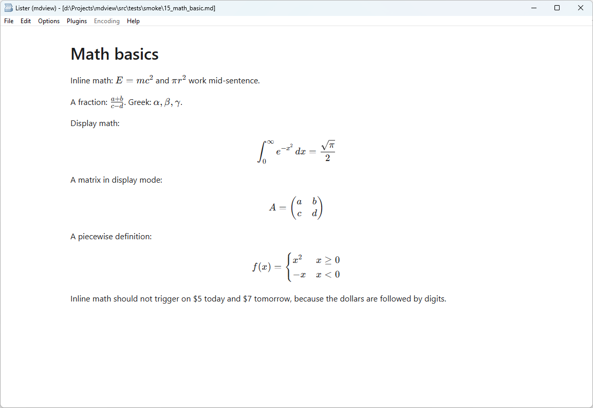
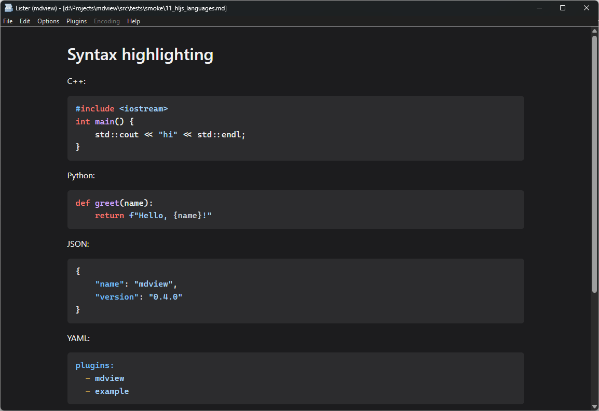
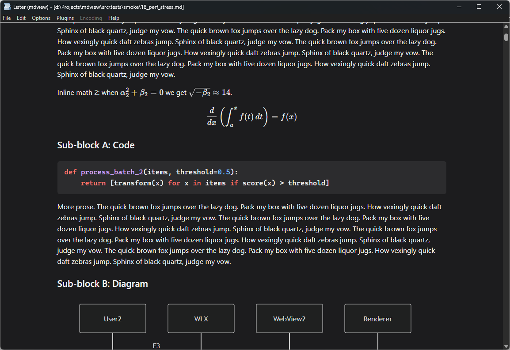

# mdview

A Total Commander Lister plugin that previews Markdown files —
with Mermaid diagrams, TeX math, and syntax highlighting — through
an embedded Microsoft Edge WebView2.



| | |
|---|---|
|  |  |
|  |  |

## Install

1. Download the latest `mdview-X.Y.Z.zip` from
   [Releases](https://github.com/drolevar/mdview/releases).
2. Open it in Total Commander — TC detects the bundled
   `pluginst.inf` and offers to install the plugin. Accept.
3. Press **F3** on any `.md` file.

Works on 32- and 64-bit Total Commander; the installer
(`pluginst.inf`) auto-selects the binary matching TC's bitness.
Requires the
[WebView2 runtime](https://developer.microsoft.com/microsoft-edge/webview2/)
(preinstalled on current Windows 11). Full details, including manual
install: [docs/installing.md](docs/installing.md).

## Features

- GitHub-flavored Markdown (tables, task lists, strikethrough,
  autolink)
- **Mermaid** diagrams
- **TeX math** via KaTeX
- Syntax highlighting for fenced code blocks
- Follows Total Commander's light/dark theme

## Build from source

```powershell
git clone --recurse-submodules https://github.com/drolevar/mdview.git
cd mdview
.\tools\build.ps1 release
```

Full prerequisites and options: [docs/building.md](docs/building.md).

## How it works

A native host manages the plugin lifecycle and a precached WebView2
control; the viewer (HTML/TS, bundled into the DLL) does the
rendering. See [docs/architecture.md](docs/architecture.md).

## License

[MIT](LICENSE).
