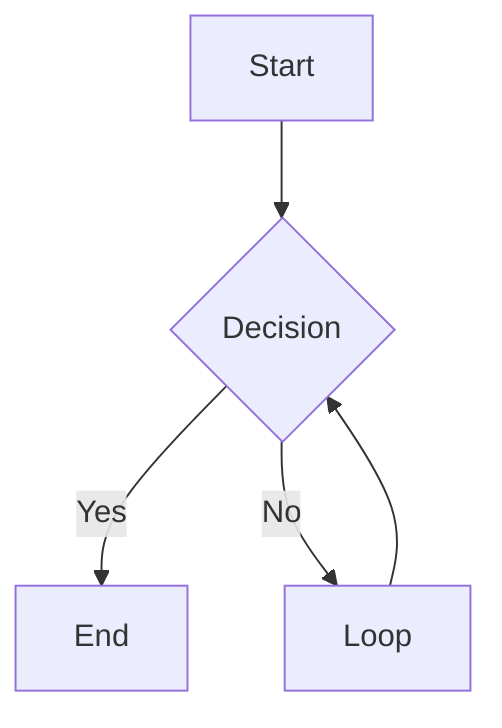
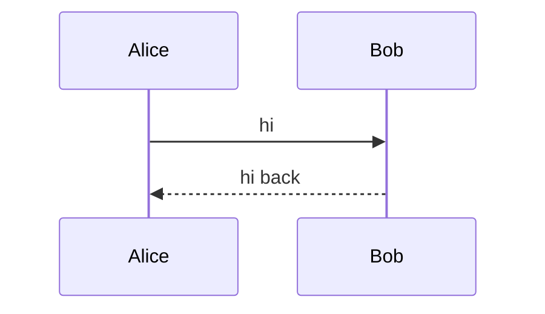

# Mermaid basic

A flowchart:

```mermaid
flowchart TD
    A[Start] --> B{Decision}
    B -->|Yes| C[End]
    B -->|No| D[Loop] --> B
```

A sequence diagram:

```mermaid
sequenceDiagram
    Alice->>Bob: hi
    Bob-->>Alice: hi back
```
