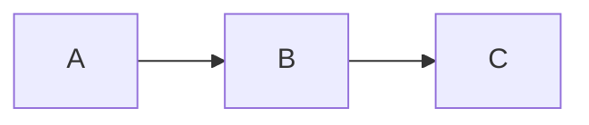
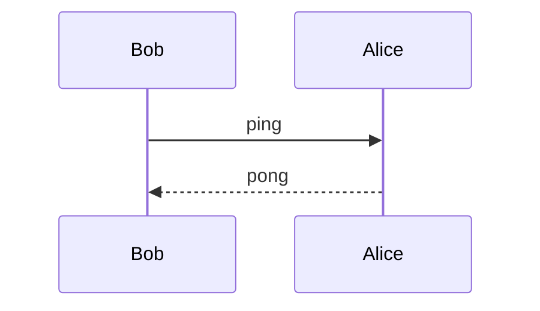

# Mixed content

Plain paragraph with **bold** and *italic*.

- bullet one
- bullet two

```python
def f(x):
    return x + 1
```

A diagram embedded in mixed content:



| col1 | col2 |
|------|------|
| a    | 1    |
| b    | 2    |

> A blockquote.

Another diagram:



End of mixed.
