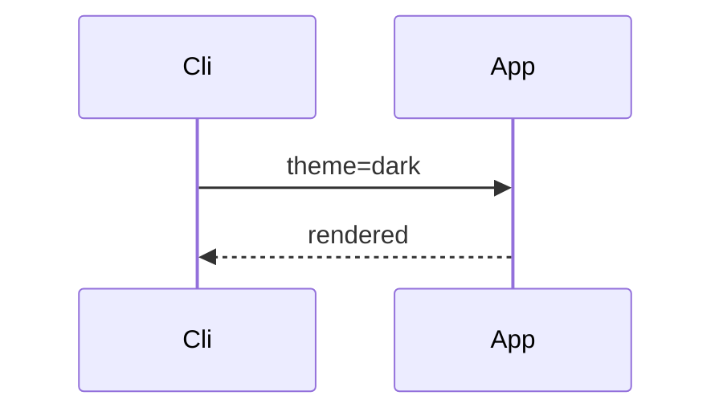

# Runtime theme change

The harness loads this in light theme, then sends `ListSendCommand`
with `lcp_darkmode`, then re-asserts the theme bits in the rendered
summary.

```cpp
int main() { return 0; }
```


