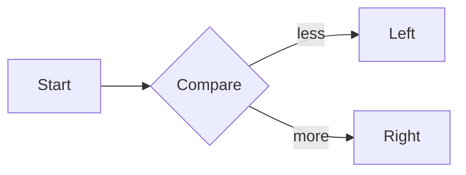

# Math with mermaid and code

A formula introducing the algorithm: $T(n) = O(n \log n)$.



```python
def merge_sort(xs):
    if len(xs) <= 1:
        return xs
    mid = len(xs) // 2
    return merge(merge_sort(xs[:mid]), merge_sort(xs[mid:]))
```

Display math after the diagram:

$$
T(n) = 2 T(n/2) + O(n)
$$
