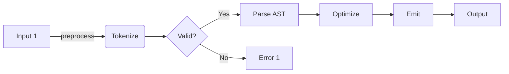
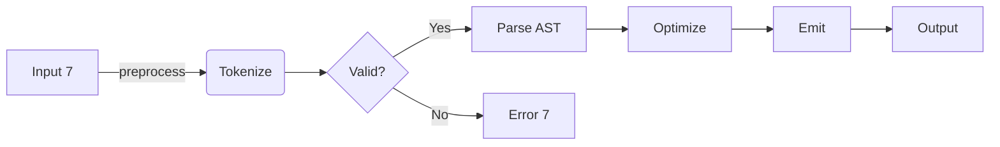
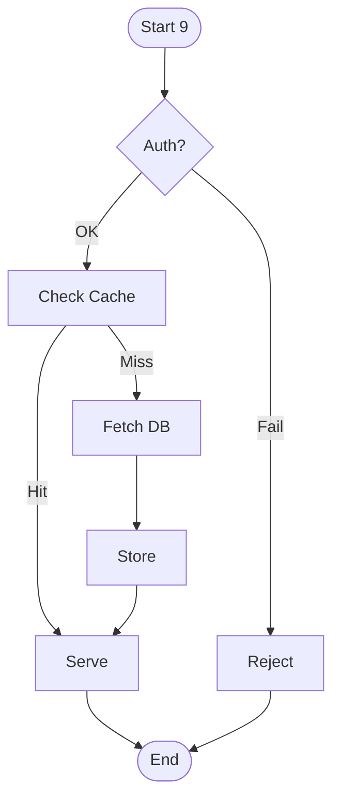
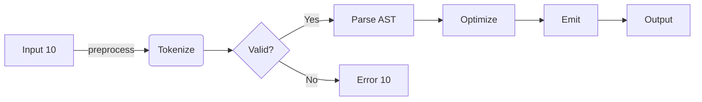
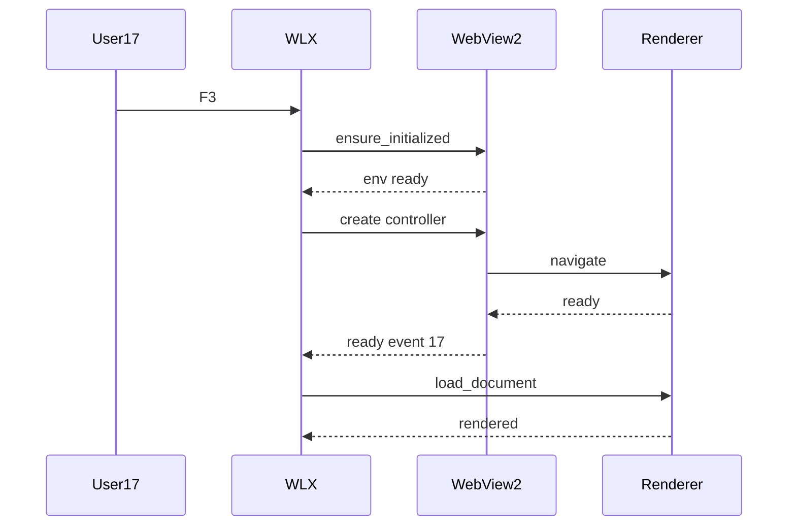

# Performance Stress Fixture

Auto-generated for M8 perf measurement. Mix of math, diagrams, code, and prose.


## Section 1: Mixed Content Block

The quick brown fox jumps over the lazy dog. Pack my box with five dozen liquor jugs. How vexingly quick daft zebras jump. Sphinx of black quartz, judge my vow. The quick brown fox jumps over the lazy dog. Pack my box with five dozen liquor jugs. How vexingly quick daft zebras jump. Sphinx of black quartz, judge my vow. The quick brown fox jumps over the lazy dog. Pack my box with five dozen liquor jugs. How vexingly quick daft zebras jump. Sphinx of black quartz, judge my vow. The quick brown fox jumps over the lazy dog. Pack my box with five dozen liquor jugs. How vexingly quick daft zebras jump. Sphinx of black quartz, judge my vow. 

Inline math 1: when $\alpha_{1}^2 + \beta_{1} = 0$ we get $\sqrt{-\beta_{1}} \approx 7$.

$$ \int_{-\infty}^{\infty} e^{-x^2} \, dx = \sqrt{\pi} $$

### Sub-block A: Code

```python
def process_batch_1(items, threshold=0.5):
    return [transform(x) for x in items if score(x) > threshold]
```

More prose. The quick brown fox jumps over the lazy dog. Pack my box with five dozen liquor jugs. How vexingly quick daft zebras jump. Sphinx of black quartz, judge my vow. The quick brown fox jumps over the lazy dog. Pack my box with five dozen liquor jugs. How vexingly quick daft zebras jump. Sphinx of black quartz, judge my vow. The quick brown fox jumps over the lazy dog. Pack my box with five dozen liquor jugs. How vexingly quick daft zebras jump. Sphinx of black quartz, judge my vow. The quick brown fox jumps over the lazy dog. Pack my box with five dozen liquor jugs. How vexingly quick daft zebras jump. Sphinx of black quartz, judge my vow. 

### Sub-block B: Diagram



Followup math:

$$ \frac{d}{dx}\left(\int_a^x f(t)\,dt\right) = f(x) $$

- item 1.1 with $E_{1} = m_{1}c^2$
- item 1.2 with $\hbar \omega_{1} = \frac{p_{1}^2}{2m}$
- item 1.3 (The quick brown fox jumps over the lazy dog. Pack my box with five dozen liquor jugs. How vexingly quick daft zebras jump. Sphinx of black quartz, judge my vow. The quick brown fox jumps over the lazy dog. Pack my box with five dozen liquor jugs. How vexingly quick daft zebras jump. Sphinx of black quartz, judge my vow. The quick brown fox jumps over the lazy dog. Pack my box with five dozen liquor jugs. How vexingly quick daft zebras jump. Sphinx of black quartz, judge my vow. The quick brown fox jumps over the lazy dog. Pack my box with five dozen liquor jugs. How vexingly quick daft zebras jump. Sphinx of black quartz, judge my vow. )


## Section 2: Mixed Content Block

The quick brown fox jumps over the lazy dog. Pack my box with five dozen liquor jugs. How vexingly quick daft zebras jump. Sphinx of black quartz, judge my vow. The quick brown fox jumps over the lazy dog. Pack my box with five dozen liquor jugs. How vexingly quick daft zebras jump. Sphinx of black quartz, judge my vow. The quick brown fox jumps over the lazy dog. Pack my box with five dozen liquor jugs. How vexingly quick daft zebras jump. Sphinx of black quartz, judge my vow. The quick brown fox jumps over the lazy dog. Pack my box with five dozen liquor jugs. How vexingly quick daft zebras jump. Sphinx of black quartz, judge my vow. 

Inline math 2: when $\alpha_{2}^2 + \beta_{2} = 0$ we get $\sqrt{-\beta_{2}} \approx 14$.

$$ \frac{d}{dx}\left(\int_a^x f(t)\,dt\right) = f(x) $$

### Sub-block A: Code

```python
def process_batch_2(items, threshold=0.5):
    return [transform(x) for x in items if score(x) > threshold]
```

More prose. The quick brown fox jumps over the lazy dog. Pack my box with five dozen liquor jugs. How vexingly quick daft zebras jump. Sphinx of black quartz, judge my vow. The quick brown fox jumps over the lazy dog. Pack my box with five dozen liquor jugs. How vexingly quick daft zebras jump. Sphinx of black quartz, judge my vow. The quick brown fox jumps over the lazy dog. Pack my box with five dozen liquor jugs. How vexingly quick daft zebras jump. Sphinx of black quartz, judge my vow. The quick brown fox jumps over the lazy dog. Pack my box with five dozen liquor jugs. How vexingly quick daft zebras jump. Sphinx of black quartz, judge my vow. 

### Sub-block B: Diagram


Followup math:

$$ \sum_{n=1}^{\infty} \frac{1}{n^s} = \prod_{p \text{ prime}} \frac{1}{1 - p^{-s}} $$

- item 2.1 with $E_{2} = m_{2}c^2$
- item 2.2 with $\hbar \omega_{2} = \frac{p_{2}^2}{2m}$
- item 2.3 (The quick brown fox jumps over the lazy dog. Pack my box with five dozen liquor jugs. How vexingly quick daft zebras jump. Sphinx of black quartz, judge my vow. The quick brown fox jumps over the lazy dog. Pack my box with five dozen liquor jugs. How vexingly quick daft zebras jump. Sphinx of black quartz, judge my vow. The quick brown fox jumps over the lazy dog. Pack my box with five dozen liquor jugs. How vexingly quick daft zebras jump. Sphinx of black quartz, judge my vow. The quick brown fox jumps over the lazy dog. Pack my box with five dozen liquor jugs. How vexingly quick daft zebras jump. Sphinx of black quartz, judge my vow. )


## Section 3: Mixed Content Block

The quick brown fox jumps over the lazy dog. Pack my box with five dozen liquor jugs. How vexingly quick daft zebras jump. Sphinx of black quartz, judge my vow. The quick brown fox jumps over the lazy dog. Pack my box with five dozen liquor jugs. How vexingly quick daft zebras jump. Sphinx of black quartz, judge my vow. The quick brown fox jumps over the lazy dog. Pack my box with five dozen liquor jugs. How vexingly quick daft zebras jump. Sphinx of black quartz, judge my vow. The quick brown fox jumps over the lazy dog. Pack my box with five dozen liquor jugs. How vexingly quick daft zebras jump. Sphinx of black quartz, judge my vow. 

Inline math 3: when $\alpha_{3}^2 + \beta_{3} = 0$ we get $\sqrt{-\beta_{3}} \approx 21$.

$$ \sum_{n=1}^{\infty} \frac{1}{n^s} = \prod_{p \text{ prime}} \frac{1}{1 - p^{-s}} $$

### Sub-block A: Code

```python
def process_batch_3(items, threshold=0.5):
    return [transform(x) for x in items if score(x) > threshold]
```

More prose. The quick brown fox jumps over the lazy dog. Pack my box with five dozen liquor jugs. How vexingly quick daft zebras jump. Sphinx of black quartz, judge my vow. The quick brown fox jumps over the lazy dog. Pack my box with five dozen liquor jugs. How vexingly quick daft zebras jump. Sphinx of black quartz, judge my vow. The quick brown fox jumps over the lazy dog. Pack my box with five dozen liquor jugs. How vexingly quick daft zebras jump. Sphinx of black quartz, judge my vow. The quick brown fox jumps over the lazy dog. Pack my box with five dozen liquor jugs. How vexingly quick daft zebras jump. Sphinx of black quartz, judge my vow. 

### Sub-block B: Diagram


Followup math:

$$ \begin{pmatrix} a & b \ c & d \end{pmatrix} \begin{pmatrix} x \ y \end{pmatrix} = \begin{pmatrix} ax+by \ cx+dy \end{pmatrix} $$

- item 3.1 with $E_{3} = m_{3}c^2$
- item 3.2 with $\hbar \omega_{3} = \frac{p_{3}^2}{2m}$
- item 3.3 (The quick brown fox jumps over the lazy dog. Pack my box with five dozen liquor jugs. How vexingly quick daft zebras jump. Sphinx of black quartz, judge my vow. The quick brown fox jumps over the lazy dog. Pack my box with five dozen liquor jugs. How vexingly quick daft zebras jump. Sphinx of black quartz, judge my vow. The quick brown fox jumps over the lazy dog. Pack my box with five dozen liquor jugs. How vexingly quick daft zebras jump. Sphinx of black quartz, judge my vow. The quick brown fox jumps over the lazy dog. Pack my box with five dozen liquor jugs. How vexingly quick daft zebras jump. Sphinx of black quartz, judge my vow. )


## Section 4: Mixed Content Block

The quick brown fox jumps over the lazy dog. Pack my box with five dozen liquor jugs. How vexingly quick daft zebras jump. Sphinx of black quartz, judge my vow. The quick brown fox jumps over the lazy dog. Pack my box with five dozen liquor jugs. How vexingly quick daft zebras jump. Sphinx of black quartz, judge my vow. The quick brown fox jumps over the lazy dog. Pack my box with five dozen liquor jugs. How vexingly quick daft zebras jump. Sphinx of black quartz, judge my vow. The quick brown fox jumps over the lazy dog. Pack my box with five dozen liquor jugs. How vexingly quick daft zebras jump. Sphinx of black quartz, judge my vow. 

Inline math 4: when $\alpha_{4}^2 + \beta_{4} = 0$ we get $\sqrt{-\beta_{4}} \approx 28$.

$$ \begin{pmatrix} a & b \ c & d \end{pmatrix} \begin{pmatrix} x \ y \end{pmatrix} = \begin{pmatrix} ax+by \ cx+dy \end{pmatrix} $$

### Sub-block A: Code

```python
def process_batch_4(items, threshold=0.5):
    return [transform(x) for x in items if score(x) > threshold]
```

More prose. The quick brown fox jumps over the lazy dog. Pack my box with five dozen liquor jugs. How vexingly quick daft zebras jump. Sphinx of black quartz, judge my vow. The quick brown fox jumps over the lazy dog. Pack my box with five dozen liquor jugs. How vexingly quick daft zebras jump. Sphinx of black quartz, judge my vow. The quick brown fox jumps over the lazy dog. Pack my box with five dozen liquor jugs. How vexingly quick daft zebras jump. Sphinx of black quartz, judge my vow. The quick brown fox jumps over the lazy dog. Pack my box with five dozen liquor jugs. How vexingly quick daft zebras jump. Sphinx of black quartz, judge my vow. 

### Sub-block B: Diagram


Followup math:

$$ \nabla \times \mathbf{B} - \frac{1}{c^2}\frac{\partial \mathbf{E}}{\partial t} = \mu_0 \mathbf{J} $$

- item 4.1 with $E_{4} = m_{4}c^2$
- item 4.2 with $\hbar \omega_{4} = \frac{p_{4}^2}{2m}$
- item 4.3 (The quick brown fox jumps over the lazy dog. Pack my box with five dozen liquor jugs. How vexingly quick daft zebras jump. Sphinx of black quartz, judge my vow. The quick brown fox jumps over the lazy dog. Pack my box with five dozen liquor jugs. How vexingly quick daft zebras jump. Sphinx of black quartz, judge my vow. The quick brown fox jumps over the lazy dog. Pack my box with five dozen liquor jugs. How vexingly quick daft zebras jump. Sphinx of black quartz, judge my vow. The quick brown fox jumps over the lazy dog. Pack my box with five dozen liquor jugs. How vexingly quick daft zebras jump. Sphinx of black quartz, judge my vow. )


## Section 5: Mixed Content Block

The quick brown fox jumps over the lazy dog. Pack my box with five dozen liquor jugs. How vexingly quick daft zebras jump. Sphinx of black quartz, judge my vow. The quick brown fox jumps over the lazy dog. Pack my box with five dozen liquor jugs. How vexingly quick daft zebras jump. Sphinx of black quartz, judge my vow. The quick brown fox jumps over the lazy dog. Pack my box with five dozen liquor jugs. How vexingly quick daft zebras jump. Sphinx of black quartz, judge my vow. The quick brown fox jumps over the lazy dog. Pack my box with five dozen liquor jugs. How vexingly quick daft zebras jump. Sphinx of black quartz, judge my vow. 

Inline math 5: when $\alpha_{5}^2 + \beta_{5} = 0$ we get $\sqrt{-\beta_{5}} \approx 35$.

$$ \nabla \times \mathbf{B} - \frac{1}{c^2}\frac{\partial \mathbf{E}}{\partial t} = \mu_0 \mathbf{J} $$

### Sub-block A: Code

```python
def process_batch_5(items, threshold=0.5):
    return [transform(x) for x in items if score(x) > threshold]
```

More prose. The quick brown fox jumps over the lazy dog. Pack my box with five dozen liquor jugs. How vexingly quick daft zebras jump. Sphinx of black quartz, judge my vow. The quick brown fox jumps over the lazy dog. Pack my box with five dozen liquor jugs. How vexingly quick daft zebras jump. Sphinx of black quartz, judge my vow. The quick brown fox jumps over the lazy dog. Pack my box with five dozen liquor jugs. How vexingly quick daft zebras jump. Sphinx of black quartz, judge my vow. The quick brown fox jumps over the lazy dog. Pack my box with five dozen liquor jugs. How vexingly quick daft zebras jump. Sphinx of black quartz, judge my vow. 

### Sub-block B: Diagram


Followup math:

$$ \mathcal{L}\{f(t)\} = \int_0^{\infty} f(t) e^{-st}\,dt $$

- item 5.1 with $E_{5} = m_{5}c^2$
- item 5.2 with $\hbar \omega_{5} = \frac{p_{5}^2}{2m}$
- item 5.3 (The quick brown fox jumps over the lazy dog. Pack my box with five dozen liquor jugs. How vexingly quick daft zebras jump. Sphinx of black quartz, judge my vow. The quick brown fox jumps over the lazy dog. Pack my box with five dozen liquor jugs. How vexingly quick daft zebras jump. Sphinx of black quartz, judge my vow. The quick brown fox jumps over the lazy dog. Pack my box with five dozen liquor jugs. How vexingly quick daft zebras jump. Sphinx of black quartz, judge my vow. The quick brown fox jumps over the lazy dog. Pack my box with five dozen liquor jugs. How vexingly quick daft zebras jump. Sphinx of black quartz, judge my vow. )


## Section 6: Mixed Content Block

The quick brown fox jumps over the lazy dog. Pack my box with five dozen liquor jugs. How vexingly quick daft zebras jump. Sphinx of black quartz, judge my vow. The quick brown fox jumps over the lazy dog. Pack my box with five dozen liquor jugs. How vexingly quick daft zebras jump. Sphinx of black quartz, judge my vow. The quick brown fox jumps over the lazy dog. Pack my box with five dozen liquor jugs. How vexingly quick daft zebras jump. Sphinx of black quartz, judge my vow. The quick brown fox jumps over the lazy dog. Pack my box with five dozen liquor jugs. How vexingly quick daft zebras jump. Sphinx of black quartz, judge my vow. 

Inline math 6: when $\alpha_{6}^2 + \beta_{6} = 0$ we get $\sqrt{-\beta_{6}} \approx 42$.

$$ \mathcal{L}\{f(t)\} = \int_0^{\infty} f(t) e^{-st}\,dt $$

### Sub-block A: Code

```python
def process_batch_6(items, threshold=0.5):
    return [transform(x) for x in items if score(x) > threshold]
```

More prose. The quick brown fox jumps over the lazy dog. Pack my box with five dozen liquor jugs. How vexingly quick daft zebras jump. Sphinx of black quartz, judge my vow. The quick brown fox jumps over the lazy dog. Pack my box with five dozen liquor jugs. How vexingly quick daft zebras jump. Sphinx of black quartz, judge my vow. The quick brown fox jumps over the lazy dog. Pack my box with five dozen liquor jugs. How vexingly quick daft zebras jump. Sphinx of black quartz, judge my vow. The quick brown fox jumps over the lazy dog. Pack my box with five dozen liquor jugs. How vexingly quick daft zebras jump. Sphinx of black quartz, judge my vow. 

### Sub-block B: Diagram


Followup math:

$$ \lim_{n \to \infty}\left(1 + \frac{1}{n}\right)^n = e $$

- item 6.1 with $E_{6} = m_{6}c^2$
- item 6.2 with $\hbar \omega_{6} = \frac{p_{6}^2}{2m}$
- item 6.3 (The quick brown fox jumps over the lazy dog. Pack my box with five dozen liquor jugs. How vexingly quick daft zebras jump. Sphinx of black quartz, judge my vow. The quick brown fox jumps over the lazy dog. Pack my box with five dozen liquor jugs. How vexingly quick daft zebras jump. Sphinx of black quartz, judge my vow. The quick brown fox jumps over the lazy dog. Pack my box with five dozen liquor jugs. How vexingly quick daft zebras jump. Sphinx of black quartz, judge my vow. The quick brown fox jumps over the lazy dog. Pack my box with five dozen liquor jugs. How vexingly quick daft zebras jump. Sphinx of black quartz, judge my vow. )


## Section 7: Mixed Content Block

The quick brown fox jumps over the lazy dog. Pack my box with five dozen liquor jugs. How vexingly quick daft zebras jump. Sphinx of black quartz, judge my vow. The quick brown fox jumps over the lazy dog. Pack my box with five dozen liquor jugs. How vexingly quick daft zebras jump. Sphinx of black quartz, judge my vow. The quick brown fox jumps over the lazy dog. Pack my box with five dozen liquor jugs. How vexingly quick daft zebras jump. Sphinx of black quartz, judge my vow. The quick brown fox jumps over the lazy dog. Pack my box with five dozen liquor jugs. How vexingly quick daft zebras jump. Sphinx of black quartz, judge my vow. 

Inline math 7: when $\alpha_{7}^2 + \beta_{7} = 0$ we get $\sqrt{-\beta_{7}} \approx 49$.

$$ \lim_{n \to \infty}\left(1 + \frac{1}{n}\right)^n = e $$

### Sub-block A: Code

```python
def process_batch_7(items, threshold=0.5):
    return [transform(x) for x in items if score(x) > threshold]
```

More prose. The quick brown fox jumps over the lazy dog. Pack my box with five dozen liquor jugs. How vexingly quick daft zebras jump. Sphinx of black quartz, judge my vow. The quick brown fox jumps over the lazy dog. Pack my box with five dozen liquor jugs. How vexingly quick daft zebras jump. Sphinx of black quartz, judge my vow. The quick brown fox jumps over the lazy dog. Pack my box with five dozen liquor jugs. How vexingly quick daft zebras jump. Sphinx of black quartz, judge my vow. The quick brown fox jumps over the lazy dog. Pack my box with five dozen liquor jugs. How vexingly quick daft zebras jump. Sphinx of black quartz, judge my vow. 

### Sub-block B: Diagram



Followup math:

$$ \int_{-\infty}^{\infty} e^{-x^2} \, dx = \sqrt{\pi} $$

- item 7.1 with $E_{7} = m_{7}c^2$
- item 7.2 with $\hbar \omega_{7} = \frac{p_{7}^2}{2m}$
- item 7.3 (The quick brown fox jumps over the lazy dog. Pack my box with five dozen liquor jugs. How vexingly quick daft zebras jump. Sphinx of black quartz, judge my vow. The quick brown fox jumps over the lazy dog. Pack my box with five dozen liquor jugs. How vexingly quick daft zebras jump. Sphinx of black quartz, judge my vow. The quick brown fox jumps over the lazy dog. Pack my box with five dozen liquor jugs. How vexingly quick daft zebras jump. Sphinx of black quartz, judge my vow. The quick brown fox jumps over the lazy dog. Pack my box with five dozen liquor jugs. How vexingly quick daft zebras jump. Sphinx of black quartz, judge my vow. )


## Section 8: Mixed Content Block

The quick brown fox jumps over the lazy dog. Pack my box with five dozen liquor jugs. How vexingly quick daft zebras jump. Sphinx of black quartz, judge my vow. The quick brown fox jumps over the lazy dog. Pack my box with five dozen liquor jugs. How vexingly quick daft zebras jump. Sphinx of black quartz, judge my vow. The quick brown fox jumps over the lazy dog. Pack my box with five dozen liquor jugs. How vexingly quick daft zebras jump. Sphinx of black quartz, judge my vow. The quick brown fox jumps over the lazy dog. Pack my box with five dozen liquor jugs. How vexingly quick daft zebras jump. Sphinx of black quartz, judge my vow. 

Inline math 8: when $\alpha_{8}^2 + \beta_{8} = 0$ we get $\sqrt{-\beta_{8}} \approx 56$.

$$ \int_{-\infty}^{\infty} e^{-x^2} \, dx = \sqrt{\pi} $$

### Sub-block A: Code

```python
def process_batch_8(items, threshold=0.5):
    return [transform(x) for x in items if score(x) > threshold]
```

More prose. The quick brown fox jumps over the lazy dog. Pack my box with five dozen liquor jugs. How vexingly quick daft zebras jump. Sphinx of black quartz, judge my vow. The quick brown fox jumps over the lazy dog. Pack my box with five dozen liquor jugs. How vexingly quick daft zebras jump. Sphinx of black quartz, judge my vow. The quick brown fox jumps over the lazy dog. Pack my box with five dozen liquor jugs. How vexingly quick daft zebras jump. Sphinx of black quartz, judge my vow. The quick brown fox jumps over the lazy dog. Pack my box with five dozen liquor jugs. How vexingly quick daft zebras jump. Sphinx of black quartz, judge my vow. 

### Sub-block B: Diagram


Followup math:

$$ \frac{d}{dx}\left(\int_a^x f(t)\,dt\right) = f(x) $$

- item 8.1 with $E_{8} = m_{8}c^2$
- item 8.2 with $\hbar \omega_{8} = \frac{p_{8}^2}{2m}$
- item 8.3 (The quick brown fox jumps over the lazy dog. Pack my box with five dozen liquor jugs. How vexingly quick daft zebras jump. Sphinx of black quartz, judge my vow. The quick brown fox jumps over the lazy dog. Pack my box with five dozen liquor jugs. How vexingly quick daft zebras jump. Sphinx of black quartz, judge my vow. The quick brown fox jumps over the lazy dog. Pack my box with five dozen liquor jugs. How vexingly quick daft zebras jump. Sphinx of black quartz, judge my vow. The quick brown fox jumps over the lazy dog. Pack my box with five dozen liquor jugs. How vexingly quick daft zebras jump. Sphinx of black quartz, judge my vow. )


## Section 9: Mixed Content Block

The quick brown fox jumps over the lazy dog. Pack my box with five dozen liquor jugs. How vexingly quick daft zebras jump. Sphinx of black quartz, judge my vow. The quick brown fox jumps over the lazy dog. Pack my box with five dozen liquor jugs. How vexingly quick daft zebras jump. Sphinx of black quartz, judge my vow. The quick brown fox jumps over the lazy dog. Pack my box with five dozen liquor jugs. How vexingly quick daft zebras jump. Sphinx of black quartz, judge my vow. The quick brown fox jumps over the lazy dog. Pack my box with five dozen liquor jugs. How vexingly quick daft zebras jump. Sphinx of black quartz, judge my vow. 

Inline math 9: when $\alpha_{9}^2 + \beta_{9} = 0$ we get $\sqrt{-\beta_{9}} \approx 63$.

$$ \frac{d}{dx}\left(\int_a^x f(t)\,dt\right) = f(x) $$

### Sub-block A: Code

```python
def process_batch_9(items, threshold=0.5):
    return [transform(x) for x in items if score(x) > threshold]
```

More prose. The quick brown fox jumps over the lazy dog. Pack my box with five dozen liquor jugs. How vexingly quick daft zebras jump. Sphinx of black quartz, judge my vow. The quick brown fox jumps over the lazy dog. Pack my box with five dozen liquor jugs. How vexingly quick daft zebras jump. Sphinx of black quartz, judge my vow. The quick brown fox jumps over the lazy dog. Pack my box with five dozen liquor jugs. How vexingly quick daft zebras jump. Sphinx of black quartz, judge my vow. The quick brown fox jumps over the lazy dog. Pack my box with five dozen liquor jugs. How vexingly quick daft zebras jump. Sphinx of black quartz, judge my vow. 

### Sub-block B: Diagram



Followup math:

$$ \sum_{n=1}^{\infty} \frac{1}{n^s} = \prod_{p \text{ prime}} \frac{1}{1 - p^{-s}} $$

- item 9.1 with $E_{9} = m_{9}c^2$
- item 9.2 with $\hbar \omega_{9} = \frac{p_{9}^2}{2m}$
- item 9.3 (The quick brown fox jumps over the lazy dog. Pack my box with five dozen liquor jugs. How vexingly quick daft zebras jump. Sphinx of black quartz, judge my vow. The quick brown fox jumps over the lazy dog. Pack my box with five dozen liquor jugs. How vexingly quick daft zebras jump. Sphinx of black quartz, judge my vow. The quick brown fox jumps over the lazy dog. Pack my box with five dozen liquor jugs. How vexingly quick daft zebras jump. Sphinx of black quartz, judge my vow. The quick brown fox jumps over the lazy dog. Pack my box with five dozen liquor jugs. How vexingly quick daft zebras jump. Sphinx of black quartz, judge my vow. )


## Section 10: Mixed Content Block

The quick brown fox jumps over the lazy dog. Pack my box with five dozen liquor jugs. How vexingly quick daft zebras jump. Sphinx of black quartz, judge my vow. The quick brown fox jumps over the lazy dog. Pack my box with five dozen liquor jugs. How vexingly quick daft zebras jump. Sphinx of black quartz, judge my vow. The quick brown fox jumps over the lazy dog. Pack my box with five dozen liquor jugs. How vexingly quick daft zebras jump. Sphinx of black quartz, judge my vow. The quick brown fox jumps over the lazy dog. Pack my box with five dozen liquor jugs. How vexingly quick daft zebras jump. Sphinx of black quartz, judge my vow. 

Inline math 10: when $\alpha_{10}^2 + \beta_{10} = 0$ we get $\sqrt{-\beta_{10}} \approx 70$.

$$ \sum_{n=1}^{\infty} \frac{1}{n^s} = \prod_{p \text{ prime}} \frac{1}{1 - p^{-s}} $$

### Sub-block A: Code

```python
def process_batch_10(items, threshold=0.5):
    return [transform(x) for x in items if score(x) > threshold]
```

More prose. The quick brown fox jumps over the lazy dog. Pack my box with five dozen liquor jugs. How vexingly quick daft zebras jump. Sphinx of black quartz, judge my vow. The quick brown fox jumps over the lazy dog. Pack my box with five dozen liquor jugs. How vexingly quick daft zebras jump. Sphinx of black quartz, judge my vow. The quick brown fox jumps over the lazy dog. Pack my box with five dozen liquor jugs. How vexingly quick daft zebras jump. Sphinx of black quartz, judge my vow. The quick brown fox jumps over the lazy dog. Pack my box with five dozen liquor jugs. How vexingly quick daft zebras jump. Sphinx of black quartz, judge my vow. 

### Sub-block B: Diagram



Followup math:

$$ \begin{pmatrix} a & b \ c & d \end{pmatrix} \begin{pmatrix} x \ y \end{pmatrix} = \begin{pmatrix} ax+by \ cx+dy \end{pmatrix} $$

- item 10.1 with $E_{10} = m_{10}c^2$
- item 10.2 with $\hbar \omega_{10} = \frac{p_{10}^2}{2m}$
- item 10.3 (The quick brown fox jumps over the lazy dog. Pack my box with five dozen liquor jugs. How vexingly quick daft zebras jump. Sphinx of black quartz, judge my vow. The quick brown fox jumps over the lazy dog. Pack my box with five dozen liquor jugs. How vexingly quick daft zebras jump. Sphinx of black quartz, judge my vow. The quick brown fox jumps over the lazy dog. Pack my box with five dozen liquor jugs. How vexingly quick daft zebras jump. Sphinx of black quartz, judge my vow. The quick brown fox jumps over the lazy dog. Pack my box with five dozen liquor jugs. How vexingly quick daft zebras jump. Sphinx of black quartz, judge my vow. )


## Section 11: Mixed Content Block

The quick brown fox jumps over the lazy dog. Pack my box with five dozen liquor jugs. How vexingly quick daft zebras jump. Sphinx of black quartz, judge my vow. The quick brown fox jumps over the lazy dog. Pack my box with five dozen liquor jugs. How vexingly quick daft zebras jump. Sphinx of black quartz, judge my vow. The quick brown fox jumps over the lazy dog. Pack my box with five dozen liquor jugs. How vexingly quick daft zebras jump. Sphinx of black quartz, judge my vow. The quick brown fox jumps over the lazy dog. Pack my box with five dozen liquor jugs. How vexingly quick daft zebras jump. Sphinx of black quartz, judge my vow. 

Inline math 11: when $\alpha_{11}^2 + \beta_{11} = 0$ we get $\sqrt{-\beta_{11}} \approx 77$.

$$ \begin{pmatrix} a & b \ c & d \end{pmatrix} \begin{pmatrix} x \ y \end{pmatrix} = \begin{pmatrix} ax+by \ cx+dy \end{pmatrix} $$

### Sub-block A: Code

```python
def process_batch_11(items, threshold=0.5):
    return [transform(x) for x in items if score(x) > threshold]
```

More prose. The quick brown fox jumps over the lazy dog. Pack my box with five dozen liquor jugs. How vexingly quick daft zebras jump. Sphinx of black quartz, judge my vow. The quick brown fox jumps over the lazy dog. Pack my box with five dozen liquor jugs. How vexingly quick daft zebras jump. Sphinx of black quartz, judge my vow. The quick brown fox jumps over the lazy dog. Pack my box with five dozen liquor jugs. How vexingly quick daft zebras jump. Sphinx of black quartz, judge my vow. The quick brown fox jumps over the lazy dog. Pack my box with five dozen liquor jugs. How vexingly quick daft zebras jump. Sphinx of black quartz, judge my vow. 

### Sub-block B: Diagram


Followup math:

$$ \nabla \times \mathbf{B} - \frac{1}{c^2}\frac{\partial \mathbf{E}}{\partial t} = \mu_0 \mathbf{J} $$

- item 11.1 with $E_{11} = m_{11}c^2$
- item 11.2 with $\hbar \omega_{11} = \frac{p_{11}^2}{2m}$
- item 11.3 (The quick brown fox jumps over the lazy dog. Pack my box with five dozen liquor jugs. How vexingly quick daft zebras jump. Sphinx of black quartz, judge my vow. The quick brown fox jumps over the lazy dog. Pack my box with five dozen liquor jugs. How vexingly quick daft zebras jump. Sphinx of black quartz, judge my vow. The quick brown fox jumps over the lazy dog. Pack my box with five dozen liquor jugs. How vexingly quick daft zebras jump. Sphinx of black quartz, judge my vow. The quick brown fox jumps over the lazy dog. Pack my box with five dozen liquor jugs. How vexingly quick daft zebras jump. Sphinx of black quartz, judge my vow. )


## Section 12: Mixed Content Block

The quick brown fox jumps over the lazy dog. Pack my box with five dozen liquor jugs. How vexingly quick daft zebras jump. Sphinx of black quartz, judge my vow. The quick brown fox jumps over the lazy dog. Pack my box with five dozen liquor jugs. How vexingly quick daft zebras jump. Sphinx of black quartz, judge my vow. The quick brown fox jumps over the lazy dog. Pack my box with five dozen liquor jugs. How vexingly quick daft zebras jump. Sphinx of black quartz, judge my vow. The quick brown fox jumps over the lazy dog. Pack my box with five dozen liquor jugs. How vexingly quick daft zebras jump. Sphinx of black quartz, judge my vow. 

Inline math 12: when $\alpha_{12}^2 + \beta_{12} = 0$ we get $\sqrt{-\beta_{12}} \approx 84$.

$$ \nabla \times \mathbf{B} - \frac{1}{c^2}\frac{\partial \mathbf{E}}{\partial t} = \mu_0 \mathbf{J} $$

### Sub-block A: Code

```python
def process_batch_12(items, threshold=0.5):
    return [transform(x) for x in items if score(x) > threshold]
```

More prose. The quick brown fox jumps over the lazy dog. Pack my box with five dozen liquor jugs. How vexingly quick daft zebras jump. Sphinx of black quartz, judge my vow. The quick brown fox jumps over the lazy dog. Pack my box with five dozen liquor jugs. How vexingly quick daft zebras jump. Sphinx of black quartz, judge my vow. The quick brown fox jumps over the lazy dog. Pack my box with five dozen liquor jugs. How vexingly quick daft zebras jump. Sphinx of black quartz, judge my vow. The quick brown fox jumps over the lazy dog. Pack my box with five dozen liquor jugs. How vexingly quick daft zebras jump. Sphinx of black quartz, judge my vow. 

### Sub-block B: Diagram


Followup math:

$$ \mathcal{L}\{f(t)\} = \int_0^{\infty} f(t) e^{-st}\,dt $$

- item 12.1 with $E_{12} = m_{12}c^2$
- item 12.2 with $\hbar \omega_{12} = \frac{p_{12}^2}{2m}$
- item 12.3 (The quick brown fox jumps over the lazy dog. Pack my box with five dozen liquor jugs. How vexingly quick daft zebras jump. Sphinx of black quartz, judge my vow. The quick brown fox jumps over the lazy dog. Pack my box with five dozen liquor jugs. How vexingly quick daft zebras jump. Sphinx of black quartz, judge my vow. The quick brown fox jumps over the lazy dog. Pack my box with five dozen liquor jugs. How vexingly quick daft zebras jump. Sphinx of black quartz, judge my vow. The quick brown fox jumps over the lazy dog. Pack my box with five dozen liquor jugs. How vexingly quick daft zebras jump. Sphinx of black quartz, judge my vow. )


## Section 13: Mixed Content Block

The quick brown fox jumps over the lazy dog. Pack my box with five dozen liquor jugs. How vexingly quick daft zebras jump. Sphinx of black quartz, judge my vow. The quick brown fox jumps over the lazy dog. Pack my box with five dozen liquor jugs. How vexingly quick daft zebras jump. Sphinx of black quartz, judge my vow. The quick brown fox jumps over the lazy dog. Pack my box with five dozen liquor jugs. How vexingly quick daft zebras jump. Sphinx of black quartz, judge my vow. The quick brown fox jumps over the lazy dog. Pack my box with five dozen liquor jugs. How vexingly quick daft zebras jump. Sphinx of black quartz, judge my vow. 

Inline math 13: when $\alpha_{13}^2 + \beta_{13} = 0$ we get $\sqrt{-\beta_{13}} \approx 91$.

$$ \mathcal{L}\{f(t)\} = \int_0^{\infty} f(t) e^{-st}\,dt $$

### Sub-block A: Code

```python
def process_batch_13(items, threshold=0.5):
    return [transform(x) for x in items if score(x) > threshold]
```

More prose. The quick brown fox jumps over the lazy dog. Pack my box with five dozen liquor jugs. How vexingly quick daft zebras jump. Sphinx of black quartz, judge my vow. The quick brown fox jumps over the lazy dog. Pack my box with five dozen liquor jugs. How vexingly quick daft zebras jump. Sphinx of black quartz, judge my vow. The quick brown fox jumps over the lazy dog. Pack my box with five dozen liquor jugs. How vexingly quick daft zebras jump. Sphinx of black quartz, judge my vow. The quick brown fox jumps over the lazy dog. Pack my box with five dozen liquor jugs. How vexingly quick daft zebras jump. Sphinx of black quartz, judge my vow. 

### Sub-block B: Diagram


Followup math:

$$ \lim_{n \to \infty}\left(1 + \frac{1}{n}\right)^n = e $$

- item 13.1 with $E_{13} = m_{13}c^2$
- item 13.2 with $\hbar \omega_{13} = \frac{p_{13}^2}{2m}$
- item 13.3 (The quick brown fox jumps over the lazy dog. Pack my box with five dozen liquor jugs. How vexingly quick daft zebras jump. Sphinx of black quartz, judge my vow. The quick brown fox jumps over the lazy dog. Pack my box with five dozen liquor jugs. How vexingly quick daft zebras jump. Sphinx of black quartz, judge my vow. The quick brown fox jumps over the lazy dog. Pack my box with five dozen liquor jugs. How vexingly quick daft zebras jump. Sphinx of black quartz, judge my vow. The quick brown fox jumps over the lazy dog. Pack my box with five dozen liquor jugs. How vexingly quick daft zebras jump. Sphinx of black quartz, judge my vow. )


## Section 14: Mixed Content Block

The quick brown fox jumps over the lazy dog. Pack my box with five dozen liquor jugs. How vexingly quick daft zebras jump. Sphinx of black quartz, judge my vow. The quick brown fox jumps over the lazy dog. Pack my box with five dozen liquor jugs. How vexingly quick daft zebras jump. Sphinx of black quartz, judge my vow. The quick brown fox jumps over the lazy dog. Pack my box with five dozen liquor jugs. How vexingly quick daft zebras jump. Sphinx of black quartz, judge my vow. The quick brown fox jumps over the lazy dog. Pack my box with five dozen liquor jugs. How vexingly quick daft zebras jump. Sphinx of black quartz, judge my vow. 

Inline math 14: when $\alpha_{14}^2 + \beta_{14} = 0$ we get $\sqrt{-\beta_{14}} \approx 98$.

$$ \lim_{n \to \infty}\left(1 + \frac{1}{n}\right)^n = e $$

### Sub-block A: Code

```python
def process_batch_14(items, threshold=0.5):
    return [transform(x) for x in items if score(x) > threshold]
```

More prose. The quick brown fox jumps over the lazy dog. Pack my box with five dozen liquor jugs. How vexingly quick daft zebras jump. Sphinx of black quartz, judge my vow. The quick brown fox jumps over the lazy dog. Pack my box with five dozen liquor jugs. How vexingly quick daft zebras jump. Sphinx of black quartz, judge my vow. The quick brown fox jumps over the lazy dog. Pack my box with five dozen liquor jugs. How vexingly quick daft zebras jump. Sphinx of black quartz, judge my vow. The quick brown fox jumps over the lazy dog. Pack my box with five dozen liquor jugs. How vexingly quick daft zebras jump. Sphinx of black quartz, judge my vow. 

### Sub-block B: Diagram


Followup math:

$$ \int_{-\infty}^{\infty} e^{-x^2} \, dx = \sqrt{\pi} $$

- item 14.1 with $E_{14} = m_{14}c^2$
- item 14.2 with $\hbar \omega_{14} = \frac{p_{14}^2}{2m}$
- item 14.3 (The quick brown fox jumps over the lazy dog. Pack my box with five dozen liquor jugs. How vexingly quick daft zebras jump. Sphinx of black quartz, judge my vow. The quick brown fox jumps over the lazy dog. Pack my box with five dozen liquor jugs. How vexingly quick daft zebras jump. Sphinx of black quartz, judge my vow. The quick brown fox jumps over the lazy dog. Pack my box with five dozen liquor jugs. How vexingly quick daft zebras jump. Sphinx of black quartz, judge my vow. The quick brown fox jumps over the lazy dog. Pack my box with five dozen liquor jugs. How vexingly quick daft zebras jump. Sphinx of black quartz, judge my vow. )


## Section 15: Mixed Content Block

The quick brown fox jumps over the lazy dog. Pack my box with five dozen liquor jugs. How vexingly quick daft zebras jump. Sphinx of black quartz, judge my vow. The quick brown fox jumps over the lazy dog. Pack my box with five dozen liquor jugs. How vexingly quick daft zebras jump. Sphinx of black quartz, judge my vow. The quick brown fox jumps over the lazy dog. Pack my box with five dozen liquor jugs. How vexingly quick daft zebras jump. Sphinx of black quartz, judge my vow. The quick brown fox jumps over the lazy dog. Pack my box with five dozen liquor jugs. How vexingly quick daft zebras jump. Sphinx of black quartz, judge my vow. 

Inline math 15: when $\alpha_{15}^2 + \beta_{15} = 0$ we get $\sqrt{-\beta_{15}} \approx 105$.

$$ \int_{-\infty}^{\infty} e^{-x^2} \, dx = \sqrt{\pi} $$

### Sub-block A: Code

```python
def process_batch_15(items, threshold=0.5):
    return [transform(x) for x in items if score(x) > threshold]
```

More prose. The quick brown fox jumps over the lazy dog. Pack my box with five dozen liquor jugs. How vexingly quick daft zebras jump. Sphinx of black quartz, judge my vow. The quick brown fox jumps over the lazy dog. Pack my box with five dozen liquor jugs. How vexingly quick daft zebras jump. Sphinx of black quartz, judge my vow. The quick brown fox jumps over the lazy dog. Pack my box with five dozen liquor jugs. How vexingly quick daft zebras jump. Sphinx of black quartz, judge my vow. The quick brown fox jumps over the lazy dog. Pack my box with five dozen liquor jugs. How vexingly quick daft zebras jump. Sphinx of black quartz, judge my vow. 

### Sub-block B: Diagram


Followup math:

$$ \frac{d}{dx}\left(\int_a^x f(t)\,dt\right) = f(x) $$

- item 15.1 with $E_{15} = m_{15}c^2$
- item 15.2 with $\hbar \omega_{15} = \frac{p_{15}^2}{2m}$
- item 15.3 (The quick brown fox jumps over the lazy dog. Pack my box with five dozen liquor jugs. How vexingly quick daft zebras jump. Sphinx of black quartz, judge my vow. The quick brown fox jumps over the lazy dog. Pack my box with five dozen liquor jugs. How vexingly quick daft zebras jump. Sphinx of black quartz, judge my vow. The quick brown fox jumps over the lazy dog. Pack my box with five dozen liquor jugs. How vexingly quick daft zebras jump. Sphinx of black quartz, judge my vow. The quick brown fox jumps over the lazy dog. Pack my box with five dozen liquor jugs. How vexingly quick daft zebras jump. Sphinx of black quartz, judge my vow. )


## Section 16: Mixed Content Block

The quick brown fox jumps over the lazy dog. Pack my box with five dozen liquor jugs. How vexingly quick daft zebras jump. Sphinx of black quartz, judge my vow. The quick brown fox jumps over the lazy dog. Pack my box with five dozen liquor jugs. How vexingly quick daft zebras jump. Sphinx of black quartz, judge my vow. The quick brown fox jumps over the lazy dog. Pack my box with five dozen liquor jugs. How vexingly quick daft zebras jump. Sphinx of black quartz, judge my vow. The quick brown fox jumps over the lazy dog. Pack my box with five dozen liquor jugs. How vexingly quick daft zebras jump. Sphinx of black quartz, judge my vow. 

Inline math 16: when $\alpha_{16}^2 + \beta_{16} = 0$ we get $\sqrt{-\beta_{16}} \approx 112$.

$$ \frac{d}{dx}\left(\int_a^x f(t)\,dt\right) = f(x) $$

### Sub-block A: Code

```python
def process_batch_16(items, threshold=0.5):
    return [transform(x) for x in items if score(x) > threshold]
```

More prose. The quick brown fox jumps over the lazy dog. Pack my box with five dozen liquor jugs. How vexingly quick daft zebras jump. Sphinx of black quartz, judge my vow. The quick brown fox jumps over the lazy dog. Pack my box with five dozen liquor jugs. How vexingly quick daft zebras jump. Sphinx of black quartz, judge my vow. The quick brown fox jumps over the lazy dog. Pack my box with five dozen liquor jugs. How vexingly quick daft zebras jump. Sphinx of black quartz, judge my vow. The quick brown fox jumps over the lazy dog. Pack my box with five dozen liquor jugs. How vexingly quick daft zebras jump. Sphinx of black quartz, judge my vow. 

### Sub-block B: Diagram


Followup math:

$$ \sum_{n=1}^{\infty} \frac{1}{n^s} = \prod_{p \text{ prime}} \frac{1}{1 - p^{-s}} $$

- item 16.1 with $E_{16} = m_{16}c^2$
- item 16.2 with $\hbar \omega_{16} = \frac{p_{16}^2}{2m}$
- item 16.3 (The quick brown fox jumps over the lazy dog. Pack my box with five dozen liquor jugs. How vexingly quick daft zebras jump. Sphinx of black quartz, judge my vow. The quick brown fox jumps over the lazy dog. Pack my box with five dozen liquor jugs. How vexingly quick daft zebras jump. Sphinx of black quartz, judge my vow. The quick brown fox jumps over the lazy dog. Pack my box with five dozen liquor jugs. How vexingly quick daft zebras jump. Sphinx of black quartz, judge my vow. The quick brown fox jumps over the lazy dog. Pack my box with five dozen liquor jugs. How vexingly quick daft zebras jump. Sphinx of black quartz, judge my vow. )


## Section 17: Mixed Content Block

The quick brown fox jumps over the lazy dog. Pack my box with five dozen liquor jugs. How vexingly quick daft zebras jump. Sphinx of black quartz, judge my vow. The quick brown fox jumps over the lazy dog. Pack my box with five dozen liquor jugs. How vexingly quick daft zebras jump. Sphinx of black quartz, judge my vow. The quick brown fox jumps over the lazy dog. Pack my box with five dozen liquor jugs. How vexingly quick daft zebras jump. Sphinx of black quartz, judge my vow. The quick brown fox jumps over the lazy dog. Pack my box with five dozen liquor jugs. How vexingly quick daft zebras jump. Sphinx of black quartz, judge my vow. 

Inline math 17: when $\alpha_{17}^2 + \beta_{17} = 0$ we get $\sqrt{-\beta_{17}} \approx 119$.

$$ \sum_{n=1}^{\infty} \frac{1}{n^s} = \prod_{p \text{ prime}} \frac{1}{1 - p^{-s}} $$

### Sub-block A: Code

```python
def process_batch_17(items, threshold=0.5):
    return [transform(x) for x in items if score(x) > threshold]
```

More prose. The quick brown fox jumps over the lazy dog. Pack my box with five dozen liquor jugs. How vexingly quick daft zebras jump. Sphinx of black quartz, judge my vow. The quick brown fox jumps over the lazy dog. Pack my box with five dozen liquor jugs. How vexingly quick daft zebras jump. Sphinx of black quartz, judge my vow. The quick brown fox jumps over the lazy dog. Pack my box with five dozen liquor jugs. How vexingly quick daft zebras jump. Sphinx of black quartz, judge my vow. The quick brown fox jumps over the lazy dog. Pack my box with five dozen liquor jugs. How vexingly quick daft zebras jump. Sphinx of black quartz, judge my vow. 

### Sub-block B: Diagram



Followup math:

$$ \begin{pmatrix} a & b \ c & d \end{pmatrix} \begin{pmatrix} x \ y \end{pmatrix} = \begin{pmatrix} ax+by \ cx+dy \end{pmatrix} $$

- item 17.1 with $E_{17} = m_{17}c^2$
- item 17.2 with $\hbar \omega_{17} = \frac{p_{17}^2}{2m}$
- item 17.3 (The quick brown fox jumps over the lazy dog. Pack my box with five dozen liquor jugs. How vexingly quick daft zebras jump. Sphinx of black quartz, judge my vow. The quick brown fox jumps over the lazy dog. Pack my box with five dozen liquor jugs. How vexingly quick daft zebras jump. Sphinx of black quartz, judge my vow. The quick brown fox jumps over the lazy dog. Pack my box with five dozen liquor jugs. How vexingly quick daft zebras jump. Sphinx of black quartz, judge my vow. The quick brown fox jumps over the lazy dog. Pack my box with five dozen liquor jugs. How vexingly quick daft zebras jump. Sphinx of black quartz, judge my vow. )


## Section 18: Mixed Content Block

The quick brown fox jumps over the lazy dog. Pack my box with five dozen liquor jugs. How vexingly quick daft zebras jump. Sphinx of black quartz, judge my vow. The quick brown fox jumps over the lazy dog. Pack my box with five dozen liquor jugs. How vexingly quick daft zebras jump. Sphinx of black quartz, judge my vow. The quick brown fox jumps over the lazy dog. Pack my box with five dozen liquor jugs. How vexingly quick daft zebras jump. Sphinx of black quartz, judge my vow. The quick brown fox jumps over the lazy dog. Pack my box with five dozen liquor jugs. How vexingly quick daft zebras jump. Sphinx of black quartz, judge my vow. 

Inline math 18: when $\alpha_{18}^2 + \beta_{18} = 0$ we get $\sqrt{-\beta_{18}} \approx 126$.

$$ \begin{pmatrix} a & b \ c & d \end{pmatrix} \begin{pmatrix} x \ y \end{pmatrix} = \begin{pmatrix} ax+by \ cx+dy \end{pmatrix} $$

### Sub-block A: Code

```python
def process_batch_18(items, threshold=0.5):
    return [transform(x) for x in items if score(x) > threshold]
```

More prose. The quick brown fox jumps over the lazy dog. Pack my box with five dozen liquor jugs. How vexingly quick daft zebras jump. Sphinx of black quartz, judge my vow. The quick brown fox jumps over the lazy dog. Pack my box with five dozen liquor jugs. How vexingly quick daft zebras jump. Sphinx of black quartz, judge my vow. The quick brown fox jumps over the lazy dog. Pack my box with five dozen liquor jugs. How vexingly quick daft zebras jump. Sphinx of black quartz, judge my vow. The quick brown fox jumps over the lazy dog. Pack my box with five dozen liquor jugs. How vexingly quick daft zebras jump. Sphinx of black quartz, judge my vow. 

### Sub-block B: Diagram


Followup math:

$$ \nabla \times \mathbf{B} - \frac{1}{c^2}\frac{\partial \mathbf{E}}{\partial t} = \mu_0 \mathbf{J} $$

- item 18.1 with $E_{18} = m_{18}c^2$
- item 18.2 with $\hbar \omega_{18} = \frac{p_{18}^2}{2m}$
- item 18.3 (The quick brown fox jumps over the lazy dog. Pack my box with five dozen liquor jugs. How vexingly quick daft zebras jump. Sphinx of black quartz, judge my vow. The quick brown fox jumps over the lazy dog. Pack my box with five dozen liquor jugs. How vexingly quick daft zebras jump. Sphinx of black quartz, judge my vow. The quick brown fox jumps over the lazy dog. Pack my box with five dozen liquor jugs. How vexingly quick daft zebras jump. Sphinx of black quartz, judge my vow. The quick brown fox jumps over the lazy dog. Pack my box with five dozen liquor jugs. How vexingly quick daft zebras jump. Sphinx of black quartz, judge my vow. )


## Section 19: Mixed Content Block

The quick brown fox jumps over the lazy dog. Pack my box with five dozen liquor jugs. How vexingly quick daft zebras jump. Sphinx of black quartz, judge my vow. The quick brown fox jumps over the lazy dog. Pack my box with five dozen liquor jugs. How vexingly quick daft zebras jump. Sphinx of black quartz, judge my vow. The quick brown fox jumps over the lazy dog. Pack my box with five dozen liquor jugs. How vexingly quick daft zebras jump. Sphinx of black quartz, judge my vow. The quick brown fox jumps over the lazy dog. Pack my box with five dozen liquor jugs. How vexingly quick daft zebras jump. Sphinx of black quartz, judge my vow. 

Inline math 19: when $\alpha_{19}^2 + \beta_{19} = 0$ we get $\sqrt{-\beta_{19}} \approx 133$.

$$ \nabla \times \mathbf{B} - \frac{1}{c^2}\frac{\partial \mathbf{E}}{\partial t} = \mu_0 \mathbf{J} $$

### Sub-block A: Code

```python
def process_batch_19(items, threshold=0.5):
    return [transform(x) for x in items if score(x) > threshold]
```

More prose. The quick brown fox jumps over the lazy dog. Pack my box with five dozen liquor jugs. How vexingly quick daft zebras jump. Sphinx of black quartz, judge my vow. The quick brown fox jumps over the lazy dog. Pack my box with five dozen liquor jugs. How vexingly quick daft zebras jump. Sphinx of black quartz, judge my vow. The quick brown fox jumps over the lazy dog. Pack my box with five dozen liquor jugs. How vexingly quick daft zebras jump. Sphinx of black quartz, judge my vow. The quick brown fox jumps over the lazy dog. Pack my box with five dozen liquor jugs. How vexingly quick daft zebras jump. Sphinx of black quartz, judge my vow. 

### Sub-block B: Diagram


Followup math:

$$ \mathcal{L}\{f(t)\} = \int_0^{\infty} f(t) e^{-st}\,dt $$

- item 19.1 with $E_{19} = m_{19}c^2$
- item 19.2 with $\hbar \omega_{19} = \frac{p_{19}^2}{2m}$
- item 19.3 (The quick brown fox jumps over the lazy dog. Pack my box with five dozen liquor jugs. How vexingly quick daft zebras jump. Sphinx of black quartz, judge my vow. The quick brown fox jumps over the lazy dog. Pack my box with five dozen liquor jugs. How vexingly quick daft zebras jump. Sphinx of black quartz, judge my vow. The quick brown fox jumps over the lazy dog. Pack my box with five dozen liquor jugs. How vexingly quick daft zebras jump. Sphinx of black quartz, judge my vow. The quick brown fox jumps over the lazy dog. Pack my box with five dozen liquor jugs. How vexingly quick daft zebras jump. Sphinx of black quartz, judge my vow. )


## Section 20: Mixed Content Block

The quick brown fox jumps over the lazy dog. Pack my box with five dozen liquor jugs. How vexingly quick daft zebras jump. Sphinx of black quartz, judge my vow. The quick brown fox jumps over the lazy dog. Pack my box with five dozen liquor jugs. How vexingly quick daft zebras jump. Sphinx of black quartz, judge my vow. The quick brown fox jumps over the lazy dog. Pack my box with five dozen liquor jugs. How vexingly quick daft zebras jump. Sphinx of black quartz, judge my vow. The quick brown fox jumps over the lazy dog. Pack my box with five dozen liquor jugs. How vexingly quick daft zebras jump. Sphinx of black quartz, judge my vow. 

Inline math 20: when $\alpha_{20}^2 + \beta_{20} = 0$ we get $\sqrt{-\beta_{20}} \approx 140$.

$$ \mathcal{L}\{f(t)\} = \int_0^{\infty} f(t) e^{-st}\,dt $$

### Sub-block A: Code

```python
def process_batch_20(items, threshold=0.5):
    return [transform(x) for x in items if score(x) > threshold]
```

More prose. The quick brown fox jumps over the lazy dog. Pack my box with five dozen liquor jugs. How vexingly quick daft zebras jump. Sphinx of black quartz, judge my vow. The quick brown fox jumps over the lazy dog. Pack my box with five dozen liquor jugs. How vexingly quick daft zebras jump. Sphinx of black quartz, judge my vow. The quick brown fox jumps over the lazy dog. Pack my box with five dozen liquor jugs. How vexingly quick daft zebras jump. Sphinx of black quartz, judge my vow. The quick brown fox jumps over the lazy dog. Pack my box with five dozen liquor jugs. How vexingly quick daft zebras jump. Sphinx of black quartz, judge my vow. 

### Sub-block B: Diagram


Followup math:

$$ \lim_{n \to \infty}\left(1 + \frac{1}{n}\right)^n = e $$

- item 20.1 with $E_{20} = m_{20}c^2$
- item 20.2 with $\hbar \omega_{20} = \frac{p_{20}^2}{2m}$
- item 20.3 (The quick brown fox jumps over the lazy dog. Pack my box with five dozen liquor jugs. How vexingly quick daft zebras jump. Sphinx of black quartz, judge my vow. The quick brown fox jumps over the lazy dog. Pack my box with five dozen liquor jugs. How vexingly quick daft zebras jump. Sphinx of black quartz, judge my vow. The quick brown fox jumps over the lazy dog. Pack my box with five dozen liquor jugs. How vexingly quick daft zebras jump. Sphinx of black quartz, judge my vow. The quick brown fox jumps over the lazy dog. Pack my box with five dozen liquor jugs. How vexingly quick daft zebras jump. Sphinx of black quartz, judge my vow. )


## Section 21: Mixed Content Block

The quick brown fox jumps over the lazy dog. Pack my box with five dozen liquor jugs. How vexingly quick daft zebras jump. Sphinx of black quartz, judge my vow. The quick brown fox jumps over the lazy dog. Pack my box with five dozen liquor jugs. How vexingly quick daft zebras jump. Sphinx of black quartz, judge my vow. The quick brown fox jumps over the lazy dog. Pack my box with five dozen liquor jugs. How vexingly quick daft zebras jump. Sphinx of black quartz, judge my vow. The quick brown fox jumps over the lazy dog. Pack my box with five dozen liquor jugs. How vexingly quick daft zebras jump. Sphinx of black quartz, judge my vow. 

Inline math 21: when $\alpha_{21}^2 + \beta_{21} = 0$ we get $\sqrt{-\beta_{21}} \approx 147$.

$$ \lim_{n \to \infty}\left(1 + \frac{1}{n}\right)^n = e $$

### Sub-block A: Code

```python
def process_batch_21(items, threshold=0.5):
    return [transform(x) for x in items if score(x) > threshold]
```

More prose. The quick brown fox jumps over the lazy dog. Pack my box with five dozen liquor jugs. How vexingly quick daft zebras jump. Sphinx of black quartz, judge my vow. The quick brown fox jumps over the lazy dog. Pack my box with five dozen liquor jugs. How vexingly quick daft zebras jump. Sphinx of black quartz, judge my vow. The quick brown fox jumps over the lazy dog. Pack my box with five dozen liquor jugs. How vexingly quick daft zebras jump. Sphinx of black quartz, judge my vow. The quick brown fox jumps over the lazy dog. Pack my box with five dozen liquor jugs. How vexingly quick daft zebras jump. Sphinx of black quartz, judge my vow. 

### Sub-block B: Diagram

```mermaid
flowchart TD
    Start([Start 21]) --> Auth{Auth?}
    Auth -->|OK| Cache[Check Cache]
    Auth -->|Fail| Reject[Reject]
    Cache -->|Hit| Serve[Serve]
    Cache -->|Miss| Fetch[Fetch DB]
    Fetch --> Store[Store]
    Store --> Serve
    Serve --> End([End])
    Reject --> End
```

Followup math:

$$ \int_{-\infty}^{\infty} e^{-x^2} \, dx = \sqrt{\pi} $$

- item 21.1 with $E_{21} = m_{21}c^2$
- item 21.2 with $\hbar \omega_{21} = \frac{p_{21}^2}{2m}$
- item 21.3 (The quick brown fox jumps over the lazy dog. Pack my box with five dozen liquor jugs. How vexingly quick daft zebras jump. Sphinx of black quartz, judge my vow. The quick brown fox jumps over the lazy dog. Pack my box with five dozen liquor jugs. How vexingly quick daft zebras jump. Sphinx of black quartz, judge my vow. The quick brown fox jumps over the lazy dog. Pack my box with five dozen liquor jugs. How vexingly quick daft zebras jump. Sphinx of black quartz, judge my vow. The quick brown fox jumps over the lazy dog. Pack my box with five dozen liquor jugs. How vexingly quick daft zebras jump. Sphinx of black quartz, judge my vow. )


## Section 22: Mixed Content Block

The quick brown fox jumps over the lazy dog. Pack my box with five dozen liquor jugs. How vexingly quick daft zebras jump. Sphinx of black quartz, judge my vow. The quick brown fox jumps over the lazy dog. Pack my box with five dozen liquor jugs. How vexingly quick daft zebras jump. Sphinx of black quartz, judge my vow. The quick brown fox jumps over the lazy dog. Pack my box with five dozen liquor jugs. How vexingly quick daft zebras jump. Sphinx of black quartz, judge my vow. The quick brown fox jumps over the lazy dog. Pack my box with five dozen liquor jugs. How vexingly quick daft zebras jump. Sphinx of black quartz, judge my vow. 

Inline math 22: when $\alpha_{22}^2 + \beta_{22} = 0$ we get $\sqrt{-\beta_{22}} \approx 154$.

$$ \int_{-\infty}^{\infty} e^{-x^2} \, dx = \sqrt{\pi} $$

### Sub-block A: Code

```python
def process_batch_22(items, threshold=0.5):
    return [transform(x) for x in items if score(x) > threshold]
```

More prose. The quick brown fox jumps over the lazy dog. Pack my box with five dozen liquor jugs. How vexingly quick daft zebras jump. Sphinx of black quartz, judge my vow. The quick brown fox jumps over the lazy dog. Pack my box with five dozen liquor jugs. How vexingly quick daft zebras jump. Sphinx of black quartz, judge my vow. The quick brown fox jumps over the lazy dog. Pack my box with five dozen liquor jugs. How vexingly quick daft zebras jump. Sphinx of black quartz, judge my vow. The quick brown fox jumps over the lazy dog. Pack my box with five dozen liquor jugs. How vexingly quick daft zebras jump. Sphinx of black quartz, judge my vow. 

### Sub-block B: Diagram

```mermaid
flowchart LR
    A[Input 22] -->|preprocess| B(Tokenize)
    B --> C{Valid?}
    C -->|Yes| D[Parse AST]
    C -->|No| E[Error 22]
    D --> F[Optimize]
    F --> G[Emit]
    G --> H[Output]
```

Followup math:

$$ \frac{d}{dx}\left(\int_a^x f(t)\,dt\right) = f(x) $$

- item 22.1 with $E_{22} = m_{22}c^2$
- item 22.2 with $\hbar \omega_{22} = \frac{p_{22}^2}{2m}$
- item 22.3 (The quick brown fox jumps over the lazy dog. Pack my box with five dozen liquor jugs. How vexingly quick daft zebras jump. Sphinx of black quartz, judge my vow. The quick brown fox jumps over the lazy dog. Pack my box with five dozen liquor jugs. How vexingly quick daft zebras jump. Sphinx of black quartz, judge my vow. The quick brown fox jumps over the lazy dog. Pack my box with five dozen liquor jugs. How vexingly quick daft zebras jump. Sphinx of black quartz, judge my vow. The quick brown fox jumps over the lazy dog. Pack my box with five dozen liquor jugs. How vexingly quick daft zebras jump. Sphinx of black quartz, judge my vow. )


## Section 23: Mixed Content Block

The quick brown fox jumps over the lazy dog. Pack my box with five dozen liquor jugs. How vexingly quick daft zebras jump. Sphinx of black quartz, judge my vow. The quick brown fox jumps over the lazy dog. Pack my box with five dozen liquor jugs. How vexingly quick daft zebras jump. Sphinx of black quartz, judge my vow. The quick brown fox jumps over the lazy dog. Pack my box with five dozen liquor jugs. How vexingly quick daft zebras jump. Sphinx of black quartz, judge my vow. The quick brown fox jumps over the lazy dog. Pack my box with five dozen liquor jugs. How vexingly quick daft zebras jump. Sphinx of black quartz, judge my vow. 

Inline math 23: when $\alpha_{23}^2 + \beta_{23} = 0$ we get $\sqrt{-\beta_{23}} \approx 161$.

$$ \frac{d}{dx}\left(\int_a^x f(t)\,dt\right) = f(x) $$

### Sub-block A: Code

```python
def process_batch_23(items, threshold=0.5):
    return [transform(x) for x in items if score(x) > threshold]
```

More prose. The quick brown fox jumps over the lazy dog. Pack my box with five dozen liquor jugs. How vexingly quick daft zebras jump. Sphinx of black quartz, judge my vow. The quick brown fox jumps over the lazy dog. Pack my box with five dozen liquor jugs. How vexingly quick daft zebras jump. Sphinx of black quartz, judge my vow. The quick brown fox jumps over the lazy dog. Pack my box with five dozen liquor jugs. How vexingly quick daft zebras jump. Sphinx of black quartz, judge my vow. The quick brown fox jumps over the lazy dog. Pack my box with five dozen liquor jugs. How vexingly quick daft zebras jump. Sphinx of black quartz, judge my vow. 

### Sub-block B: Diagram

```mermaid
sequenceDiagram
    participant U as User23
    participant W as WLX
    participant V as WebView2
    participant R as Renderer
    U->>W: F3
    W->>V: ensure_initialized
    V-->>W: env ready
    W->>V: create controller
    V->>R: navigate
    R-->>V: ready
    V-->>W: ready event 23
    W->>R: load_document
    R-->>W: rendered
```

Followup math:

$$ \sum_{n=1}^{\infty} \frac{1}{n^s} = \prod_{p \text{ prime}} \frac{1}{1 - p^{-s}} $$

- item 23.1 with $E_{23} = m_{23}c^2$
- item 23.2 with $\hbar \omega_{23} = \frac{p_{23}^2}{2m}$
- item 23.3 (The quick brown fox jumps over the lazy dog. Pack my box with five dozen liquor jugs. How vexingly quick daft zebras jump. Sphinx of black quartz, judge my vow. The quick brown fox jumps over the lazy dog. Pack my box with five dozen liquor jugs. How vexingly quick daft zebras jump. Sphinx of black quartz, judge my vow. The quick brown fox jumps over the lazy dog. Pack my box with five dozen liquor jugs. How vexingly quick daft zebras jump. Sphinx of black quartz, judge my vow. The quick brown fox jumps over the lazy dog. Pack my box with five dozen liquor jugs. How vexingly quick daft zebras jump. Sphinx of black quartz, judge my vow. )


## Section 24: Mixed Content Block

The quick brown fox jumps over the lazy dog. Pack my box with five dozen liquor jugs. How vexingly quick daft zebras jump. Sphinx of black quartz, judge my vow. The quick brown fox jumps over the lazy dog. Pack my box with five dozen liquor jugs. How vexingly quick daft zebras jump. Sphinx of black quartz, judge my vow. The quick brown fox jumps over the lazy dog. Pack my box with five dozen liquor jugs. How vexingly quick daft zebras jump. Sphinx of black quartz, judge my vow. The quick brown fox jumps over the lazy dog. Pack my box with five dozen liquor jugs. How vexingly quick daft zebras jump. Sphinx of black quartz, judge my vow. 

Inline math 24: when $\alpha_{24}^2 + \beta_{24} = 0$ we get $\sqrt{-\beta_{24}} \approx 168$.

$$ \sum_{n=1}^{\infty} \frac{1}{n^s} = \prod_{p \text{ prime}} \frac{1}{1 - p^{-s}} $$

### Sub-block A: Code

```python
def process_batch_24(items, threshold=0.5):
    return [transform(x) for x in items if score(x) > threshold]
```

More prose. The quick brown fox jumps over the lazy dog. Pack my box with five dozen liquor jugs. How vexingly quick daft zebras jump. Sphinx of black quartz, judge my vow. The quick brown fox jumps over the lazy dog. Pack my box with five dozen liquor jugs. How vexingly quick daft zebras jump. Sphinx of black quartz, judge my vow. The quick brown fox jumps over the lazy dog. Pack my box with five dozen liquor jugs. How vexingly quick daft zebras jump. Sphinx of black quartz, judge my vow. The quick brown fox jumps over the lazy dog. Pack my box with five dozen liquor jugs. How vexingly quick daft zebras jump. Sphinx of black quartz, judge my vow. 

### Sub-block B: Diagram

```mermaid
flowchart TD
    Start([Start 24]) --> Auth{Auth?}
    Auth -->|OK| Cache[Check Cache]
    Auth -->|Fail| Reject[Reject]
    Cache -->|Hit| Serve[Serve]
    Cache -->|Miss| Fetch[Fetch DB]
    Fetch --> Store[Store]
    Store --> Serve
    Serve --> End([End])
    Reject --> End
```

Followup math:

$$ \begin{pmatrix} a & b \ c & d \end{pmatrix} \begin{pmatrix} x \ y \end{pmatrix} = \begin{pmatrix} ax+by \ cx+dy \end{pmatrix} $$

- item 24.1 with $E_{24} = m_{24}c^2$
- item 24.2 with $\hbar \omega_{24} = \frac{p_{24}^2}{2m}$
- item 24.3 (The quick brown fox jumps over the lazy dog. Pack my box with five dozen liquor jugs. How vexingly quick daft zebras jump. Sphinx of black quartz, judge my vow. The quick brown fox jumps over the lazy dog. Pack my box with five dozen liquor jugs. How vexingly quick daft zebras jump. Sphinx of black quartz, judge my vow. The quick brown fox jumps over the lazy dog. Pack my box with five dozen liquor jugs. How vexingly quick daft zebras jump. Sphinx of black quartz, judge my vow. The quick brown fox jumps over the lazy dog. Pack my box with five dozen liquor jugs. How vexingly quick daft zebras jump. Sphinx of black quartz, judge my vow. )


## Section 25: Mixed Content Block

The quick brown fox jumps over the lazy dog. Pack my box with five dozen liquor jugs. How vexingly quick daft zebras jump. Sphinx of black quartz, judge my vow. The quick brown fox jumps over the lazy dog. Pack my box with five dozen liquor jugs. How vexingly quick daft zebras jump. Sphinx of black quartz, judge my vow. The quick brown fox jumps over the lazy dog. Pack my box with five dozen liquor jugs. How vexingly quick daft zebras jump. Sphinx of black quartz, judge my vow. The quick brown fox jumps over the lazy dog. Pack my box with five dozen liquor jugs. How vexingly quick daft zebras jump. Sphinx of black quartz, judge my vow. 

Inline math 25: when $\alpha_{25}^2 + \beta_{25} = 0$ we get $\sqrt{-\beta_{25}} \approx 175$.

$$ \begin{pmatrix} a & b \ c & d \end{pmatrix} \begin{pmatrix} x \ y \end{pmatrix} = \begin{pmatrix} ax+by \ cx+dy \end{pmatrix} $$

### Sub-block A: Code

```python
def process_batch_25(items, threshold=0.5):
    return [transform(x) for x in items if score(x) > threshold]
```

More prose. The quick brown fox jumps over the lazy dog. Pack my box with five dozen liquor jugs. How vexingly quick daft zebras jump. Sphinx of black quartz, judge my vow. The quick brown fox jumps over the lazy dog. Pack my box with five dozen liquor jugs. How vexingly quick daft zebras jump. Sphinx of black quartz, judge my vow. The quick brown fox jumps over the lazy dog. Pack my box with five dozen liquor jugs. How vexingly quick daft zebras jump. Sphinx of black quartz, judge my vow. The quick brown fox jumps over the lazy dog. Pack my box with five dozen liquor jugs. How vexingly quick daft zebras jump. Sphinx of black quartz, judge my vow. 

### Sub-block B: Diagram

```mermaid
flowchart LR
    A[Input 25] -->|preprocess| B(Tokenize)
    B --> C{Valid?}
    C -->|Yes| D[Parse AST]
    C -->|No| E[Error 25]
    D --> F[Optimize]
    F --> G[Emit]
    G --> H[Output]
```

Followup math:

$$ \nabla \times \mathbf{B} - \frac{1}{c^2}\frac{\partial \mathbf{E}}{\partial t} = \mu_0 \mathbf{J} $$

- item 25.1 with $E_{25} = m_{25}c^2$
- item 25.2 with $\hbar \omega_{25} = \frac{p_{25}^2}{2m}$
- item 25.3 (The quick brown fox jumps over the lazy dog. Pack my box with five dozen liquor jugs. How vexingly quick daft zebras jump. Sphinx of black quartz, judge my vow. The quick brown fox jumps over the lazy dog. Pack my box with five dozen liquor jugs. How vexingly quick daft zebras jump. Sphinx of black quartz, judge my vow. The quick brown fox jumps over the lazy dog. Pack my box with five dozen liquor jugs. How vexingly quick daft zebras jump. Sphinx of black quartz, judge my vow. The quick brown fox jumps over the lazy dog. Pack my box with five dozen liquor jugs. How vexingly quick daft zebras jump. Sphinx of black quartz, judge my vow. )


## Section 26: Mixed Content Block

The quick brown fox jumps over the lazy dog. Pack my box with five dozen liquor jugs. How vexingly quick daft zebras jump. Sphinx of black quartz, judge my vow. The quick brown fox jumps over the lazy dog. Pack my box with five dozen liquor jugs. How vexingly quick daft zebras jump. Sphinx of black quartz, judge my vow. The quick brown fox jumps over the lazy dog. Pack my box with five dozen liquor jugs. How vexingly quick daft zebras jump. Sphinx of black quartz, judge my vow. The quick brown fox jumps over the lazy dog. Pack my box with five dozen liquor jugs. How vexingly quick daft zebras jump. Sphinx of black quartz, judge my vow. 

Inline math 26: when $\alpha_{26}^2 + \beta_{26} = 0$ we get $\sqrt{-\beta_{26}} \approx 182$.

$$ \nabla \times \mathbf{B} - \frac{1}{c^2}\frac{\partial \mathbf{E}}{\partial t} = \mu_0 \mathbf{J} $$

### Sub-block A: Code

```python
def process_batch_26(items, threshold=0.5):
    return [transform(x) for x in items if score(x) > threshold]
```

More prose. The quick brown fox jumps over the lazy dog. Pack my box with five dozen liquor jugs. How vexingly quick daft zebras jump. Sphinx of black quartz, judge my vow. The quick brown fox jumps over the lazy dog. Pack my box with five dozen liquor jugs. How vexingly quick daft zebras jump. Sphinx of black quartz, judge my vow. The quick brown fox jumps over the lazy dog. Pack my box with five dozen liquor jugs. How vexingly quick daft zebras jump. Sphinx of black quartz, judge my vow. The quick brown fox jumps over the lazy dog. Pack my box with five dozen liquor jugs. How vexingly quick daft zebras jump. Sphinx of black quartz, judge my vow. 

### Sub-block B: Diagram

```mermaid
sequenceDiagram
    participant U as User26
    participant W as WLX
    participant V as WebView2
    participant R as Renderer
    U->>W: F3
    W->>V: ensure_initialized
    V-->>W: env ready
    W->>V: create controller
    V->>R: navigate
    R-->>V: ready
    V-->>W: ready event 26
    W->>R: load_document
    R-->>W: rendered
```

Followup math:

$$ \mathcal{L}\{f(t)\} = \int_0^{\infty} f(t) e^{-st}\,dt $$

- item 26.1 with $E_{26} = m_{26}c^2$
- item 26.2 with $\hbar \omega_{26} = \frac{p_{26}^2}{2m}$
- item 26.3 (The quick brown fox jumps over the lazy dog. Pack my box with five dozen liquor jugs. How vexingly quick daft zebras jump. Sphinx of black quartz, judge my vow. The quick brown fox jumps over the lazy dog. Pack my box with five dozen liquor jugs. How vexingly quick daft zebras jump. Sphinx of black quartz, judge my vow. The quick brown fox jumps over the lazy dog. Pack my box with five dozen liquor jugs. How vexingly quick daft zebras jump. Sphinx of black quartz, judge my vow. The quick brown fox jumps over the lazy dog. Pack my box with five dozen liquor jugs. How vexingly quick daft zebras jump. Sphinx of black quartz, judge my vow. )


## Section 27: Mixed Content Block

The quick brown fox jumps over the lazy dog. Pack my box with five dozen liquor jugs. How vexingly quick daft zebras jump. Sphinx of black quartz, judge my vow. The quick brown fox jumps over the lazy dog. Pack my box with five dozen liquor jugs. How vexingly quick daft zebras jump. Sphinx of black quartz, judge my vow. The quick brown fox jumps over the lazy dog. Pack my box with five dozen liquor jugs. How vexingly quick daft zebras jump. Sphinx of black quartz, judge my vow. The quick brown fox jumps over the lazy dog. Pack my box with five dozen liquor jugs. How vexingly quick daft zebras jump. Sphinx of black quartz, judge my vow. 

Inline math 27: when $\alpha_{27}^2 + \beta_{27} = 0$ we get $\sqrt{-\beta_{27}} \approx 189$.

$$ \mathcal{L}\{f(t)\} = \int_0^{\infty} f(t) e^{-st}\,dt $$

### Sub-block A: Code

```python
def process_batch_27(items, threshold=0.5):
    return [transform(x) for x in items if score(x) > threshold]
```

More prose. The quick brown fox jumps over the lazy dog. Pack my box with five dozen liquor jugs. How vexingly quick daft zebras jump. Sphinx of black quartz, judge my vow. The quick brown fox jumps over the lazy dog. Pack my box with five dozen liquor jugs. How vexingly quick daft zebras jump. Sphinx of black quartz, judge my vow. The quick brown fox jumps over the lazy dog. Pack my box with five dozen liquor jugs. How vexingly quick daft zebras jump. Sphinx of black quartz, judge my vow. The quick brown fox jumps over the lazy dog. Pack my box with five dozen liquor jugs. How vexingly quick daft zebras jump. Sphinx of black quartz, judge my vow. 

### Sub-block B: Diagram

```mermaid
flowchart TD
    Start([Start 27]) --> Auth{Auth?}
    Auth -->|OK| Cache[Check Cache]
    Auth -->|Fail| Reject[Reject]
    Cache -->|Hit| Serve[Serve]
    Cache -->|Miss| Fetch[Fetch DB]
    Fetch --> Store[Store]
    Store --> Serve
    Serve --> End([End])
    Reject --> End
```

Followup math:

$$ \lim_{n \to \infty}\left(1 + \frac{1}{n}\right)^n = e $$

- item 27.1 with $E_{27} = m_{27}c^2$
- item 27.2 with $\hbar \omega_{27} = \frac{p_{27}^2}{2m}$
- item 27.3 (The quick brown fox jumps over the lazy dog. Pack my box with five dozen liquor jugs. How vexingly quick daft zebras jump. Sphinx of black quartz, judge my vow. The quick brown fox jumps over the lazy dog. Pack my box with five dozen liquor jugs. How vexingly quick daft zebras jump. Sphinx of black quartz, judge my vow. The quick brown fox jumps over the lazy dog. Pack my box with five dozen liquor jugs. How vexingly quick daft zebras jump. Sphinx of black quartz, judge my vow. The quick brown fox jumps over the lazy dog. Pack my box with five dozen liquor jugs. How vexingly quick daft zebras jump. Sphinx of black quartz, judge my vow. )


## Section 28: Mixed Content Block

The quick brown fox jumps over the lazy dog. Pack my box with five dozen liquor jugs. How vexingly quick daft zebras jump. Sphinx of black quartz, judge my vow. The quick brown fox jumps over the lazy dog. Pack my box with five dozen liquor jugs. How vexingly quick daft zebras jump. Sphinx of black quartz, judge my vow. The quick brown fox jumps over the lazy dog. Pack my box with five dozen liquor jugs. How vexingly quick daft zebras jump. Sphinx of black quartz, judge my vow. The quick brown fox jumps over the lazy dog. Pack my box with five dozen liquor jugs. How vexingly quick daft zebras jump. Sphinx of black quartz, judge my vow. 

Inline math 28: when $\alpha_{28}^2 + \beta_{28} = 0$ we get $\sqrt{-\beta_{28}} \approx 196$.

$$ \lim_{n \to \infty}\left(1 + \frac{1}{n}\right)^n = e $$

### Sub-block A: Code

```python
def process_batch_28(items, threshold=0.5):
    return [transform(x) for x in items if score(x) > threshold]
```

More prose. The quick brown fox jumps over the lazy dog. Pack my box with five dozen liquor jugs. How vexingly quick daft zebras jump. Sphinx of black quartz, judge my vow. The quick brown fox jumps over the lazy dog. Pack my box with five dozen liquor jugs. How vexingly quick daft zebras jump. Sphinx of black quartz, judge my vow. The quick brown fox jumps over the lazy dog. Pack my box with five dozen liquor jugs. How vexingly quick daft zebras jump. Sphinx of black quartz, judge my vow. The quick brown fox jumps over the lazy dog. Pack my box with five dozen liquor jugs. How vexingly quick daft zebras jump. Sphinx of black quartz, judge my vow. 

### Sub-block B: Diagram

```mermaid
flowchart LR
    A[Input 28] -->|preprocess| B(Tokenize)
    B --> C{Valid?}
    C -->|Yes| D[Parse AST]
    C -->|No| E[Error 28]
    D --> F[Optimize]
    F --> G[Emit]
    G --> H[Output]
```

Followup math:

$$ \int_{-\infty}^{\infty} e^{-x^2} \, dx = \sqrt{\pi} $$

- item 28.1 with $E_{28} = m_{28}c^2$
- item 28.2 with $\hbar \omega_{28} = \frac{p_{28}^2}{2m}$
- item 28.3 (The quick brown fox jumps over the lazy dog. Pack my box with five dozen liquor jugs. How vexingly quick daft zebras jump. Sphinx of black quartz, judge my vow. The quick brown fox jumps over the lazy dog. Pack my box with five dozen liquor jugs. How vexingly quick daft zebras jump. Sphinx of black quartz, judge my vow. The quick brown fox jumps over the lazy dog. Pack my box with five dozen liquor jugs. How vexingly quick daft zebras jump. Sphinx of black quartz, judge my vow. The quick brown fox jumps over the lazy dog. Pack my box with five dozen liquor jugs. How vexingly quick daft zebras jump. Sphinx of black quartz, judge my vow. )


## Section 29: Mixed Content Block

The quick brown fox jumps over the lazy dog. Pack my box with five dozen liquor jugs. How vexingly quick daft zebras jump. Sphinx of black quartz, judge my vow. The quick brown fox jumps over the lazy dog. Pack my box with five dozen liquor jugs. How vexingly quick daft zebras jump. Sphinx of black quartz, judge my vow. The quick brown fox jumps over the lazy dog. Pack my box with five dozen liquor jugs. How vexingly quick daft zebras jump. Sphinx of black quartz, judge my vow. The quick brown fox jumps over the lazy dog. Pack my box with five dozen liquor jugs. How vexingly quick daft zebras jump. Sphinx of black quartz, judge my vow. 

Inline math 29: when $\alpha_{29}^2 + \beta_{29} = 0$ we get $\sqrt{-\beta_{29}} \approx 203$.

$$ \int_{-\infty}^{\infty} e^{-x^2} \, dx = \sqrt{\pi} $$

### Sub-block A: Code

```python
def process_batch_29(items, threshold=0.5):
    return [transform(x) for x in items if score(x) > threshold]
```

More prose. The quick brown fox jumps over the lazy dog. Pack my box with five dozen liquor jugs. How vexingly quick daft zebras jump. Sphinx of black quartz, judge my vow. The quick brown fox jumps over the lazy dog. Pack my box with five dozen liquor jugs. How vexingly quick daft zebras jump. Sphinx of black quartz, judge my vow. The quick brown fox jumps over the lazy dog. Pack my box with five dozen liquor jugs. How vexingly quick daft zebras jump. Sphinx of black quartz, judge my vow. The quick brown fox jumps over the lazy dog. Pack my box with five dozen liquor jugs. How vexingly quick daft zebras jump. Sphinx of black quartz, judge my vow. 

### Sub-block B: Diagram

```mermaid
sequenceDiagram
    participant U as User29
    participant W as WLX
    participant V as WebView2
    participant R as Renderer
    U->>W: F3
    W->>V: ensure_initialized
    V-->>W: env ready
    W->>V: create controller
    V->>R: navigate
    R-->>V: ready
    V-->>W: ready event 29
    W->>R: load_document
    R-->>W: rendered
```

Followup math:

$$ \frac{d}{dx}\left(\int_a^x f(t)\,dt\right) = f(x) $$

- item 29.1 with $E_{29} = m_{29}c^2$
- item 29.2 with $\hbar \omega_{29} = \frac{p_{29}^2}{2m}$
- item 29.3 (The quick brown fox jumps over the lazy dog. Pack my box with five dozen liquor jugs. How vexingly quick daft zebras jump. Sphinx of black quartz, judge my vow. The quick brown fox jumps over the lazy dog. Pack my box with five dozen liquor jugs. How vexingly quick daft zebras jump. Sphinx of black quartz, judge my vow. The quick brown fox jumps over the lazy dog. Pack my box with five dozen liquor jugs. How vexingly quick daft zebras jump. Sphinx of black quartz, judge my vow. The quick brown fox jumps over the lazy dog. Pack my box with five dozen liquor jugs. How vexingly quick daft zebras jump. Sphinx of black quartz, judge my vow. )


## Section 30: Mixed Content Block

The quick brown fox jumps over the lazy dog. Pack my box with five dozen liquor jugs. How vexingly quick daft zebras jump. Sphinx of black quartz, judge my vow. The quick brown fox jumps over the lazy dog. Pack my box with five dozen liquor jugs. How vexingly quick daft zebras jump. Sphinx of black quartz, judge my vow. The quick brown fox jumps over the lazy dog. Pack my box with five dozen liquor jugs. How vexingly quick daft zebras jump. Sphinx of black quartz, judge my vow. The quick brown fox jumps over the lazy dog. Pack my box with five dozen liquor jugs. How vexingly quick daft zebras jump. Sphinx of black quartz, judge my vow. 

Inline math 30: when $\alpha_{30}^2 + \beta_{30} = 0$ we get $\sqrt{-\beta_{30}} \approx 210$.

$$ \frac{d}{dx}\left(\int_a^x f(t)\,dt\right) = f(x) $$

### Sub-block A: Code

```python
def process_batch_30(items, threshold=0.5):
    return [transform(x) for x in items if score(x) > threshold]
```

More prose. The quick brown fox jumps over the lazy dog. Pack my box with five dozen liquor jugs. How vexingly quick daft zebras jump. Sphinx of black quartz, judge my vow. The quick brown fox jumps over the lazy dog. Pack my box with five dozen liquor jugs. How vexingly quick daft zebras jump. Sphinx of black quartz, judge my vow. The quick brown fox jumps over the lazy dog. Pack my box with five dozen liquor jugs. How vexingly quick daft zebras jump. Sphinx of black quartz, judge my vow. The quick brown fox jumps over the lazy dog. Pack my box with five dozen liquor jugs. How vexingly quick daft zebras jump. Sphinx of black quartz, judge my vow. 

### Sub-block B: Diagram

```mermaid
flowchart TD
    Start([Start 30]) --> Auth{Auth?}
    Auth -->|OK| Cache[Check Cache]
    Auth -->|Fail| Reject[Reject]
    Cache -->|Hit| Serve[Serve]
    Cache -->|Miss| Fetch[Fetch DB]
    Fetch --> Store[Store]
    Store --> Serve
    Serve --> End([End])
    Reject --> End
```

Followup math:

$$ \sum_{n=1}^{\infty} \frac{1}{n^s} = \prod_{p \text{ prime}} \frac{1}{1 - p^{-s}} $$

- item 30.1 with $E_{30} = m_{30}c^2$
- item 30.2 with $\hbar \omega_{30} = \frac{p_{30}^2}{2m}$
- item 30.3 (The quick brown fox jumps over the lazy dog. Pack my box with five dozen liquor jugs. How vexingly quick daft zebras jump. Sphinx of black quartz, judge my vow. The quick brown fox jumps over the lazy dog. Pack my box with five dozen liquor jugs. How vexingly quick daft zebras jump. Sphinx of black quartz, judge my vow. The quick brown fox jumps over the lazy dog. Pack my box with five dozen liquor jugs. How vexingly quick daft zebras jump. Sphinx of black quartz, judge my vow. The quick brown fox jumps over the lazy dog. Pack my box with five dozen liquor jugs. How vexingly quick daft zebras jump. Sphinx of black quartz, judge my vow. )


## Section 31: Mixed Content Block

The quick brown fox jumps over the lazy dog. Pack my box with five dozen liquor jugs. How vexingly quick daft zebras jump. Sphinx of black quartz, judge my vow. The quick brown fox jumps over the lazy dog. Pack my box with five dozen liquor jugs. How vexingly quick daft zebras jump. Sphinx of black quartz, judge my vow. The quick brown fox jumps over the lazy dog. Pack my box with five dozen liquor jugs. How vexingly quick daft zebras jump. Sphinx of black quartz, judge my vow. The quick brown fox jumps over the lazy dog. Pack my box with five dozen liquor jugs. How vexingly quick daft zebras jump. Sphinx of black quartz, judge my vow. 

Inline math 31: when $\alpha_{31}^2 + \beta_{31} = 0$ we get $\sqrt{-\beta_{31}} \approx 217$.

$$ \sum_{n=1}^{\infty} \frac{1}{n^s} = \prod_{p \text{ prime}} \frac{1}{1 - p^{-s}} $$

### Sub-block A: Code

```python
def process_batch_31(items, threshold=0.5):
    return [transform(x) for x in items if score(x) > threshold]
```

More prose. The quick brown fox jumps over the lazy dog. Pack my box with five dozen liquor jugs. How vexingly quick daft zebras jump. Sphinx of black quartz, judge my vow. The quick brown fox jumps over the lazy dog. Pack my box with five dozen liquor jugs. How vexingly quick daft zebras jump. Sphinx of black quartz, judge my vow. The quick brown fox jumps over the lazy dog. Pack my box with five dozen liquor jugs. How vexingly quick daft zebras jump. Sphinx of black quartz, judge my vow. The quick brown fox jumps over the lazy dog. Pack my box with five dozen liquor jugs. How vexingly quick daft zebras jump. Sphinx of black quartz, judge my vow. 

### Sub-block B: Diagram

```mermaid
flowchart LR
    A[Input 31] -->|preprocess| B(Tokenize)
    B --> C{Valid?}
    C -->|Yes| D[Parse AST]
    C -->|No| E[Error 31]
    D --> F[Optimize]
    F --> G[Emit]
    G --> H[Output]
```

Followup math:

$$ \begin{pmatrix} a & b \ c & d \end{pmatrix} \begin{pmatrix} x \ y \end{pmatrix} = \begin{pmatrix} ax+by \ cx+dy \end{pmatrix} $$

- item 31.1 with $E_{31} = m_{31}c^2$
- item 31.2 with $\hbar \omega_{31} = \frac{p_{31}^2}{2m}$
- item 31.3 (The quick brown fox jumps over the lazy dog. Pack my box with five dozen liquor jugs. How vexingly quick daft zebras jump. Sphinx of black quartz, judge my vow. The quick brown fox jumps over the lazy dog. Pack my box with five dozen liquor jugs. How vexingly quick daft zebras jump. Sphinx of black quartz, judge my vow. The quick brown fox jumps over the lazy dog. Pack my box with five dozen liquor jugs. How vexingly quick daft zebras jump. Sphinx of black quartz, judge my vow. The quick brown fox jumps over the lazy dog. Pack my box with five dozen liquor jugs. How vexingly quick daft zebras jump. Sphinx of black quartz, judge my vow. )


## Section 32: Mixed Content Block

The quick brown fox jumps over the lazy dog. Pack my box with five dozen liquor jugs. How vexingly quick daft zebras jump. Sphinx of black quartz, judge my vow. The quick brown fox jumps over the lazy dog. Pack my box with five dozen liquor jugs. How vexingly quick daft zebras jump. Sphinx of black quartz, judge my vow. The quick brown fox jumps over the lazy dog. Pack my box with five dozen liquor jugs. How vexingly quick daft zebras jump. Sphinx of black quartz, judge my vow. The quick brown fox jumps over the lazy dog. Pack my box with five dozen liquor jugs. How vexingly quick daft zebras jump. Sphinx of black quartz, judge my vow. 

Inline math 32: when $\alpha_{32}^2 + \beta_{32} = 0$ we get $\sqrt{-\beta_{32}} \approx 224$.

$$ \begin{pmatrix} a & b \ c & d \end{pmatrix} \begin{pmatrix} x \ y \end{pmatrix} = \begin{pmatrix} ax+by \ cx+dy \end{pmatrix} $$

### Sub-block A: Code

```python
def process_batch_32(items, threshold=0.5):
    return [transform(x) for x in items if score(x) > threshold]
```

More prose. The quick brown fox jumps over the lazy dog. Pack my box with five dozen liquor jugs. How vexingly quick daft zebras jump. Sphinx of black quartz, judge my vow. The quick brown fox jumps over the lazy dog. Pack my box with five dozen liquor jugs. How vexingly quick daft zebras jump. Sphinx of black quartz, judge my vow. The quick brown fox jumps over the lazy dog. Pack my box with five dozen liquor jugs. How vexingly quick daft zebras jump. Sphinx of black quartz, judge my vow. The quick brown fox jumps over the lazy dog. Pack my box with five dozen liquor jugs. How vexingly quick daft zebras jump. Sphinx of black quartz, judge my vow. 

### Sub-block B: Diagram

```mermaid
sequenceDiagram
    participant U as User32
    participant W as WLX
    participant V as WebView2
    participant R as Renderer
    U->>W: F3
    W->>V: ensure_initialized
    V-->>W: env ready
    W->>V: create controller
    V->>R: navigate
    R-->>V: ready
    V-->>W: ready event 32
    W->>R: load_document
    R-->>W: rendered
```

Followup math:

$$ \nabla \times \mathbf{B} - \frac{1}{c^2}\frac{\partial \mathbf{E}}{\partial t} = \mu_0 \mathbf{J} $$

- item 32.1 with $E_{32} = m_{32}c^2$
- item 32.2 with $\hbar \omega_{32} = \frac{p_{32}^2}{2m}$
- item 32.3 (The quick brown fox jumps over the lazy dog. Pack my box with five dozen liquor jugs. How vexingly quick daft zebras jump. Sphinx of black quartz, judge my vow. The quick brown fox jumps over the lazy dog. Pack my box with five dozen liquor jugs. How vexingly quick daft zebras jump. Sphinx of black quartz, judge my vow. The quick brown fox jumps over the lazy dog. Pack my box with five dozen liquor jugs. How vexingly quick daft zebras jump. Sphinx of black quartz, judge my vow. The quick brown fox jumps over the lazy dog. Pack my box with five dozen liquor jugs. How vexingly quick daft zebras jump. Sphinx of black quartz, judge my vow. )


## Section 33: Mixed Content Block

The quick brown fox jumps over the lazy dog. Pack my box with five dozen liquor jugs. How vexingly quick daft zebras jump. Sphinx of black quartz, judge my vow. The quick brown fox jumps over the lazy dog. Pack my box with five dozen liquor jugs. How vexingly quick daft zebras jump. Sphinx of black quartz, judge my vow. The quick brown fox jumps over the lazy dog. Pack my box with five dozen liquor jugs. How vexingly quick daft zebras jump. Sphinx of black quartz, judge my vow. The quick brown fox jumps over the lazy dog. Pack my box with five dozen liquor jugs. How vexingly quick daft zebras jump. Sphinx of black quartz, judge my vow. 

Inline math 33: when $\alpha_{33}^2 + \beta_{33} = 0$ we get $\sqrt{-\beta_{33}} \approx 231$.

$$ \nabla \times \mathbf{B} - \frac{1}{c^2}\frac{\partial \mathbf{E}}{\partial t} = \mu_0 \mathbf{J} $$

### Sub-block A: Code

```python
def process_batch_33(items, threshold=0.5):
    return [transform(x) for x in items if score(x) > threshold]
```

More prose. The quick brown fox jumps over the lazy dog. Pack my box with five dozen liquor jugs. How vexingly quick daft zebras jump. Sphinx of black quartz, judge my vow. The quick brown fox jumps over the lazy dog. Pack my box with five dozen liquor jugs. How vexingly quick daft zebras jump. Sphinx of black quartz, judge my vow. The quick brown fox jumps over the lazy dog. Pack my box with five dozen liquor jugs. How vexingly quick daft zebras jump. Sphinx of black quartz, judge my vow. The quick brown fox jumps over the lazy dog. Pack my box with five dozen liquor jugs. How vexingly quick daft zebras jump. Sphinx of black quartz, judge my vow. 

### Sub-block B: Diagram

```mermaid
flowchart TD
    Start([Start 33]) --> Auth{Auth?}
    Auth -->|OK| Cache[Check Cache]
    Auth -->|Fail| Reject[Reject]
    Cache -->|Hit| Serve[Serve]
    Cache -->|Miss| Fetch[Fetch DB]
    Fetch --> Store[Store]
    Store --> Serve
    Serve --> End([End])
    Reject --> End
```

Followup math:

$$ \mathcal{L}\{f(t)\} = \int_0^{\infty} f(t) e^{-st}\,dt $$

- item 33.1 with $E_{33} = m_{33}c^2$
- item 33.2 with $\hbar \omega_{33} = \frac{p_{33}^2}{2m}$
- item 33.3 (The quick brown fox jumps over the lazy dog. Pack my box with five dozen liquor jugs. How vexingly quick daft zebras jump. Sphinx of black quartz, judge my vow. The quick brown fox jumps over the lazy dog. Pack my box with five dozen liquor jugs. How vexingly quick daft zebras jump. Sphinx of black quartz, judge my vow. The quick brown fox jumps over the lazy dog. Pack my box with five dozen liquor jugs. How vexingly quick daft zebras jump. Sphinx of black quartz, judge my vow. The quick brown fox jumps over the lazy dog. Pack my box with five dozen liquor jugs. How vexingly quick daft zebras jump. Sphinx of black quartz, judge my vow. )


## Section 34: Mixed Content Block

The quick brown fox jumps over the lazy dog. Pack my box with five dozen liquor jugs. How vexingly quick daft zebras jump. Sphinx of black quartz, judge my vow. The quick brown fox jumps over the lazy dog. Pack my box with five dozen liquor jugs. How vexingly quick daft zebras jump. Sphinx of black quartz, judge my vow. The quick brown fox jumps over the lazy dog. Pack my box with five dozen liquor jugs. How vexingly quick daft zebras jump. Sphinx of black quartz, judge my vow. The quick brown fox jumps over the lazy dog. Pack my box with five dozen liquor jugs. How vexingly quick daft zebras jump. Sphinx of black quartz, judge my vow. 

Inline math 34: when $\alpha_{34}^2 + \beta_{34} = 0$ we get $\sqrt{-\beta_{34}} \approx 238$.

$$ \mathcal{L}\{f(t)\} = \int_0^{\infty} f(t) e^{-st}\,dt $$

### Sub-block A: Code

```python
def process_batch_34(items, threshold=0.5):
    return [transform(x) for x in items if score(x) > threshold]
```

More prose. The quick brown fox jumps over the lazy dog. Pack my box with five dozen liquor jugs. How vexingly quick daft zebras jump. Sphinx of black quartz, judge my vow. The quick brown fox jumps over the lazy dog. Pack my box with five dozen liquor jugs. How vexingly quick daft zebras jump. Sphinx of black quartz, judge my vow. The quick brown fox jumps over the lazy dog. Pack my box with five dozen liquor jugs. How vexingly quick daft zebras jump. Sphinx of black quartz, judge my vow. The quick brown fox jumps over the lazy dog. Pack my box with five dozen liquor jugs. How vexingly quick daft zebras jump. Sphinx of black quartz, judge my vow. 

### Sub-block B: Diagram

```mermaid
flowchart LR
    A[Input 34] -->|preprocess| B(Tokenize)
    B --> C{Valid?}
    C -->|Yes| D[Parse AST]
    C -->|No| E[Error 34]
    D --> F[Optimize]
    F --> G[Emit]
    G --> H[Output]
```

Followup math:

$$ \lim_{n \to \infty}\left(1 + \frac{1}{n}\right)^n = e $$

- item 34.1 with $E_{34} = m_{34}c^2$
- item 34.2 with $\hbar \omega_{34} = \frac{p_{34}^2}{2m}$
- item 34.3 (The quick brown fox jumps over the lazy dog. Pack my box with five dozen liquor jugs. How vexingly quick daft zebras jump. Sphinx of black quartz, judge my vow. The quick brown fox jumps over the lazy dog. Pack my box with five dozen liquor jugs. How vexingly quick daft zebras jump. Sphinx of black quartz, judge my vow. The quick brown fox jumps over the lazy dog. Pack my box with five dozen liquor jugs. How vexingly quick daft zebras jump. Sphinx of black quartz, judge my vow. The quick brown fox jumps over the lazy dog. Pack my box with five dozen liquor jugs. How vexingly quick daft zebras jump. Sphinx of black quartz, judge my vow. )


## Section 35: Mixed Content Block

The quick brown fox jumps over the lazy dog. Pack my box with five dozen liquor jugs. How vexingly quick daft zebras jump. Sphinx of black quartz, judge my vow. The quick brown fox jumps over the lazy dog. Pack my box with five dozen liquor jugs. How vexingly quick daft zebras jump. Sphinx of black quartz, judge my vow. The quick brown fox jumps over the lazy dog. Pack my box with five dozen liquor jugs. How vexingly quick daft zebras jump. Sphinx of black quartz, judge my vow. The quick brown fox jumps over the lazy dog. Pack my box with five dozen liquor jugs. How vexingly quick daft zebras jump. Sphinx of black quartz, judge my vow. 

Inline math 35: when $\alpha_{35}^2 + \beta_{35} = 0$ we get $\sqrt{-\beta_{35}} \approx 245$.

$$ \lim_{n \to \infty}\left(1 + \frac{1}{n}\right)^n = e $$

### Sub-block A: Code

```python
def process_batch_35(items, threshold=0.5):
    return [transform(x) for x in items if score(x) > threshold]
```

More prose. The quick brown fox jumps over the lazy dog. Pack my box with five dozen liquor jugs. How vexingly quick daft zebras jump. Sphinx of black quartz, judge my vow. The quick brown fox jumps over the lazy dog. Pack my box with five dozen liquor jugs. How vexingly quick daft zebras jump. Sphinx of black quartz, judge my vow. The quick brown fox jumps over the lazy dog. Pack my box with five dozen liquor jugs. How vexingly quick daft zebras jump. Sphinx of black quartz, judge my vow. The quick brown fox jumps over the lazy dog. Pack my box with five dozen liquor jugs. How vexingly quick daft zebras jump. Sphinx of black quartz, judge my vow. 

### Sub-block B: Diagram

```mermaid
sequenceDiagram
    participant U as User35
    participant W as WLX
    participant V as WebView2
    participant R as Renderer
    U->>W: F3
    W->>V: ensure_initialized
    V-->>W: env ready
    W->>V: create controller
    V->>R: navigate
    R-->>V: ready
    V-->>W: ready event 35
    W->>R: load_document
    R-->>W: rendered
```

Followup math:

$$ \int_{-\infty}^{\infty} e^{-x^2} \, dx = \sqrt{\pi} $$

- item 35.1 with $E_{35} = m_{35}c^2$
- item 35.2 with $\hbar \omega_{35} = \frac{p_{35}^2}{2m}$
- item 35.3 (The quick brown fox jumps over the lazy dog. Pack my box with five dozen liquor jugs. How vexingly quick daft zebras jump. Sphinx of black quartz, judge my vow. The quick brown fox jumps over the lazy dog. Pack my box with five dozen liquor jugs. How vexingly quick daft zebras jump. Sphinx of black quartz, judge my vow. The quick brown fox jumps over the lazy dog. Pack my box with five dozen liquor jugs. How vexingly quick daft zebras jump. Sphinx of black quartz, judge my vow. The quick brown fox jumps over the lazy dog. Pack my box with five dozen liquor jugs. How vexingly quick daft zebras jump. Sphinx of black quartz, judge my vow. )


## Section 36: Mixed Content Block

The quick brown fox jumps over the lazy dog. Pack my box with five dozen liquor jugs. How vexingly quick daft zebras jump. Sphinx of black quartz, judge my vow. The quick brown fox jumps over the lazy dog. Pack my box with five dozen liquor jugs. How vexingly quick daft zebras jump. Sphinx of black quartz, judge my vow. The quick brown fox jumps over the lazy dog. Pack my box with five dozen liquor jugs. How vexingly quick daft zebras jump. Sphinx of black quartz, judge my vow. The quick brown fox jumps over the lazy dog. Pack my box with five dozen liquor jugs. How vexingly quick daft zebras jump. Sphinx of black quartz, judge my vow. 

Inline math 36: when $\alpha_{36}^2 + \beta_{36} = 0$ we get $\sqrt{-\beta_{36}} \approx 252$.

$$ \int_{-\infty}^{\infty} e^{-x^2} \, dx = \sqrt{\pi} $$

### Sub-block A: Code

```python
def process_batch_36(items, threshold=0.5):
    return [transform(x) for x in items if score(x) > threshold]
```

More prose. The quick brown fox jumps over the lazy dog. Pack my box with five dozen liquor jugs. How vexingly quick daft zebras jump. Sphinx of black quartz, judge my vow. The quick brown fox jumps over the lazy dog. Pack my box with five dozen liquor jugs. How vexingly quick daft zebras jump. Sphinx of black quartz, judge my vow. The quick brown fox jumps over the lazy dog. Pack my box with five dozen liquor jugs. How vexingly quick daft zebras jump. Sphinx of black quartz, judge my vow. The quick brown fox jumps over the lazy dog. Pack my box with five dozen liquor jugs. How vexingly quick daft zebras jump. Sphinx of black quartz, judge my vow. 

### Sub-block B: Diagram

```mermaid
flowchart TD
    Start([Start 36]) --> Auth{Auth?}
    Auth -->|OK| Cache[Check Cache]
    Auth -->|Fail| Reject[Reject]
    Cache -->|Hit| Serve[Serve]
    Cache -->|Miss| Fetch[Fetch DB]
    Fetch --> Store[Store]
    Store --> Serve
    Serve --> End([End])
    Reject --> End
```

Followup math:

$$ \frac{d}{dx}\left(\int_a^x f(t)\,dt\right) = f(x) $$

- item 36.1 with $E_{36} = m_{36}c^2$
- item 36.2 with $\hbar \omega_{36} = \frac{p_{36}^2}{2m}$
- item 36.3 (The quick brown fox jumps over the lazy dog. Pack my box with five dozen liquor jugs. How vexingly quick daft zebras jump. Sphinx of black quartz, judge my vow. The quick brown fox jumps over the lazy dog. Pack my box with five dozen liquor jugs. How vexingly quick daft zebras jump. Sphinx of black quartz, judge my vow. The quick brown fox jumps over the lazy dog. Pack my box with five dozen liquor jugs. How vexingly quick daft zebras jump. Sphinx of black quartz, judge my vow. The quick brown fox jumps over the lazy dog. Pack my box with five dozen liquor jugs. How vexingly quick daft zebras jump. Sphinx of black quartz, judge my vow. )


## Section 37: Mixed Content Block

The quick brown fox jumps over the lazy dog. Pack my box with five dozen liquor jugs. How vexingly quick daft zebras jump. Sphinx of black quartz, judge my vow. The quick brown fox jumps over the lazy dog. Pack my box with five dozen liquor jugs. How vexingly quick daft zebras jump. Sphinx of black quartz, judge my vow. The quick brown fox jumps over the lazy dog. Pack my box with five dozen liquor jugs. How vexingly quick daft zebras jump. Sphinx of black quartz, judge my vow. The quick brown fox jumps over the lazy dog. Pack my box with five dozen liquor jugs. How vexingly quick daft zebras jump. Sphinx of black quartz, judge my vow. 

Inline math 37: when $\alpha_{37}^2 + \beta_{37} = 0$ we get $\sqrt{-\beta_{37}} \approx 259$.

$$ \frac{d}{dx}\left(\int_a^x f(t)\,dt\right) = f(x) $$

### Sub-block A: Code

```python
def process_batch_37(items, threshold=0.5):
    return [transform(x) for x in items if score(x) > threshold]
```

More prose. The quick brown fox jumps over the lazy dog. Pack my box with five dozen liquor jugs. How vexingly quick daft zebras jump. Sphinx of black quartz, judge my vow. The quick brown fox jumps over the lazy dog. Pack my box with five dozen liquor jugs. How vexingly quick daft zebras jump. Sphinx of black quartz, judge my vow. The quick brown fox jumps over the lazy dog. Pack my box with five dozen liquor jugs. How vexingly quick daft zebras jump. Sphinx of black quartz, judge my vow. The quick brown fox jumps over the lazy dog. Pack my box with five dozen liquor jugs. How vexingly quick daft zebras jump. Sphinx of black quartz, judge my vow. 

### Sub-block B: Diagram

```mermaid
flowchart LR
    A[Input 37] -->|preprocess| B(Tokenize)
    B --> C{Valid?}
    C -->|Yes| D[Parse AST]
    C -->|No| E[Error 37]
    D --> F[Optimize]
    F --> G[Emit]
    G --> H[Output]
```

Followup math:

$$ \sum_{n=1}^{\infty} \frac{1}{n^s} = \prod_{p \text{ prime}} \frac{1}{1 - p^{-s}} $$

- item 37.1 with $E_{37} = m_{37}c^2$
- item 37.2 with $\hbar \omega_{37} = \frac{p_{37}^2}{2m}$
- item 37.3 (The quick brown fox jumps over the lazy dog. Pack my box with five dozen liquor jugs. How vexingly quick daft zebras jump. Sphinx of black quartz, judge my vow. The quick brown fox jumps over the lazy dog. Pack my box with five dozen liquor jugs. How vexingly quick daft zebras jump. Sphinx of black quartz, judge my vow. The quick brown fox jumps over the lazy dog. Pack my box with five dozen liquor jugs. How vexingly quick daft zebras jump. Sphinx of black quartz, judge my vow. The quick brown fox jumps over the lazy dog. Pack my box with five dozen liquor jugs. How vexingly quick daft zebras jump. Sphinx of black quartz, judge my vow. )


## Section 38: Mixed Content Block

The quick brown fox jumps over the lazy dog. Pack my box with five dozen liquor jugs. How vexingly quick daft zebras jump. Sphinx of black quartz, judge my vow. The quick brown fox jumps over the lazy dog. Pack my box with five dozen liquor jugs. How vexingly quick daft zebras jump. Sphinx of black quartz, judge my vow. The quick brown fox jumps over the lazy dog. Pack my box with five dozen liquor jugs. How vexingly quick daft zebras jump. Sphinx of black quartz, judge my vow. The quick brown fox jumps over the lazy dog. Pack my box with five dozen liquor jugs. How vexingly quick daft zebras jump. Sphinx of black quartz, judge my vow. 

Inline math 38: when $\alpha_{38}^2 + \beta_{38} = 0$ we get $\sqrt{-\beta_{38}} \approx 266$.

$$ \sum_{n=1}^{\infty} \frac{1}{n^s} = \prod_{p \text{ prime}} \frac{1}{1 - p^{-s}} $$

### Sub-block A: Code

```python
def process_batch_38(items, threshold=0.5):
    return [transform(x) for x in items if score(x) > threshold]
```

More prose. The quick brown fox jumps over the lazy dog. Pack my box with five dozen liquor jugs. How vexingly quick daft zebras jump. Sphinx of black quartz, judge my vow. The quick brown fox jumps over the lazy dog. Pack my box with five dozen liquor jugs. How vexingly quick daft zebras jump. Sphinx of black quartz, judge my vow. The quick brown fox jumps over the lazy dog. Pack my box with five dozen liquor jugs. How vexingly quick daft zebras jump. Sphinx of black quartz, judge my vow. The quick brown fox jumps over the lazy dog. Pack my box with five dozen liquor jugs. How vexingly quick daft zebras jump. Sphinx of black quartz, judge my vow. 

### Sub-block B: Diagram

```mermaid
sequenceDiagram
    participant U as User38
    participant W as WLX
    participant V as WebView2
    participant R as Renderer
    U->>W: F3
    W->>V: ensure_initialized
    V-->>W: env ready
    W->>V: create controller
    V->>R: navigate
    R-->>V: ready
    V-->>W: ready event 38
    W->>R: load_document
    R-->>W: rendered
```

Followup math:

$$ \begin{pmatrix} a & b \ c & d \end{pmatrix} \begin{pmatrix} x \ y \end{pmatrix} = \begin{pmatrix} ax+by \ cx+dy \end{pmatrix} $$

- item 38.1 with $E_{38} = m_{38}c^2$
- item 38.2 with $\hbar \omega_{38} = \frac{p_{38}^2}{2m}$
- item 38.3 (The quick brown fox jumps over the lazy dog. Pack my box with five dozen liquor jugs. How vexingly quick daft zebras jump. Sphinx of black quartz, judge my vow. The quick brown fox jumps over the lazy dog. Pack my box with five dozen liquor jugs. How vexingly quick daft zebras jump. Sphinx of black quartz, judge my vow. The quick brown fox jumps over the lazy dog. Pack my box with five dozen liquor jugs. How vexingly quick daft zebras jump. Sphinx of black quartz, judge my vow. The quick brown fox jumps over the lazy dog. Pack my box with five dozen liquor jugs. How vexingly quick daft zebras jump. Sphinx of black quartz, judge my vow. )


## Section 39: Mixed Content Block

The quick brown fox jumps over the lazy dog. Pack my box with five dozen liquor jugs. How vexingly quick daft zebras jump. Sphinx of black quartz, judge my vow. The quick brown fox jumps over the lazy dog. Pack my box with five dozen liquor jugs. How vexingly quick daft zebras jump. Sphinx of black quartz, judge my vow. The quick brown fox jumps over the lazy dog. Pack my box with five dozen liquor jugs. How vexingly quick daft zebras jump. Sphinx of black quartz, judge my vow. The quick brown fox jumps over the lazy dog. Pack my box with five dozen liquor jugs. How vexingly quick daft zebras jump. Sphinx of black quartz, judge my vow. 

Inline math 39: when $\alpha_{39}^2 + \beta_{39} = 0$ we get $\sqrt{-\beta_{39}} \approx 273$.

$$ \begin{pmatrix} a & b \ c & d \end{pmatrix} \begin{pmatrix} x \ y \end{pmatrix} = \begin{pmatrix} ax+by \ cx+dy \end{pmatrix} $$

### Sub-block A: Code

```python
def process_batch_39(items, threshold=0.5):
    return [transform(x) for x in items if score(x) > threshold]
```

More prose. The quick brown fox jumps over the lazy dog. Pack my box with five dozen liquor jugs. How vexingly quick daft zebras jump. Sphinx of black quartz, judge my vow. The quick brown fox jumps over the lazy dog. Pack my box with five dozen liquor jugs. How vexingly quick daft zebras jump. Sphinx of black quartz, judge my vow. The quick brown fox jumps over the lazy dog. Pack my box with five dozen liquor jugs. How vexingly quick daft zebras jump. Sphinx of black quartz, judge my vow. The quick brown fox jumps over the lazy dog. Pack my box with five dozen liquor jugs. How vexingly quick daft zebras jump. Sphinx of black quartz, judge my vow. 

### Sub-block B: Diagram

```mermaid
flowchart TD
    Start([Start 39]) --> Auth{Auth?}
    Auth -->|OK| Cache[Check Cache]
    Auth -->|Fail| Reject[Reject]
    Cache -->|Hit| Serve[Serve]
    Cache -->|Miss| Fetch[Fetch DB]
    Fetch --> Store[Store]
    Store --> Serve
    Serve --> End([End])
    Reject --> End
```

Followup math:

$$ \nabla \times \mathbf{B} - \frac{1}{c^2}\frac{\partial \mathbf{E}}{\partial t} = \mu_0 \mathbf{J} $$

- item 39.1 with $E_{39} = m_{39}c^2$
- item 39.2 with $\hbar \omega_{39} = \frac{p_{39}^2}{2m}$
- item 39.3 (The quick brown fox jumps over the lazy dog. Pack my box with five dozen liquor jugs. How vexingly quick daft zebras jump. Sphinx of black quartz, judge my vow. The quick brown fox jumps over the lazy dog. Pack my box with five dozen liquor jugs. How vexingly quick daft zebras jump. Sphinx of black quartz, judge my vow. The quick brown fox jumps over the lazy dog. Pack my box with five dozen liquor jugs. How vexingly quick daft zebras jump. Sphinx of black quartz, judge my vow. The quick brown fox jumps over the lazy dog. Pack my box with five dozen liquor jugs. How vexingly quick daft zebras jump. Sphinx of black quartz, judge my vow. )


## Section 40: Mixed Content Block

The quick brown fox jumps over the lazy dog. Pack my box with five dozen liquor jugs. How vexingly quick daft zebras jump. Sphinx of black quartz, judge my vow. The quick brown fox jumps over the lazy dog. Pack my box with five dozen liquor jugs. How vexingly quick daft zebras jump. Sphinx of black quartz, judge my vow. The quick brown fox jumps over the lazy dog. Pack my box with five dozen liquor jugs. How vexingly quick daft zebras jump. Sphinx of black quartz, judge my vow. The quick brown fox jumps over the lazy dog. Pack my box with five dozen liquor jugs. How vexingly quick daft zebras jump. Sphinx of black quartz, judge my vow. 

Inline math 40: when $\alpha_{40}^2 + \beta_{40} = 0$ we get $\sqrt{-\beta_{40}} \approx 280$.

$$ \nabla \times \mathbf{B} - \frac{1}{c^2}\frac{\partial \mathbf{E}}{\partial t} = \mu_0 \mathbf{J} $$

### Sub-block A: Code

```python
def process_batch_40(items, threshold=0.5):
    return [transform(x) for x in items if score(x) > threshold]
```

More prose. The quick brown fox jumps over the lazy dog. Pack my box with five dozen liquor jugs. How vexingly quick daft zebras jump. Sphinx of black quartz, judge my vow. The quick brown fox jumps over the lazy dog. Pack my box with five dozen liquor jugs. How vexingly quick daft zebras jump. Sphinx of black quartz, judge my vow. The quick brown fox jumps over the lazy dog. Pack my box with five dozen liquor jugs. How vexingly quick daft zebras jump. Sphinx of black quartz, judge my vow. The quick brown fox jumps over the lazy dog. Pack my box with five dozen liquor jugs. How vexingly quick daft zebras jump. Sphinx of black quartz, judge my vow. 

### Sub-block B: Diagram

```mermaid
flowchart LR
    A[Input 40] -->|preprocess| B(Tokenize)
    B --> C{Valid?}
    C -->|Yes| D[Parse AST]
    C -->|No| E[Error 40]
    D --> F[Optimize]
    F --> G[Emit]
    G --> H[Output]
```

Followup math:

$$ \mathcal{L}\{f(t)\} = \int_0^{\infty} f(t) e^{-st}\,dt $$

- item 40.1 with $E_{40} = m_{40}c^2$
- item 40.2 with $\hbar \omega_{40} = \frac{p_{40}^2}{2m}$
- item 40.3 (The quick brown fox jumps over the lazy dog. Pack my box with five dozen liquor jugs. How vexingly quick daft zebras jump. Sphinx of black quartz, judge my vow. The quick brown fox jumps over the lazy dog. Pack my box with five dozen liquor jugs. How vexingly quick daft zebras jump. Sphinx of black quartz, judge my vow. The quick brown fox jumps over the lazy dog. Pack my box with five dozen liquor jugs. How vexingly quick daft zebras jump. Sphinx of black quartz, judge my vow. The quick brown fox jumps over the lazy dog. Pack my box with five dozen liquor jugs. How vexingly quick daft zebras jump. Sphinx of black quartz, judge my vow. )


## Section 41: Mixed Content Block

The quick brown fox jumps over the lazy dog. Pack my box with five dozen liquor jugs. How vexingly quick daft zebras jump. Sphinx of black quartz, judge my vow. The quick brown fox jumps over the lazy dog. Pack my box with five dozen liquor jugs. How vexingly quick daft zebras jump. Sphinx of black quartz, judge my vow. The quick brown fox jumps over the lazy dog. Pack my box with five dozen liquor jugs. How vexingly quick daft zebras jump. Sphinx of black quartz, judge my vow. The quick brown fox jumps over the lazy dog. Pack my box with five dozen liquor jugs. How vexingly quick daft zebras jump. Sphinx of black quartz, judge my vow. 

Inline math 41: when $\alpha_{41}^2 + \beta_{41} = 0$ we get $\sqrt{-\beta_{41}} \approx 287$.

$$ \mathcal{L}\{f(t)\} = \int_0^{\infty} f(t) e^{-st}\,dt $$

### Sub-block A: Code

```python
def process_batch_41(items, threshold=0.5):
    return [transform(x) for x in items if score(x) > threshold]
```

More prose. The quick brown fox jumps over the lazy dog. Pack my box with five dozen liquor jugs. How vexingly quick daft zebras jump. Sphinx of black quartz, judge my vow. The quick brown fox jumps over the lazy dog. Pack my box with five dozen liquor jugs. How vexingly quick daft zebras jump. Sphinx of black quartz, judge my vow. The quick brown fox jumps over the lazy dog. Pack my box with five dozen liquor jugs. How vexingly quick daft zebras jump. Sphinx of black quartz, judge my vow. The quick brown fox jumps over the lazy dog. Pack my box with five dozen liquor jugs. How vexingly quick daft zebras jump. Sphinx of black quartz, judge my vow. 

### Sub-block B: Diagram

```mermaid
sequenceDiagram
    participant U as User41
    participant W as WLX
    participant V as WebView2
    participant R as Renderer
    U->>W: F3
    W->>V: ensure_initialized
    V-->>W: env ready
    W->>V: create controller
    V->>R: navigate
    R-->>V: ready
    V-->>W: ready event 41
    W->>R: load_document
    R-->>W: rendered
```

Followup math:

$$ \lim_{n \to \infty}\left(1 + \frac{1}{n}\right)^n = e $$

- item 41.1 with $E_{41} = m_{41}c^2$
- item 41.2 with $\hbar \omega_{41} = \frac{p_{41}^2}{2m}$
- item 41.3 (The quick brown fox jumps over the lazy dog. Pack my box with five dozen liquor jugs. How vexingly quick daft zebras jump. Sphinx of black quartz, judge my vow. The quick brown fox jumps over the lazy dog. Pack my box with five dozen liquor jugs. How vexingly quick daft zebras jump. Sphinx of black quartz, judge my vow. The quick brown fox jumps over the lazy dog. Pack my box with five dozen liquor jugs. How vexingly quick daft zebras jump. Sphinx of black quartz, judge my vow. The quick brown fox jumps over the lazy dog. Pack my box with five dozen liquor jugs. How vexingly quick daft zebras jump. Sphinx of black quartz, judge my vow. )


## Section 42: Mixed Content Block

The quick brown fox jumps over the lazy dog. Pack my box with five dozen liquor jugs. How vexingly quick daft zebras jump. Sphinx of black quartz, judge my vow. The quick brown fox jumps over the lazy dog. Pack my box with five dozen liquor jugs. How vexingly quick daft zebras jump. Sphinx of black quartz, judge my vow. The quick brown fox jumps over the lazy dog. Pack my box with five dozen liquor jugs. How vexingly quick daft zebras jump. Sphinx of black quartz, judge my vow. The quick brown fox jumps over the lazy dog. Pack my box with five dozen liquor jugs. How vexingly quick daft zebras jump. Sphinx of black quartz, judge my vow. 

Inline math 42: when $\alpha_{42}^2 + \beta_{42} = 0$ we get $\sqrt{-\beta_{42}} \approx 294$.

$$ \lim_{n \to \infty}\left(1 + \frac{1}{n}\right)^n = e $$

### Sub-block A: Code

```python
def process_batch_42(items, threshold=0.5):
    return [transform(x) for x in items if score(x) > threshold]
```

More prose. The quick brown fox jumps over the lazy dog. Pack my box with five dozen liquor jugs. How vexingly quick daft zebras jump. Sphinx of black quartz, judge my vow. The quick brown fox jumps over the lazy dog. Pack my box with five dozen liquor jugs. How vexingly quick daft zebras jump. Sphinx of black quartz, judge my vow. The quick brown fox jumps over the lazy dog. Pack my box with five dozen liquor jugs. How vexingly quick daft zebras jump. Sphinx of black quartz, judge my vow. The quick brown fox jumps over the lazy dog. Pack my box with five dozen liquor jugs. How vexingly quick daft zebras jump. Sphinx of black quartz, judge my vow. 

### Sub-block B: Diagram

```mermaid
flowchart TD
    Start([Start 42]) --> Auth{Auth?}
    Auth -->|OK| Cache[Check Cache]
    Auth -->|Fail| Reject[Reject]
    Cache -->|Hit| Serve[Serve]
    Cache -->|Miss| Fetch[Fetch DB]
    Fetch --> Store[Store]
    Store --> Serve
    Serve --> End([End])
    Reject --> End
```

Followup math:

$$ \int_{-\infty}^{\infty} e^{-x^2} \, dx = \sqrt{\pi} $$

- item 42.1 with $E_{42} = m_{42}c^2$
- item 42.2 with $\hbar \omega_{42} = \frac{p_{42}^2}{2m}$
- item 42.3 (The quick brown fox jumps over the lazy dog. Pack my box with five dozen liquor jugs. How vexingly quick daft zebras jump. Sphinx of black quartz, judge my vow. The quick brown fox jumps over the lazy dog. Pack my box with five dozen liquor jugs. How vexingly quick daft zebras jump. Sphinx of black quartz, judge my vow. The quick brown fox jumps over the lazy dog. Pack my box with five dozen liquor jugs. How vexingly quick daft zebras jump. Sphinx of black quartz, judge my vow. The quick brown fox jumps over the lazy dog. Pack my box with five dozen liquor jugs. How vexingly quick daft zebras jump. Sphinx of black quartz, judge my vow. )


## Section 43: Mixed Content Block

The quick brown fox jumps over the lazy dog. Pack my box with five dozen liquor jugs. How vexingly quick daft zebras jump. Sphinx of black quartz, judge my vow. The quick brown fox jumps over the lazy dog. Pack my box with five dozen liquor jugs. How vexingly quick daft zebras jump. Sphinx of black quartz, judge my vow. The quick brown fox jumps over the lazy dog. Pack my box with five dozen liquor jugs. How vexingly quick daft zebras jump. Sphinx of black quartz, judge my vow. The quick brown fox jumps over the lazy dog. Pack my box with five dozen liquor jugs. How vexingly quick daft zebras jump. Sphinx of black quartz, judge my vow. 

Inline math 43: when $\alpha_{43}^2 + \beta_{43} = 0$ we get $\sqrt{-\beta_{43}} \approx 301$.

$$ \int_{-\infty}^{\infty} e^{-x^2} \, dx = \sqrt{\pi} $$

### Sub-block A: Code

```python
def process_batch_43(items, threshold=0.5):
    return [transform(x) for x in items if score(x) > threshold]
```

More prose. The quick brown fox jumps over the lazy dog. Pack my box with five dozen liquor jugs. How vexingly quick daft zebras jump. Sphinx of black quartz, judge my vow. The quick brown fox jumps over the lazy dog. Pack my box with five dozen liquor jugs. How vexingly quick daft zebras jump. Sphinx of black quartz, judge my vow. The quick brown fox jumps over the lazy dog. Pack my box with five dozen liquor jugs. How vexingly quick daft zebras jump. Sphinx of black quartz, judge my vow. The quick brown fox jumps over the lazy dog. Pack my box with five dozen liquor jugs. How vexingly quick daft zebras jump. Sphinx of black quartz, judge my vow. 

### Sub-block B: Diagram

```mermaid
flowchart LR
    A[Input 43] -->|preprocess| B(Tokenize)
    B --> C{Valid?}
    C -->|Yes| D[Parse AST]
    C -->|No| E[Error 43]
    D --> F[Optimize]
    F --> G[Emit]
    G --> H[Output]
```

Followup math:

$$ \frac{d}{dx}\left(\int_a^x f(t)\,dt\right) = f(x) $$

- item 43.1 with $E_{43} = m_{43}c^2$
- item 43.2 with $\hbar \omega_{43} = \frac{p_{43}^2}{2m}$
- item 43.3 (The quick brown fox jumps over the lazy dog. Pack my box with five dozen liquor jugs. How vexingly quick daft zebras jump. Sphinx of black quartz, judge my vow. The quick brown fox jumps over the lazy dog. Pack my box with five dozen liquor jugs. How vexingly quick daft zebras jump. Sphinx of black quartz, judge my vow. The quick brown fox jumps over the lazy dog. Pack my box with five dozen liquor jugs. How vexingly quick daft zebras jump. Sphinx of black quartz, judge my vow. The quick brown fox jumps over the lazy dog. Pack my box with five dozen liquor jugs. How vexingly quick daft zebras jump. Sphinx of black quartz, judge my vow. )


## Section 44: Mixed Content Block

The quick brown fox jumps over the lazy dog. Pack my box with five dozen liquor jugs. How vexingly quick daft zebras jump. Sphinx of black quartz, judge my vow. The quick brown fox jumps over the lazy dog. Pack my box with five dozen liquor jugs. How vexingly quick daft zebras jump. Sphinx of black quartz, judge my vow. The quick brown fox jumps over the lazy dog. Pack my box with five dozen liquor jugs. How vexingly quick daft zebras jump. Sphinx of black quartz, judge my vow. The quick brown fox jumps over the lazy dog. Pack my box with five dozen liquor jugs. How vexingly quick daft zebras jump. Sphinx of black quartz, judge my vow. 

Inline math 44: when $\alpha_{44}^2 + \beta_{44} = 0$ we get $\sqrt{-\beta_{44}} \approx 308$.

$$ \frac{d}{dx}\left(\int_a^x f(t)\,dt\right) = f(x) $$

### Sub-block A: Code

```python
def process_batch_44(items, threshold=0.5):
    return [transform(x) for x in items if score(x) > threshold]
```

More prose. The quick brown fox jumps over the lazy dog. Pack my box with five dozen liquor jugs. How vexingly quick daft zebras jump. Sphinx of black quartz, judge my vow. The quick brown fox jumps over the lazy dog. Pack my box with five dozen liquor jugs. How vexingly quick daft zebras jump. Sphinx of black quartz, judge my vow. The quick brown fox jumps over the lazy dog. Pack my box with five dozen liquor jugs. How vexingly quick daft zebras jump. Sphinx of black quartz, judge my vow. The quick brown fox jumps over the lazy dog. Pack my box with five dozen liquor jugs. How vexingly quick daft zebras jump. Sphinx of black quartz, judge my vow. 

### Sub-block B: Diagram

```mermaid
sequenceDiagram
    participant U as User44
    participant W as WLX
    participant V as WebView2
    participant R as Renderer
    U->>W: F3
    W->>V: ensure_initialized
    V-->>W: env ready
    W->>V: create controller
    V->>R: navigate
    R-->>V: ready
    V-->>W: ready event 44
    W->>R: load_document
    R-->>W: rendered
```

Followup math:

$$ \sum_{n=1}^{\infty} \frac{1}{n^s} = \prod_{p \text{ prime}} \frac{1}{1 - p^{-s}} $$

- item 44.1 with $E_{44} = m_{44}c^2$
- item 44.2 with $\hbar \omega_{44} = \frac{p_{44}^2}{2m}$
- item 44.3 (The quick brown fox jumps over the lazy dog. Pack my box with five dozen liquor jugs. How vexingly quick daft zebras jump. Sphinx of black quartz, judge my vow. The quick brown fox jumps over the lazy dog. Pack my box with five dozen liquor jugs. How vexingly quick daft zebras jump. Sphinx of black quartz, judge my vow. The quick brown fox jumps over the lazy dog. Pack my box with five dozen liquor jugs. How vexingly quick daft zebras jump. Sphinx of black quartz, judge my vow. The quick brown fox jumps over the lazy dog. Pack my box with five dozen liquor jugs. How vexingly quick daft zebras jump. Sphinx of black quartz, judge my vow. )


## Section 45: Mixed Content Block

The quick brown fox jumps over the lazy dog. Pack my box with five dozen liquor jugs. How vexingly quick daft zebras jump. Sphinx of black quartz, judge my vow. The quick brown fox jumps over the lazy dog. Pack my box with five dozen liquor jugs. How vexingly quick daft zebras jump. Sphinx of black quartz, judge my vow. The quick brown fox jumps over the lazy dog. Pack my box with five dozen liquor jugs. How vexingly quick daft zebras jump. Sphinx of black quartz, judge my vow. The quick brown fox jumps over the lazy dog. Pack my box with five dozen liquor jugs. How vexingly quick daft zebras jump. Sphinx of black quartz, judge my vow. 

Inline math 45: when $\alpha_{45}^2 + \beta_{45} = 0$ we get $\sqrt{-\beta_{45}} \approx 315$.

$$ \sum_{n=1}^{\infty} \frac{1}{n^s} = \prod_{p \text{ prime}} \frac{1}{1 - p^{-s}} $$

### Sub-block A: Code

```python
def process_batch_45(items, threshold=0.5):
    return [transform(x) for x in items if score(x) > threshold]
```

More prose. The quick brown fox jumps over the lazy dog. Pack my box with five dozen liquor jugs. How vexingly quick daft zebras jump. Sphinx of black quartz, judge my vow. The quick brown fox jumps over the lazy dog. Pack my box with five dozen liquor jugs. How vexingly quick daft zebras jump. Sphinx of black quartz, judge my vow. The quick brown fox jumps over the lazy dog. Pack my box with five dozen liquor jugs. How vexingly quick daft zebras jump. Sphinx of black quartz, judge my vow. The quick brown fox jumps over the lazy dog. Pack my box with five dozen liquor jugs. How vexingly quick daft zebras jump. Sphinx of black quartz, judge my vow. 

### Sub-block B: Diagram

```mermaid
flowchart TD
    Start([Start 45]) --> Auth{Auth?}
    Auth -->|OK| Cache[Check Cache]
    Auth -->|Fail| Reject[Reject]
    Cache -->|Hit| Serve[Serve]
    Cache -->|Miss| Fetch[Fetch DB]
    Fetch --> Store[Store]
    Store --> Serve
    Serve --> End([End])
    Reject --> End
```

Followup math:

$$ \begin{pmatrix} a & b \ c & d \end{pmatrix} \begin{pmatrix} x \ y \end{pmatrix} = \begin{pmatrix} ax+by \ cx+dy \end{pmatrix} $$

- item 45.1 with $E_{45} = m_{45}c^2$
- item 45.2 with $\hbar \omega_{45} = \frac{p_{45}^2}{2m}$
- item 45.3 (The quick brown fox jumps over the lazy dog. Pack my box with five dozen liquor jugs. How vexingly quick daft zebras jump. Sphinx of black quartz, judge my vow. The quick brown fox jumps over the lazy dog. Pack my box with five dozen liquor jugs. How vexingly quick daft zebras jump. Sphinx of black quartz, judge my vow. The quick brown fox jumps over the lazy dog. Pack my box with five dozen liquor jugs. How vexingly quick daft zebras jump. Sphinx of black quartz, judge my vow. The quick brown fox jumps over the lazy dog. Pack my box with five dozen liquor jugs. How vexingly quick daft zebras jump. Sphinx of black quartz, judge my vow. )


## Section 46: Mixed Content Block

The quick brown fox jumps over the lazy dog. Pack my box with five dozen liquor jugs. How vexingly quick daft zebras jump. Sphinx of black quartz, judge my vow. The quick brown fox jumps over the lazy dog. Pack my box with five dozen liquor jugs. How vexingly quick daft zebras jump. Sphinx of black quartz, judge my vow. The quick brown fox jumps over the lazy dog. Pack my box with five dozen liquor jugs. How vexingly quick daft zebras jump. Sphinx of black quartz, judge my vow. The quick brown fox jumps over the lazy dog. Pack my box with five dozen liquor jugs. How vexingly quick daft zebras jump. Sphinx of black quartz, judge my vow. 

Inline math 46: when $\alpha_{46}^2 + \beta_{46} = 0$ we get $\sqrt{-\beta_{46}} \approx 322$.

$$ \begin{pmatrix} a & b \ c & d \end{pmatrix} \begin{pmatrix} x \ y \end{pmatrix} = \begin{pmatrix} ax+by \ cx+dy \end{pmatrix} $$

### Sub-block A: Code

```python
def process_batch_46(items, threshold=0.5):
    return [transform(x) for x in items if score(x) > threshold]
```

More prose. The quick brown fox jumps over the lazy dog. Pack my box with five dozen liquor jugs. How vexingly quick daft zebras jump. Sphinx of black quartz, judge my vow. The quick brown fox jumps over the lazy dog. Pack my box with five dozen liquor jugs. How vexingly quick daft zebras jump. Sphinx of black quartz, judge my vow. The quick brown fox jumps over the lazy dog. Pack my box with five dozen liquor jugs. How vexingly quick daft zebras jump. Sphinx of black quartz, judge my vow. The quick brown fox jumps over the lazy dog. Pack my box with five dozen liquor jugs. How vexingly quick daft zebras jump. Sphinx of black quartz, judge my vow. 

### Sub-block B: Diagram

```mermaid
flowchart LR
    A[Input 46] -->|preprocess| B(Tokenize)
    B --> C{Valid?}
    C -->|Yes| D[Parse AST]
    C -->|No| E[Error 46]
    D --> F[Optimize]
    F --> G[Emit]
    G --> H[Output]
```

Followup math:

$$ \nabla \times \mathbf{B} - \frac{1}{c^2}\frac{\partial \mathbf{E}}{\partial t} = \mu_0 \mathbf{J} $$

- item 46.1 with $E_{46} = m_{46}c^2$
- item 46.2 with $\hbar \omega_{46} = \frac{p_{46}^2}{2m}$
- item 46.3 (The quick brown fox jumps over the lazy dog. Pack my box with five dozen liquor jugs. How vexingly quick daft zebras jump. Sphinx of black quartz, judge my vow. The quick brown fox jumps over the lazy dog. Pack my box with five dozen liquor jugs. How vexingly quick daft zebras jump. Sphinx of black quartz, judge my vow. The quick brown fox jumps over the lazy dog. Pack my box with five dozen liquor jugs. How vexingly quick daft zebras jump. Sphinx of black quartz, judge my vow. The quick brown fox jumps over the lazy dog. Pack my box with five dozen liquor jugs. How vexingly quick daft zebras jump. Sphinx of black quartz, judge my vow. )


## Section 47: Mixed Content Block

The quick brown fox jumps over the lazy dog. Pack my box with five dozen liquor jugs. How vexingly quick daft zebras jump. Sphinx of black quartz, judge my vow. The quick brown fox jumps over the lazy dog. Pack my box with five dozen liquor jugs. How vexingly quick daft zebras jump. Sphinx of black quartz, judge my vow. The quick brown fox jumps over the lazy dog. Pack my box with five dozen liquor jugs. How vexingly quick daft zebras jump. Sphinx of black quartz, judge my vow. The quick brown fox jumps over the lazy dog. Pack my box with five dozen liquor jugs. How vexingly quick daft zebras jump. Sphinx of black quartz, judge my vow. 

Inline math 47: when $\alpha_{47}^2 + \beta_{47} = 0$ we get $\sqrt{-\beta_{47}} \approx 329$.

$$ \nabla \times \mathbf{B} - \frac{1}{c^2}\frac{\partial \mathbf{E}}{\partial t} = \mu_0 \mathbf{J} $$

### Sub-block A: Code

```python
def process_batch_47(items, threshold=0.5):
    return [transform(x) for x in items if score(x) > threshold]
```

More prose. The quick brown fox jumps over the lazy dog. Pack my box with five dozen liquor jugs. How vexingly quick daft zebras jump. Sphinx of black quartz, judge my vow. The quick brown fox jumps over the lazy dog. Pack my box with five dozen liquor jugs. How vexingly quick daft zebras jump. Sphinx of black quartz, judge my vow. The quick brown fox jumps over the lazy dog. Pack my box with five dozen liquor jugs. How vexingly quick daft zebras jump. Sphinx of black quartz, judge my vow. The quick brown fox jumps over the lazy dog. Pack my box with five dozen liquor jugs. How vexingly quick daft zebras jump. Sphinx of black quartz, judge my vow. 

### Sub-block B: Diagram

```mermaid
sequenceDiagram
    participant U as User47
    participant W as WLX
    participant V as WebView2
    participant R as Renderer
    U->>W: F3
    W->>V: ensure_initialized
    V-->>W: env ready
    W->>V: create controller
    V->>R: navigate
    R-->>V: ready
    V-->>W: ready event 47
    W->>R: load_document
    R-->>W: rendered
```

Followup math:

$$ \mathcal{L}\{f(t)\} = \int_0^{\infty} f(t) e^{-st}\,dt $$

- item 47.1 with $E_{47} = m_{47}c^2$
- item 47.2 with $\hbar \omega_{47} = \frac{p_{47}^2}{2m}$
- item 47.3 (The quick brown fox jumps over the lazy dog. Pack my box with five dozen liquor jugs. How vexingly quick daft zebras jump. Sphinx of black quartz, judge my vow. The quick brown fox jumps over the lazy dog. Pack my box with five dozen liquor jugs. How vexingly quick daft zebras jump. Sphinx of black quartz, judge my vow. The quick brown fox jumps over the lazy dog. Pack my box with five dozen liquor jugs. How vexingly quick daft zebras jump. Sphinx of black quartz, judge my vow. The quick brown fox jumps over the lazy dog. Pack my box with five dozen liquor jugs. How vexingly quick daft zebras jump. Sphinx of black quartz, judge my vow. )


## Section 48: Mixed Content Block

The quick brown fox jumps over the lazy dog. Pack my box with five dozen liquor jugs. How vexingly quick daft zebras jump. Sphinx of black quartz, judge my vow. The quick brown fox jumps over the lazy dog. Pack my box with five dozen liquor jugs. How vexingly quick daft zebras jump. Sphinx of black quartz, judge my vow. The quick brown fox jumps over the lazy dog. Pack my box with five dozen liquor jugs. How vexingly quick daft zebras jump. Sphinx of black quartz, judge my vow. The quick brown fox jumps over the lazy dog. Pack my box with five dozen liquor jugs. How vexingly quick daft zebras jump. Sphinx of black quartz, judge my vow. 

Inline math 48: when $\alpha_{48}^2 + \beta_{48} = 0$ we get $\sqrt{-\beta_{48}} \approx 336$.

$$ \mathcal{L}\{f(t)\} = \int_0^{\infty} f(t) e^{-st}\,dt $$

### Sub-block A: Code

```python
def process_batch_48(items, threshold=0.5):
    return [transform(x) for x in items if score(x) > threshold]
```

More prose. The quick brown fox jumps over the lazy dog. Pack my box with five dozen liquor jugs. How vexingly quick daft zebras jump. Sphinx of black quartz, judge my vow. The quick brown fox jumps over the lazy dog. Pack my box with five dozen liquor jugs. How vexingly quick daft zebras jump. Sphinx of black quartz, judge my vow. The quick brown fox jumps over the lazy dog. Pack my box with five dozen liquor jugs. How vexingly quick daft zebras jump. Sphinx of black quartz, judge my vow. The quick brown fox jumps over the lazy dog. Pack my box with five dozen liquor jugs. How vexingly quick daft zebras jump. Sphinx of black quartz, judge my vow. 

### Sub-block B: Diagram

```mermaid
flowchart TD
    Start([Start 48]) --> Auth{Auth?}
    Auth -->|OK| Cache[Check Cache]
    Auth -->|Fail| Reject[Reject]
    Cache -->|Hit| Serve[Serve]
    Cache -->|Miss| Fetch[Fetch DB]
    Fetch --> Store[Store]
    Store --> Serve
    Serve --> End([End])
    Reject --> End
```

Followup math:

$$ \lim_{n \to \infty}\left(1 + \frac{1}{n}\right)^n = e $$

- item 48.1 with $E_{48} = m_{48}c^2$
- item 48.2 with $\hbar \omega_{48} = \frac{p_{48}^2}{2m}$
- item 48.3 (The quick brown fox jumps over the lazy dog. Pack my box with five dozen liquor jugs. How vexingly quick daft zebras jump. Sphinx of black quartz, judge my vow. The quick brown fox jumps over the lazy dog. Pack my box with five dozen liquor jugs. How vexingly quick daft zebras jump. Sphinx of black quartz, judge my vow. The quick brown fox jumps over the lazy dog. Pack my box with five dozen liquor jugs. How vexingly quick daft zebras jump. Sphinx of black quartz, judge my vow. The quick brown fox jumps over the lazy dog. Pack my box with five dozen liquor jugs. How vexingly quick daft zebras jump. Sphinx of black quartz, judge my vow. )


## Section 49: Mixed Content Block

The quick brown fox jumps over the lazy dog. Pack my box with five dozen liquor jugs. How vexingly quick daft zebras jump. Sphinx of black quartz, judge my vow. The quick brown fox jumps over the lazy dog. Pack my box with five dozen liquor jugs. How vexingly quick daft zebras jump. Sphinx of black quartz, judge my vow. The quick brown fox jumps over the lazy dog. Pack my box with five dozen liquor jugs. How vexingly quick daft zebras jump. Sphinx of black quartz, judge my vow. The quick brown fox jumps over the lazy dog. Pack my box with five dozen liquor jugs. How vexingly quick daft zebras jump. Sphinx of black quartz, judge my vow. 

Inline math 49: when $\alpha_{49}^2 + \beta_{49} = 0$ we get $\sqrt{-\beta_{49}} \approx 343$.

$$ \lim_{n \to \infty}\left(1 + \frac{1}{n}\right)^n = e $$

### Sub-block A: Code

```python
def process_batch_49(items, threshold=0.5):
    return [transform(x) for x in items if score(x) > threshold]
```

More prose. The quick brown fox jumps over the lazy dog. Pack my box with five dozen liquor jugs. How vexingly quick daft zebras jump. Sphinx of black quartz, judge my vow. The quick brown fox jumps over the lazy dog. Pack my box with five dozen liquor jugs. How vexingly quick daft zebras jump. Sphinx of black quartz, judge my vow. The quick brown fox jumps over the lazy dog. Pack my box with five dozen liquor jugs. How vexingly quick daft zebras jump. Sphinx of black quartz, judge my vow. The quick brown fox jumps over the lazy dog. Pack my box with five dozen liquor jugs. How vexingly quick daft zebras jump. Sphinx of black quartz, judge my vow. 

### Sub-block B: Diagram

```mermaid
flowchart LR
    A[Input 49] -->|preprocess| B(Tokenize)
    B --> C{Valid?}
    C -->|Yes| D[Parse AST]
    C -->|No| E[Error 49]
    D --> F[Optimize]
    F --> G[Emit]
    G --> H[Output]
```

Followup math:

$$ \int_{-\infty}^{\infty} e^{-x^2} \, dx = \sqrt{\pi} $$

- item 49.1 with $E_{49} = m_{49}c^2$
- item 49.2 with $\hbar \omega_{49} = \frac{p_{49}^2}{2m}$
- item 49.3 (The quick brown fox jumps over the lazy dog. Pack my box with five dozen liquor jugs. How vexingly quick daft zebras jump. Sphinx of black quartz, judge my vow. The quick brown fox jumps over the lazy dog. Pack my box with five dozen liquor jugs. How vexingly quick daft zebras jump. Sphinx of black quartz, judge my vow. The quick brown fox jumps over the lazy dog. Pack my box with five dozen liquor jugs. How vexingly quick daft zebras jump. Sphinx of black quartz, judge my vow. The quick brown fox jumps over the lazy dog. Pack my box with five dozen liquor jugs. How vexingly quick daft zebras jump. Sphinx of black quartz, judge my vow. )


## Section 50: Mixed Content Block

The quick brown fox jumps over the lazy dog. Pack my box with five dozen liquor jugs. How vexingly quick daft zebras jump. Sphinx of black quartz, judge my vow. The quick brown fox jumps over the lazy dog. Pack my box with five dozen liquor jugs. How vexingly quick daft zebras jump. Sphinx of black quartz, judge my vow. The quick brown fox jumps over the lazy dog. Pack my box with five dozen liquor jugs. How vexingly quick daft zebras jump. Sphinx of black quartz, judge my vow. The quick brown fox jumps over the lazy dog. Pack my box with five dozen liquor jugs. How vexingly quick daft zebras jump. Sphinx of black quartz, judge my vow. 

Inline math 50: when $\alpha_{50}^2 + \beta_{50} = 0$ we get $\sqrt{-\beta_{50}} \approx 350$.

$$ \int_{-\infty}^{\infty} e^{-x^2} \, dx = \sqrt{\pi} $$

### Sub-block A: Code

```python
def process_batch_50(items, threshold=0.5):
    return [transform(x) for x in items if score(x) > threshold]
```

More prose. The quick brown fox jumps over the lazy dog. Pack my box with five dozen liquor jugs. How vexingly quick daft zebras jump. Sphinx of black quartz, judge my vow. The quick brown fox jumps over the lazy dog. Pack my box with five dozen liquor jugs. How vexingly quick daft zebras jump. Sphinx of black quartz, judge my vow. The quick brown fox jumps over the lazy dog. Pack my box with five dozen liquor jugs. How vexingly quick daft zebras jump. Sphinx of black quartz, judge my vow. The quick brown fox jumps over the lazy dog. Pack my box with five dozen liquor jugs. How vexingly quick daft zebras jump. Sphinx of black quartz, judge my vow. 

### Sub-block B: Diagram

```mermaid
sequenceDiagram
    participant U as User50
    participant W as WLX
    participant V as WebView2
    participant R as Renderer
    U->>W: F3
    W->>V: ensure_initialized
    V-->>W: env ready
    W->>V: create controller
    V->>R: navigate
    R-->>V: ready
    V-->>W: ready event 50
    W->>R: load_document
    R-->>W: rendered
```

Followup math:

$$ \frac{d}{dx}\left(\int_a^x f(t)\,dt\right) = f(x) $$

- item 50.1 with $E_{50} = m_{50}c^2$
- item 50.2 with $\hbar \omega_{50} = \frac{p_{50}^2}{2m}$
- item 50.3 (The quick brown fox jumps over the lazy dog. Pack my box with five dozen liquor jugs. How vexingly quick daft zebras jump. Sphinx of black quartz, judge my vow. The quick brown fox jumps over the lazy dog. Pack my box with five dozen liquor jugs. How vexingly quick daft zebras jump. Sphinx of black quartz, judge my vow. The quick brown fox jumps over the lazy dog. Pack my box with five dozen liquor jugs. How vexingly quick daft zebras jump. Sphinx of black quartz, judge my vow. The quick brown fox jumps over the lazy dog. Pack my box with five dozen liquor jugs. How vexingly quick daft zebras jump. Sphinx of black quartz, judge my vow. )


## Section 51: Mixed Content Block

The quick brown fox jumps over the lazy dog. Pack my box with five dozen liquor jugs. How vexingly quick daft zebras jump. Sphinx of black quartz, judge my vow. The quick brown fox jumps over the lazy dog. Pack my box with five dozen liquor jugs. How vexingly quick daft zebras jump. Sphinx of black quartz, judge my vow. The quick brown fox jumps over the lazy dog. Pack my box with five dozen liquor jugs. How vexingly quick daft zebras jump. Sphinx of black quartz, judge my vow. The quick brown fox jumps over the lazy dog. Pack my box with five dozen liquor jugs. How vexingly quick daft zebras jump. Sphinx of black quartz, judge my vow. 

Inline math 51: when $\alpha_{51}^2 + \beta_{51} = 0$ we get $\sqrt{-\beta_{51}} \approx 357$.

$$ \frac{d}{dx}\left(\int_a^x f(t)\,dt\right) = f(x) $$

### Sub-block A: Code

```python
def process_batch_51(items, threshold=0.5):
    return [transform(x) for x in items if score(x) > threshold]
```

More prose. The quick brown fox jumps over the lazy dog. Pack my box with five dozen liquor jugs. How vexingly quick daft zebras jump. Sphinx of black quartz, judge my vow. The quick brown fox jumps over the lazy dog. Pack my box with five dozen liquor jugs. How vexingly quick daft zebras jump. Sphinx of black quartz, judge my vow. The quick brown fox jumps over the lazy dog. Pack my box with five dozen liquor jugs. How vexingly quick daft zebras jump. Sphinx of black quartz, judge my vow. The quick brown fox jumps over the lazy dog. Pack my box with five dozen liquor jugs. How vexingly quick daft zebras jump. Sphinx of black quartz, judge my vow. 

### Sub-block B: Diagram

```mermaid
flowchart TD
    Start([Start 51]) --> Auth{Auth?}
    Auth -->|OK| Cache[Check Cache]
    Auth -->|Fail| Reject[Reject]
    Cache -->|Hit| Serve[Serve]
    Cache -->|Miss| Fetch[Fetch DB]
    Fetch --> Store[Store]
    Store --> Serve
    Serve --> End([End])
    Reject --> End
```

Followup math:

$$ \sum_{n=1}^{\infty} \frac{1}{n^s} = \prod_{p \text{ prime}} \frac{1}{1 - p^{-s}} $$

- item 51.1 with $E_{51} = m_{51}c^2$
- item 51.2 with $\hbar \omega_{51} = \frac{p_{51}^2}{2m}$
- item 51.3 (The quick brown fox jumps over the lazy dog. Pack my box with five dozen liquor jugs. How vexingly quick daft zebras jump. Sphinx of black quartz, judge my vow. The quick brown fox jumps over the lazy dog. Pack my box with five dozen liquor jugs. How vexingly quick daft zebras jump. Sphinx of black quartz, judge my vow. The quick brown fox jumps over the lazy dog. Pack my box with five dozen liquor jugs. How vexingly quick daft zebras jump. Sphinx of black quartz, judge my vow. The quick brown fox jumps over the lazy dog. Pack my box with five dozen liquor jugs. How vexingly quick daft zebras jump. Sphinx of black quartz, judge my vow. )


## Section 52: Mixed Content Block

The quick brown fox jumps over the lazy dog. Pack my box with five dozen liquor jugs. How vexingly quick daft zebras jump. Sphinx of black quartz, judge my vow. The quick brown fox jumps over the lazy dog. Pack my box with five dozen liquor jugs. How vexingly quick daft zebras jump. Sphinx of black quartz, judge my vow. The quick brown fox jumps over the lazy dog. Pack my box with five dozen liquor jugs. How vexingly quick daft zebras jump. Sphinx of black quartz, judge my vow. The quick brown fox jumps over the lazy dog. Pack my box with five dozen liquor jugs. How vexingly quick daft zebras jump. Sphinx of black quartz, judge my vow. 

Inline math 52: when $\alpha_{52}^2 + \beta_{52} = 0$ we get $\sqrt{-\beta_{52}} \approx 364$.

$$ \sum_{n=1}^{\infty} \frac{1}{n^s} = \prod_{p \text{ prime}} \frac{1}{1 - p^{-s}} $$

### Sub-block A: Code

```python
def process_batch_52(items, threshold=0.5):
    return [transform(x) for x in items if score(x) > threshold]
```

More prose. The quick brown fox jumps over the lazy dog. Pack my box with five dozen liquor jugs. How vexingly quick daft zebras jump. Sphinx of black quartz, judge my vow. The quick brown fox jumps over the lazy dog. Pack my box with five dozen liquor jugs. How vexingly quick daft zebras jump. Sphinx of black quartz, judge my vow. The quick brown fox jumps over the lazy dog. Pack my box with five dozen liquor jugs. How vexingly quick daft zebras jump. Sphinx of black quartz, judge my vow. The quick brown fox jumps over the lazy dog. Pack my box with five dozen liquor jugs. How vexingly quick daft zebras jump. Sphinx of black quartz, judge my vow. 

### Sub-block B: Diagram

```mermaid
flowchart LR
    A[Input 52] -->|preprocess| B(Tokenize)
    B --> C{Valid?}
    C -->|Yes| D[Parse AST]
    C -->|No| E[Error 52]
    D --> F[Optimize]
    F --> G[Emit]
    G --> H[Output]
```

Followup math:

$$ \begin{pmatrix} a & b \ c & d \end{pmatrix} \begin{pmatrix} x \ y \end{pmatrix} = \begin{pmatrix} ax+by \ cx+dy \end{pmatrix} $$

- item 52.1 with $E_{52} = m_{52}c^2$
- item 52.2 with $\hbar \omega_{52} = \frac{p_{52}^2}{2m}$
- item 52.3 (The quick brown fox jumps over the lazy dog. Pack my box with five dozen liquor jugs. How vexingly quick daft zebras jump. Sphinx of black quartz, judge my vow. The quick brown fox jumps over the lazy dog. Pack my box with five dozen liquor jugs. How vexingly quick daft zebras jump. Sphinx of black quartz, judge my vow. The quick brown fox jumps over the lazy dog. Pack my box with five dozen liquor jugs. How vexingly quick daft zebras jump. Sphinx of black quartz, judge my vow. The quick brown fox jumps over the lazy dog. Pack my box with five dozen liquor jugs. How vexingly quick daft zebras jump. Sphinx of black quartz, judge my vow. )


## Section 53: Mixed Content Block

The quick brown fox jumps over the lazy dog. Pack my box with five dozen liquor jugs. How vexingly quick daft zebras jump. Sphinx of black quartz, judge my vow. The quick brown fox jumps over the lazy dog. Pack my box with five dozen liquor jugs. How vexingly quick daft zebras jump. Sphinx of black quartz, judge my vow. The quick brown fox jumps over the lazy dog. Pack my box with five dozen liquor jugs. How vexingly quick daft zebras jump. Sphinx of black quartz, judge my vow. The quick brown fox jumps over the lazy dog. Pack my box with five dozen liquor jugs. How vexingly quick daft zebras jump. Sphinx of black quartz, judge my vow. 

Inline math 53: when $\alpha_{53}^2 + \beta_{53} = 0$ we get $\sqrt{-\beta_{53}} \approx 371$.

$$ \begin{pmatrix} a & b \ c & d \end{pmatrix} \begin{pmatrix} x \ y \end{pmatrix} = \begin{pmatrix} ax+by \ cx+dy \end{pmatrix} $$

### Sub-block A: Code

```python
def process_batch_53(items, threshold=0.5):
    return [transform(x) for x in items if score(x) > threshold]
```

More prose. The quick brown fox jumps over the lazy dog. Pack my box with five dozen liquor jugs. How vexingly quick daft zebras jump. Sphinx of black quartz, judge my vow. The quick brown fox jumps over the lazy dog. Pack my box with five dozen liquor jugs. How vexingly quick daft zebras jump. Sphinx of black quartz, judge my vow. The quick brown fox jumps over the lazy dog. Pack my box with five dozen liquor jugs. How vexingly quick daft zebras jump. Sphinx of black quartz, judge my vow. The quick brown fox jumps over the lazy dog. Pack my box with five dozen liquor jugs. How vexingly quick daft zebras jump. Sphinx of black quartz, judge my vow. 

### Sub-block B: Diagram

```mermaid
sequenceDiagram
    participant U as User53
    participant W as WLX
    participant V as WebView2
    participant R as Renderer
    U->>W: F3
    W->>V: ensure_initialized
    V-->>W: env ready
    W->>V: create controller
    V->>R: navigate
    R-->>V: ready
    V-->>W: ready event 53
    W->>R: load_document
    R-->>W: rendered
```

Followup math:

$$ \nabla \times \mathbf{B} - \frac{1}{c^2}\frac{\partial \mathbf{E}}{\partial t} = \mu_0 \mathbf{J} $$

- item 53.1 with $E_{53} = m_{53}c^2$
- item 53.2 with $\hbar \omega_{53} = \frac{p_{53}^2}{2m}$
- item 53.3 (The quick brown fox jumps over the lazy dog. Pack my box with five dozen liquor jugs. How vexingly quick daft zebras jump. Sphinx of black quartz, judge my vow. The quick brown fox jumps over the lazy dog. Pack my box with five dozen liquor jugs. How vexingly quick daft zebras jump. Sphinx of black quartz, judge my vow. The quick brown fox jumps over the lazy dog. Pack my box with five dozen liquor jugs. How vexingly quick daft zebras jump. Sphinx of black quartz, judge my vow. The quick brown fox jumps over the lazy dog. Pack my box with five dozen liquor jugs. How vexingly quick daft zebras jump. Sphinx of black quartz, judge my vow. )


## Section 54: Mixed Content Block

The quick brown fox jumps over the lazy dog. Pack my box with five dozen liquor jugs. How vexingly quick daft zebras jump. Sphinx of black quartz, judge my vow. The quick brown fox jumps over the lazy dog. Pack my box with five dozen liquor jugs. How vexingly quick daft zebras jump. Sphinx of black quartz, judge my vow. The quick brown fox jumps over the lazy dog. Pack my box with five dozen liquor jugs. How vexingly quick daft zebras jump. Sphinx of black quartz, judge my vow. The quick brown fox jumps over the lazy dog. Pack my box with five dozen liquor jugs. How vexingly quick daft zebras jump. Sphinx of black quartz, judge my vow. 

Inline math 54: when $\alpha_{54}^2 + \beta_{54} = 0$ we get $\sqrt{-\beta_{54}} \approx 378$.

$$ \nabla \times \mathbf{B} - \frac{1}{c^2}\frac{\partial \mathbf{E}}{\partial t} = \mu_0 \mathbf{J} $$

### Sub-block A: Code

```python
def process_batch_54(items, threshold=0.5):
    return [transform(x) for x in items if score(x) > threshold]
```

More prose. The quick brown fox jumps over the lazy dog. Pack my box with five dozen liquor jugs. How vexingly quick daft zebras jump. Sphinx of black quartz, judge my vow. The quick brown fox jumps over the lazy dog. Pack my box with five dozen liquor jugs. How vexingly quick daft zebras jump. Sphinx of black quartz, judge my vow. The quick brown fox jumps over the lazy dog. Pack my box with five dozen liquor jugs. How vexingly quick daft zebras jump. Sphinx of black quartz, judge my vow. The quick brown fox jumps over the lazy dog. Pack my box with five dozen liquor jugs. How vexingly quick daft zebras jump. Sphinx of black quartz, judge my vow. 

### Sub-block B: Diagram

```mermaid
flowchart TD
    Start([Start 54]) --> Auth{Auth?}
    Auth -->|OK| Cache[Check Cache]
    Auth -->|Fail| Reject[Reject]
    Cache -->|Hit| Serve[Serve]
    Cache -->|Miss| Fetch[Fetch DB]
    Fetch --> Store[Store]
    Store --> Serve
    Serve --> End([End])
    Reject --> End
```

Followup math:

$$ \mathcal{L}\{f(t)\} = \int_0^{\infty} f(t) e^{-st}\,dt $$

- item 54.1 with $E_{54} = m_{54}c^2$
- item 54.2 with $\hbar \omega_{54} = \frac{p_{54}^2}{2m}$
- item 54.3 (The quick brown fox jumps over the lazy dog. Pack my box with five dozen liquor jugs. How vexingly quick daft zebras jump. Sphinx of black quartz, judge my vow. The quick brown fox jumps over the lazy dog. Pack my box with five dozen liquor jugs. How vexingly quick daft zebras jump. Sphinx of black quartz, judge my vow. The quick brown fox jumps over the lazy dog. Pack my box with five dozen liquor jugs. How vexingly quick daft zebras jump. Sphinx of black quartz, judge my vow. The quick brown fox jumps over the lazy dog. Pack my box with five dozen liquor jugs. How vexingly quick daft zebras jump. Sphinx of black quartz, judge my vow. )


## Section 55: Mixed Content Block

The quick brown fox jumps over the lazy dog. Pack my box with five dozen liquor jugs. How vexingly quick daft zebras jump. Sphinx of black quartz, judge my vow. The quick brown fox jumps over the lazy dog. Pack my box with five dozen liquor jugs. How vexingly quick daft zebras jump. Sphinx of black quartz, judge my vow. The quick brown fox jumps over the lazy dog. Pack my box with five dozen liquor jugs. How vexingly quick daft zebras jump. Sphinx of black quartz, judge my vow. The quick brown fox jumps over the lazy dog. Pack my box with five dozen liquor jugs. How vexingly quick daft zebras jump. Sphinx of black quartz, judge my vow. 

Inline math 55: when $\alpha_{55}^2 + \beta_{55} = 0$ we get $\sqrt{-\beta_{55}} \approx 385$.

$$ \mathcal{L}\{f(t)\} = \int_0^{\infty} f(t) e^{-st}\,dt $$

### Sub-block A: Code

```python
def process_batch_55(items, threshold=0.5):
    return [transform(x) for x in items if score(x) > threshold]
```

More prose. The quick brown fox jumps over the lazy dog. Pack my box with five dozen liquor jugs. How vexingly quick daft zebras jump. Sphinx of black quartz, judge my vow. The quick brown fox jumps over the lazy dog. Pack my box with five dozen liquor jugs. How vexingly quick daft zebras jump. Sphinx of black quartz, judge my vow. The quick brown fox jumps over the lazy dog. Pack my box with five dozen liquor jugs. How vexingly quick daft zebras jump. Sphinx of black quartz, judge my vow. The quick brown fox jumps over the lazy dog. Pack my box with five dozen liquor jugs. How vexingly quick daft zebras jump. Sphinx of black quartz, judge my vow. 

### Sub-block B: Diagram

```mermaid
flowchart LR
    A[Input 55] -->|preprocess| B(Tokenize)
    B --> C{Valid?}
    C -->|Yes| D[Parse AST]
    C -->|No| E[Error 55]
    D --> F[Optimize]
    F --> G[Emit]
    G --> H[Output]
```

Followup math:

$$ \lim_{n \to \infty}\left(1 + \frac{1}{n}\right)^n = e $$

- item 55.1 with $E_{55} = m_{55}c^2$
- item 55.2 with $\hbar \omega_{55} = \frac{p_{55}^2}{2m}$
- item 55.3 (The quick brown fox jumps over the lazy dog. Pack my box with five dozen liquor jugs. How vexingly quick daft zebras jump. Sphinx of black quartz, judge my vow. The quick brown fox jumps over the lazy dog. Pack my box with five dozen liquor jugs. How vexingly quick daft zebras jump. Sphinx of black quartz, judge my vow. The quick brown fox jumps over the lazy dog. Pack my box with five dozen liquor jugs. How vexingly quick daft zebras jump. Sphinx of black quartz, judge my vow. The quick brown fox jumps over the lazy dog. Pack my box with five dozen liquor jugs. How vexingly quick daft zebras jump. Sphinx of black quartz, judge my vow. )


## Section 56: Mixed Content Block

The quick brown fox jumps over the lazy dog. Pack my box with five dozen liquor jugs. How vexingly quick daft zebras jump. Sphinx of black quartz, judge my vow. The quick brown fox jumps over the lazy dog. Pack my box with five dozen liquor jugs. How vexingly quick daft zebras jump. Sphinx of black quartz, judge my vow. The quick brown fox jumps over the lazy dog. Pack my box with five dozen liquor jugs. How vexingly quick daft zebras jump. Sphinx of black quartz, judge my vow. The quick brown fox jumps over the lazy dog. Pack my box with five dozen liquor jugs. How vexingly quick daft zebras jump. Sphinx of black quartz, judge my vow. 

Inline math 56: when $\alpha_{56}^2 + \beta_{56} = 0$ we get $\sqrt{-\beta_{56}} \approx 392$.

$$ \lim_{n \to \infty}\left(1 + \frac{1}{n}\right)^n = e $$

### Sub-block A: Code

```python
def process_batch_56(items, threshold=0.5):
    return [transform(x) for x in items if score(x) > threshold]
```

More prose. The quick brown fox jumps over the lazy dog. Pack my box with five dozen liquor jugs. How vexingly quick daft zebras jump. Sphinx of black quartz, judge my vow. The quick brown fox jumps over the lazy dog. Pack my box with five dozen liquor jugs. How vexingly quick daft zebras jump. Sphinx of black quartz, judge my vow. The quick brown fox jumps over the lazy dog. Pack my box with five dozen liquor jugs. How vexingly quick daft zebras jump. Sphinx of black quartz, judge my vow. The quick brown fox jumps over the lazy dog. Pack my box with five dozen liquor jugs. How vexingly quick daft zebras jump. Sphinx of black quartz, judge my vow. 

### Sub-block B: Diagram

```mermaid
sequenceDiagram
    participant U as User56
    participant W as WLX
    participant V as WebView2
    participant R as Renderer
    U->>W: F3
    W->>V: ensure_initialized
    V-->>W: env ready
    W->>V: create controller
    V->>R: navigate
    R-->>V: ready
    V-->>W: ready event 56
    W->>R: load_document
    R-->>W: rendered
```

Followup math:

$$ \int_{-\infty}^{\infty} e^{-x^2} \, dx = \sqrt{\pi} $$

- item 56.1 with $E_{56} = m_{56}c^2$
- item 56.2 with $\hbar \omega_{56} = \frac{p_{56}^2}{2m}$
- item 56.3 (The quick brown fox jumps over the lazy dog. Pack my box with five dozen liquor jugs. How vexingly quick daft zebras jump. Sphinx of black quartz, judge my vow. The quick brown fox jumps over the lazy dog. Pack my box with five dozen liquor jugs. How vexingly quick daft zebras jump. Sphinx of black quartz, judge my vow. The quick brown fox jumps over the lazy dog. Pack my box with five dozen liquor jugs. How vexingly quick daft zebras jump. Sphinx of black quartz, judge my vow. The quick brown fox jumps over the lazy dog. Pack my box with five dozen liquor jugs. How vexingly quick daft zebras jump. Sphinx of black quartz, judge my vow. )


## Section 57: Mixed Content Block

The quick brown fox jumps over the lazy dog. Pack my box with five dozen liquor jugs. How vexingly quick daft zebras jump. Sphinx of black quartz, judge my vow. The quick brown fox jumps over the lazy dog. Pack my box with five dozen liquor jugs. How vexingly quick daft zebras jump. Sphinx of black quartz, judge my vow. The quick brown fox jumps over the lazy dog. Pack my box with five dozen liquor jugs. How vexingly quick daft zebras jump. Sphinx of black quartz, judge my vow. The quick brown fox jumps over the lazy dog. Pack my box with five dozen liquor jugs. How vexingly quick daft zebras jump. Sphinx of black quartz, judge my vow. 

Inline math 57: when $\alpha_{57}^2 + \beta_{57} = 0$ we get $\sqrt{-\beta_{57}} \approx 399$.

$$ \int_{-\infty}^{\infty} e^{-x^2} \, dx = \sqrt{\pi} $$

### Sub-block A: Code

```python
def process_batch_57(items, threshold=0.5):
    return [transform(x) for x in items if score(x) > threshold]
```

More prose. The quick brown fox jumps over the lazy dog. Pack my box with five dozen liquor jugs. How vexingly quick daft zebras jump. Sphinx of black quartz, judge my vow. The quick brown fox jumps over the lazy dog. Pack my box with five dozen liquor jugs. How vexingly quick daft zebras jump. Sphinx of black quartz, judge my vow. The quick brown fox jumps over the lazy dog. Pack my box with five dozen liquor jugs. How vexingly quick daft zebras jump. Sphinx of black quartz, judge my vow. The quick brown fox jumps over the lazy dog. Pack my box with five dozen liquor jugs. How vexingly quick daft zebras jump. Sphinx of black quartz, judge my vow. 

### Sub-block B: Diagram

```mermaid
flowchart TD
    Start([Start 57]) --> Auth{Auth?}
    Auth -->|OK| Cache[Check Cache]
    Auth -->|Fail| Reject[Reject]
    Cache -->|Hit| Serve[Serve]
    Cache -->|Miss| Fetch[Fetch DB]
    Fetch --> Store[Store]
    Store --> Serve
    Serve --> End([End])
    Reject --> End
```

Followup math:

$$ \frac{d}{dx}\left(\int_a^x f(t)\,dt\right) = f(x) $$

- item 57.1 with $E_{57} = m_{57}c^2$
- item 57.2 with $\hbar \omega_{57} = \frac{p_{57}^2}{2m}$
- item 57.3 (The quick brown fox jumps over the lazy dog. Pack my box with five dozen liquor jugs. How vexingly quick daft zebras jump. Sphinx of black quartz, judge my vow. The quick brown fox jumps over the lazy dog. Pack my box with five dozen liquor jugs. How vexingly quick daft zebras jump. Sphinx of black quartz, judge my vow. The quick brown fox jumps over the lazy dog. Pack my box with five dozen liquor jugs. How vexingly quick daft zebras jump. Sphinx of black quartz, judge my vow. The quick brown fox jumps over the lazy dog. Pack my box with five dozen liquor jugs. How vexingly quick daft zebras jump. Sphinx of black quartz, judge my vow. )


## Section 58: Mixed Content Block

The quick brown fox jumps over the lazy dog. Pack my box with five dozen liquor jugs. How vexingly quick daft zebras jump. Sphinx of black quartz, judge my vow. The quick brown fox jumps over the lazy dog. Pack my box with five dozen liquor jugs. How vexingly quick daft zebras jump. Sphinx of black quartz, judge my vow. The quick brown fox jumps over the lazy dog. Pack my box with five dozen liquor jugs. How vexingly quick daft zebras jump. Sphinx of black quartz, judge my vow. The quick brown fox jumps over the lazy dog. Pack my box with five dozen liquor jugs. How vexingly quick daft zebras jump. Sphinx of black quartz, judge my vow. 

Inline math 58: when $\alpha_{58}^2 + \beta_{58} = 0$ we get $\sqrt{-\beta_{58}} \approx 406$.

$$ \frac{d}{dx}\left(\int_a^x f(t)\,dt\right) = f(x) $$

### Sub-block A: Code

```python
def process_batch_58(items, threshold=0.5):
    return [transform(x) for x in items if score(x) > threshold]
```

More prose. The quick brown fox jumps over the lazy dog. Pack my box with five dozen liquor jugs. How vexingly quick daft zebras jump. Sphinx of black quartz, judge my vow. The quick brown fox jumps over the lazy dog. Pack my box with five dozen liquor jugs. How vexingly quick daft zebras jump. Sphinx of black quartz, judge my vow. The quick brown fox jumps over the lazy dog. Pack my box with five dozen liquor jugs. How vexingly quick daft zebras jump. Sphinx of black quartz, judge my vow. The quick brown fox jumps over the lazy dog. Pack my box with five dozen liquor jugs. How vexingly quick daft zebras jump. Sphinx of black quartz, judge my vow. 

### Sub-block B: Diagram

```mermaid
flowchart LR
    A[Input 58] -->|preprocess| B(Tokenize)
    B --> C{Valid?}
    C -->|Yes| D[Parse AST]
    C -->|No| E[Error 58]
    D --> F[Optimize]
    F --> G[Emit]
    G --> H[Output]
```

Followup math:

$$ \sum_{n=1}^{\infty} \frac{1}{n^s} = \prod_{p \text{ prime}} \frac{1}{1 - p^{-s}} $$

- item 58.1 with $E_{58} = m_{58}c^2$
- item 58.2 with $\hbar \omega_{58} = \frac{p_{58}^2}{2m}$
- item 58.3 (The quick brown fox jumps over the lazy dog. Pack my box with five dozen liquor jugs. How vexingly quick daft zebras jump. Sphinx of black quartz, judge my vow. The quick brown fox jumps over the lazy dog. Pack my box with five dozen liquor jugs. How vexingly quick daft zebras jump. Sphinx of black quartz, judge my vow. The quick brown fox jumps over the lazy dog. Pack my box with five dozen liquor jugs. How vexingly quick daft zebras jump. Sphinx of black quartz, judge my vow. The quick brown fox jumps over the lazy dog. Pack my box with five dozen liquor jugs. How vexingly quick daft zebras jump. Sphinx of black quartz, judge my vow. )


## Section 59: Mixed Content Block

The quick brown fox jumps over the lazy dog. Pack my box with five dozen liquor jugs. How vexingly quick daft zebras jump. Sphinx of black quartz, judge my vow. The quick brown fox jumps over the lazy dog. Pack my box with five dozen liquor jugs. How vexingly quick daft zebras jump. Sphinx of black quartz, judge my vow. The quick brown fox jumps over the lazy dog. Pack my box with five dozen liquor jugs. How vexingly quick daft zebras jump. Sphinx of black quartz, judge my vow. The quick brown fox jumps over the lazy dog. Pack my box with five dozen liquor jugs. How vexingly quick daft zebras jump. Sphinx of black quartz, judge my vow. 

Inline math 59: when $\alpha_{59}^2 + \beta_{59} = 0$ we get $\sqrt{-\beta_{59}} \approx 413$.

$$ \sum_{n=1}^{\infty} \frac{1}{n^s} = \prod_{p \text{ prime}} \frac{1}{1 - p^{-s}} $$

### Sub-block A: Code

```python
def process_batch_59(items, threshold=0.5):
    return [transform(x) for x in items if score(x) > threshold]
```

More prose. The quick brown fox jumps over the lazy dog. Pack my box with five dozen liquor jugs. How vexingly quick daft zebras jump. Sphinx of black quartz, judge my vow. The quick brown fox jumps over the lazy dog. Pack my box with five dozen liquor jugs. How vexingly quick daft zebras jump. Sphinx of black quartz, judge my vow. The quick brown fox jumps over the lazy dog. Pack my box with five dozen liquor jugs. How vexingly quick daft zebras jump. Sphinx of black quartz, judge my vow. The quick brown fox jumps over the lazy dog. Pack my box with five dozen liquor jugs. How vexingly quick daft zebras jump. Sphinx of black quartz, judge my vow. 

### Sub-block B: Diagram

```mermaid
sequenceDiagram
    participant U as User59
    participant W as WLX
    participant V as WebView2
    participant R as Renderer
    U->>W: F3
    W->>V: ensure_initialized
    V-->>W: env ready
    W->>V: create controller
    V->>R: navigate
    R-->>V: ready
    V-->>W: ready event 59
    W->>R: load_document
    R-->>W: rendered
```

Followup math:

$$ \begin{pmatrix} a & b \ c & d \end{pmatrix} \begin{pmatrix} x \ y \end{pmatrix} = \begin{pmatrix} ax+by \ cx+dy \end{pmatrix} $$

- item 59.1 with $E_{59} = m_{59}c^2$
- item 59.2 with $\hbar \omega_{59} = \frac{p_{59}^2}{2m}$
- item 59.3 (The quick brown fox jumps over the lazy dog. Pack my box with five dozen liquor jugs. How vexingly quick daft zebras jump. Sphinx of black quartz, judge my vow. The quick brown fox jumps over the lazy dog. Pack my box with five dozen liquor jugs. How vexingly quick daft zebras jump. Sphinx of black quartz, judge my vow. The quick brown fox jumps over the lazy dog. Pack my box with five dozen liquor jugs. How vexingly quick daft zebras jump. Sphinx of black quartz, judge my vow. The quick brown fox jumps over the lazy dog. Pack my box with five dozen liquor jugs. How vexingly quick daft zebras jump. Sphinx of black quartz, judge my vow. )


## Section 60: Mixed Content Block

The quick brown fox jumps over the lazy dog. Pack my box with five dozen liquor jugs. How vexingly quick daft zebras jump. Sphinx of black quartz, judge my vow. The quick brown fox jumps over the lazy dog. Pack my box with five dozen liquor jugs. How vexingly quick daft zebras jump. Sphinx of black quartz, judge my vow. The quick brown fox jumps over the lazy dog. Pack my box with five dozen liquor jugs. How vexingly quick daft zebras jump. Sphinx of black quartz, judge my vow. The quick brown fox jumps over the lazy dog. Pack my box with five dozen liquor jugs. How vexingly quick daft zebras jump. Sphinx of black quartz, judge my vow. 

Inline math 60: when $\alpha_{60}^2 + \beta_{60} = 0$ we get $\sqrt{-\beta_{60}} \approx 420$.

$$ \begin{pmatrix} a & b \ c & d \end{pmatrix} \begin{pmatrix} x \ y \end{pmatrix} = \begin{pmatrix} ax+by \ cx+dy \end{pmatrix} $$

### Sub-block A: Code

```python
def process_batch_60(items, threshold=0.5):
    return [transform(x) for x in items if score(x) > threshold]
```

More prose. The quick brown fox jumps over the lazy dog. Pack my box with five dozen liquor jugs. How vexingly quick daft zebras jump. Sphinx of black quartz, judge my vow. The quick brown fox jumps over the lazy dog. Pack my box with five dozen liquor jugs. How vexingly quick daft zebras jump. Sphinx of black quartz, judge my vow. The quick brown fox jumps over the lazy dog. Pack my box with five dozen liquor jugs. How vexingly quick daft zebras jump. Sphinx of black quartz, judge my vow. The quick brown fox jumps over the lazy dog. Pack my box with five dozen liquor jugs. How vexingly quick daft zebras jump. Sphinx of black quartz, judge my vow. 

### Sub-block B: Diagram

```mermaid
flowchart TD
    Start([Start 60]) --> Auth{Auth?}
    Auth -->|OK| Cache[Check Cache]
    Auth -->|Fail| Reject[Reject]
    Cache -->|Hit| Serve[Serve]
    Cache -->|Miss| Fetch[Fetch DB]
    Fetch --> Store[Store]
    Store --> Serve
    Serve --> End([End])
    Reject --> End
```

Followup math:

$$ \nabla \times \mathbf{B} - \frac{1}{c^2}\frac{\partial \mathbf{E}}{\partial t} = \mu_0 \mathbf{J} $$

- item 60.1 with $E_{60} = m_{60}c^2$
- item 60.2 with $\hbar \omega_{60} = \frac{p_{60}^2}{2m}$
- item 60.3 (The quick brown fox jumps over the lazy dog. Pack my box with five dozen liquor jugs. How vexingly quick daft zebras jump. Sphinx of black quartz, judge my vow. The quick brown fox jumps over the lazy dog. Pack my box with five dozen liquor jugs. How vexingly quick daft zebras jump. Sphinx of black quartz, judge my vow. The quick brown fox jumps over the lazy dog. Pack my box with five dozen liquor jugs. How vexingly quick daft zebras jump. Sphinx of black quartz, judge my vow. The quick brown fox jumps over the lazy dog. Pack my box with five dozen liquor jugs. How vexingly quick daft zebras jump. Sphinx of black quartz, judge my vow. )


## Section 61: Mixed Content Block

The quick brown fox jumps over the lazy dog. Pack my box with five dozen liquor jugs. How vexingly quick daft zebras jump. Sphinx of black quartz, judge my vow. The quick brown fox jumps over the lazy dog. Pack my box with five dozen liquor jugs. How vexingly quick daft zebras jump. Sphinx of black quartz, judge my vow. The quick brown fox jumps over the lazy dog. Pack my box with five dozen liquor jugs. How vexingly quick daft zebras jump. Sphinx of black quartz, judge my vow. The quick brown fox jumps over the lazy dog. Pack my box with five dozen liquor jugs. How vexingly quick daft zebras jump. Sphinx of black quartz, judge my vow. 

Inline math 61: when $\alpha_{61}^2 + \beta_{61} = 0$ we get $\sqrt{-\beta_{61}} \approx 427$.

$$ \nabla \times \mathbf{B} - \frac{1}{c^2}\frac{\partial \mathbf{E}}{\partial t} = \mu_0 \mathbf{J} $$

### Sub-block A: Code

```python
def process_batch_61(items, threshold=0.5):
    return [transform(x) for x in items if score(x) > threshold]
```

More prose. The quick brown fox jumps over the lazy dog. Pack my box with five dozen liquor jugs. How vexingly quick daft zebras jump. Sphinx of black quartz, judge my vow. The quick brown fox jumps over the lazy dog. Pack my box with five dozen liquor jugs. How vexingly quick daft zebras jump. Sphinx of black quartz, judge my vow. The quick brown fox jumps over the lazy dog. Pack my box with five dozen liquor jugs. How vexingly quick daft zebras jump. Sphinx of black quartz, judge my vow. The quick brown fox jumps over the lazy dog. Pack my box with five dozen liquor jugs. How vexingly quick daft zebras jump. Sphinx of black quartz, judge my vow. 

### Sub-block B: Diagram

```mermaid
flowchart LR
    A[Input 61] -->|preprocess| B(Tokenize)
    B --> C{Valid?}
    C -->|Yes| D[Parse AST]
    C -->|No| E[Error 61]
    D --> F[Optimize]
    F --> G[Emit]
    G --> H[Output]
```

Followup math:

$$ \mathcal{L}\{f(t)\} = \int_0^{\infty} f(t) e^{-st}\,dt $$

- item 61.1 with $E_{61} = m_{61}c^2$
- item 61.2 with $\hbar \omega_{61} = \frac{p_{61}^2}{2m}$
- item 61.3 (The quick brown fox jumps over the lazy dog. Pack my box with five dozen liquor jugs. How vexingly quick daft zebras jump. Sphinx of black quartz, judge my vow. The quick brown fox jumps over the lazy dog. Pack my box with five dozen liquor jugs. How vexingly quick daft zebras jump. Sphinx of black quartz, judge my vow. The quick brown fox jumps over the lazy dog. Pack my box with five dozen liquor jugs. How vexingly quick daft zebras jump. Sphinx of black quartz, judge my vow. The quick brown fox jumps over the lazy dog. Pack my box with five dozen liquor jugs. How vexingly quick daft zebras jump. Sphinx of black quartz, judge my vow. )


## Section 62: Mixed Content Block

The quick brown fox jumps over the lazy dog. Pack my box with five dozen liquor jugs. How vexingly quick daft zebras jump. Sphinx of black quartz, judge my vow. The quick brown fox jumps over the lazy dog. Pack my box with five dozen liquor jugs. How vexingly quick daft zebras jump. Sphinx of black quartz, judge my vow. The quick brown fox jumps over the lazy dog. Pack my box with five dozen liquor jugs. How vexingly quick daft zebras jump. Sphinx of black quartz, judge my vow. The quick brown fox jumps over the lazy dog. Pack my box with five dozen liquor jugs. How vexingly quick daft zebras jump. Sphinx of black quartz, judge my vow. 

Inline math 62: when $\alpha_{62}^2 + \beta_{62} = 0$ we get $\sqrt{-\beta_{62}} \approx 434$.

$$ \mathcal{L}\{f(t)\} = \int_0^{\infty} f(t) e^{-st}\,dt $$

### Sub-block A: Code

```python
def process_batch_62(items, threshold=0.5):
    return [transform(x) for x in items if score(x) > threshold]
```

More prose. The quick brown fox jumps over the lazy dog. Pack my box with five dozen liquor jugs. How vexingly quick daft zebras jump. Sphinx of black quartz, judge my vow. The quick brown fox jumps over the lazy dog. Pack my box with five dozen liquor jugs. How vexingly quick daft zebras jump. Sphinx of black quartz, judge my vow. The quick brown fox jumps over the lazy dog. Pack my box with five dozen liquor jugs. How vexingly quick daft zebras jump. Sphinx of black quartz, judge my vow. The quick brown fox jumps over the lazy dog. Pack my box with five dozen liquor jugs. How vexingly quick daft zebras jump. Sphinx of black quartz, judge my vow. 

### Sub-block B: Diagram

```mermaid
sequenceDiagram
    participant U as User62
    participant W as WLX
    participant V as WebView2
    participant R as Renderer
    U->>W: F3
    W->>V: ensure_initialized
    V-->>W: env ready
    W->>V: create controller
    V->>R: navigate
    R-->>V: ready
    V-->>W: ready event 62
    W->>R: load_document
    R-->>W: rendered
```

Followup math:

$$ \lim_{n \to \infty}\left(1 + \frac{1}{n}\right)^n = e $$

- item 62.1 with $E_{62} = m_{62}c^2$
- item 62.2 with $\hbar \omega_{62} = \frac{p_{62}^2}{2m}$
- item 62.3 (The quick brown fox jumps over the lazy dog. Pack my box with five dozen liquor jugs. How vexingly quick daft zebras jump. Sphinx of black quartz, judge my vow. The quick brown fox jumps over the lazy dog. Pack my box with five dozen liquor jugs. How vexingly quick daft zebras jump. Sphinx of black quartz, judge my vow. The quick brown fox jumps over the lazy dog. Pack my box with five dozen liquor jugs. How vexingly quick daft zebras jump. Sphinx of black quartz, judge my vow. The quick brown fox jumps over the lazy dog. Pack my box with five dozen liquor jugs. How vexingly quick daft zebras jump. Sphinx of black quartz, judge my vow. )


## Section 63: Mixed Content Block

The quick brown fox jumps over the lazy dog. Pack my box with five dozen liquor jugs. How vexingly quick daft zebras jump. Sphinx of black quartz, judge my vow. The quick brown fox jumps over the lazy dog. Pack my box with five dozen liquor jugs. How vexingly quick daft zebras jump. Sphinx of black quartz, judge my vow. The quick brown fox jumps over the lazy dog. Pack my box with five dozen liquor jugs. How vexingly quick daft zebras jump. Sphinx of black quartz, judge my vow. The quick brown fox jumps over the lazy dog. Pack my box with five dozen liquor jugs. How vexingly quick daft zebras jump. Sphinx of black quartz, judge my vow. 

Inline math 63: when $\alpha_{63}^2 + \beta_{63} = 0$ we get $\sqrt{-\beta_{63}} \approx 441$.

$$ \lim_{n \to \infty}\left(1 + \frac{1}{n}\right)^n = e $$

### Sub-block A: Code

```python
def process_batch_63(items, threshold=0.5):
    return [transform(x) for x in items if score(x) > threshold]
```

More prose. The quick brown fox jumps over the lazy dog. Pack my box with five dozen liquor jugs. How vexingly quick daft zebras jump. Sphinx of black quartz, judge my vow. The quick brown fox jumps over the lazy dog. Pack my box with five dozen liquor jugs. How vexingly quick daft zebras jump. Sphinx of black quartz, judge my vow. The quick brown fox jumps over the lazy dog. Pack my box with five dozen liquor jugs. How vexingly quick daft zebras jump. Sphinx of black quartz, judge my vow. The quick brown fox jumps over the lazy dog. Pack my box with five dozen liquor jugs. How vexingly quick daft zebras jump. Sphinx of black quartz, judge my vow. 

### Sub-block B: Diagram

```mermaid
flowchart TD
    Start([Start 63]) --> Auth{Auth?}
    Auth -->|OK| Cache[Check Cache]
    Auth -->|Fail| Reject[Reject]
    Cache -->|Hit| Serve[Serve]
    Cache -->|Miss| Fetch[Fetch DB]
    Fetch --> Store[Store]
    Store --> Serve
    Serve --> End([End])
    Reject --> End
```

Followup math:

$$ \int_{-\infty}^{\infty} e^{-x^2} \, dx = \sqrt{\pi} $$

- item 63.1 with $E_{63} = m_{63}c^2$
- item 63.2 with $\hbar \omega_{63} = \frac{p_{63}^2}{2m}$
- item 63.3 (The quick brown fox jumps over the lazy dog. Pack my box with five dozen liquor jugs. How vexingly quick daft zebras jump. Sphinx of black quartz, judge my vow. The quick brown fox jumps over the lazy dog. Pack my box with five dozen liquor jugs. How vexingly quick daft zebras jump. Sphinx of black quartz, judge my vow. The quick brown fox jumps over the lazy dog. Pack my box with five dozen liquor jugs. How vexingly quick daft zebras jump. Sphinx of black quartz, judge my vow. The quick brown fox jumps over the lazy dog. Pack my box with five dozen liquor jugs. How vexingly quick daft zebras jump. Sphinx of black quartz, judge my vow. )


## Section 64: Mixed Content Block

The quick brown fox jumps over the lazy dog. Pack my box with five dozen liquor jugs. How vexingly quick daft zebras jump. Sphinx of black quartz, judge my vow. The quick brown fox jumps over the lazy dog. Pack my box with five dozen liquor jugs. How vexingly quick daft zebras jump. Sphinx of black quartz, judge my vow. The quick brown fox jumps over the lazy dog. Pack my box with five dozen liquor jugs. How vexingly quick daft zebras jump. Sphinx of black quartz, judge my vow. The quick brown fox jumps over the lazy dog. Pack my box with five dozen liquor jugs. How vexingly quick daft zebras jump. Sphinx of black quartz, judge my vow. 

Inline math 64: when $\alpha_{64}^2 + \beta_{64} = 0$ we get $\sqrt{-\beta_{64}} \approx 448$.

$$ \int_{-\infty}^{\infty} e^{-x^2} \, dx = \sqrt{\pi} $$

### Sub-block A: Code

```python
def process_batch_64(items, threshold=0.5):
    return [transform(x) for x in items if score(x) > threshold]
```

More prose. The quick brown fox jumps over the lazy dog. Pack my box with five dozen liquor jugs. How vexingly quick daft zebras jump. Sphinx of black quartz, judge my vow. The quick brown fox jumps over the lazy dog. Pack my box with five dozen liquor jugs. How vexingly quick daft zebras jump. Sphinx of black quartz, judge my vow. The quick brown fox jumps over the lazy dog. Pack my box with five dozen liquor jugs. How vexingly quick daft zebras jump. Sphinx of black quartz, judge my vow. The quick brown fox jumps over the lazy dog. Pack my box with five dozen liquor jugs. How vexingly quick daft zebras jump. Sphinx of black quartz, judge my vow. 

### Sub-block B: Diagram

```mermaid
flowchart LR
    A[Input 64] -->|preprocess| B(Tokenize)
    B --> C{Valid?}
    C -->|Yes| D[Parse AST]
    C -->|No| E[Error 64]
    D --> F[Optimize]
    F --> G[Emit]
    G --> H[Output]
```

Followup math:

$$ \frac{d}{dx}\left(\int_a^x f(t)\,dt\right) = f(x) $$

- item 64.1 with $E_{64} = m_{64}c^2$
- item 64.2 with $\hbar \omega_{64} = \frac{p_{64}^2}{2m}$
- item 64.3 (The quick brown fox jumps over the lazy dog. Pack my box with five dozen liquor jugs. How vexingly quick daft zebras jump. Sphinx of black quartz, judge my vow. The quick brown fox jumps over the lazy dog. Pack my box with five dozen liquor jugs. How vexingly quick daft zebras jump. Sphinx of black quartz, judge my vow. The quick brown fox jumps over the lazy dog. Pack my box with five dozen liquor jugs. How vexingly quick daft zebras jump. Sphinx of black quartz, judge my vow. The quick brown fox jumps over the lazy dog. Pack my box with five dozen liquor jugs. How vexingly quick daft zebras jump. Sphinx of black quartz, judge my vow. )


## Section 65: Mixed Content Block

The quick brown fox jumps over the lazy dog. Pack my box with five dozen liquor jugs. How vexingly quick daft zebras jump. Sphinx of black quartz, judge my vow. The quick brown fox jumps over the lazy dog. Pack my box with five dozen liquor jugs. How vexingly quick daft zebras jump. Sphinx of black quartz, judge my vow. The quick brown fox jumps over the lazy dog. Pack my box with five dozen liquor jugs. How vexingly quick daft zebras jump. Sphinx of black quartz, judge my vow. The quick brown fox jumps over the lazy dog. Pack my box with five dozen liquor jugs. How vexingly quick daft zebras jump. Sphinx of black quartz, judge my vow. 

Inline math 65: when $\alpha_{65}^2 + \beta_{65} = 0$ we get $\sqrt{-\beta_{65}} \approx 455$.

$$ \frac{d}{dx}\left(\int_a^x f(t)\,dt\right) = f(x) $$

### Sub-block A: Code

```python
def process_batch_65(items, threshold=0.5):
    return [transform(x) for x in items if score(x) > threshold]
```

More prose. The quick brown fox jumps over the lazy dog. Pack my box with five dozen liquor jugs. How vexingly quick daft zebras jump. Sphinx of black quartz, judge my vow. The quick brown fox jumps over the lazy dog. Pack my box with five dozen liquor jugs. How vexingly quick daft zebras jump. Sphinx of black quartz, judge my vow. The quick brown fox jumps over the lazy dog. Pack my box with five dozen liquor jugs. How vexingly quick daft zebras jump. Sphinx of black quartz, judge my vow. The quick brown fox jumps over the lazy dog. Pack my box with five dozen liquor jugs. How vexingly quick daft zebras jump. Sphinx of black quartz, judge my vow. 

### Sub-block B: Diagram

```mermaid
sequenceDiagram
    participant U as User65
    participant W as WLX
    participant V as WebView2
    participant R as Renderer
    U->>W: F3
    W->>V: ensure_initialized
    V-->>W: env ready
    W->>V: create controller
    V->>R: navigate
    R-->>V: ready
    V-->>W: ready event 65
    W->>R: load_document
    R-->>W: rendered
```

Followup math:

$$ \sum_{n=1}^{\infty} \frac{1}{n^s} = \prod_{p \text{ prime}} \frac{1}{1 - p^{-s}} $$

- item 65.1 with $E_{65} = m_{65}c^2$
- item 65.2 with $\hbar \omega_{65} = \frac{p_{65}^2}{2m}$
- item 65.3 (The quick brown fox jumps over the lazy dog. Pack my box with five dozen liquor jugs. How vexingly quick daft zebras jump. Sphinx of black quartz, judge my vow. The quick brown fox jumps over the lazy dog. Pack my box with five dozen liquor jugs. How vexingly quick daft zebras jump. Sphinx of black quartz, judge my vow. The quick brown fox jumps over the lazy dog. Pack my box with five dozen liquor jugs. How vexingly quick daft zebras jump. Sphinx of black quartz, judge my vow. The quick brown fox jumps over the lazy dog. Pack my box with five dozen liquor jugs. How vexingly quick daft zebras jump. Sphinx of black quartz, judge my vow. )


## Section 66: Mixed Content Block

The quick brown fox jumps over the lazy dog. Pack my box with five dozen liquor jugs. How vexingly quick daft zebras jump. Sphinx of black quartz, judge my vow. The quick brown fox jumps over the lazy dog. Pack my box with five dozen liquor jugs. How vexingly quick daft zebras jump. Sphinx of black quartz, judge my vow. The quick brown fox jumps over the lazy dog. Pack my box with five dozen liquor jugs. How vexingly quick daft zebras jump. Sphinx of black quartz, judge my vow. The quick brown fox jumps over the lazy dog. Pack my box with five dozen liquor jugs. How vexingly quick daft zebras jump. Sphinx of black quartz, judge my vow. 

Inline math 66: when $\alpha_{66}^2 + \beta_{66} = 0$ we get $\sqrt{-\beta_{66}} \approx 462$.

$$ \sum_{n=1}^{\infty} \frac{1}{n^s} = \prod_{p \text{ prime}} \frac{1}{1 - p^{-s}} $$

### Sub-block A: Code

```python
def process_batch_66(items, threshold=0.5):
    return [transform(x) for x in items if score(x) > threshold]
```

More prose. The quick brown fox jumps over the lazy dog. Pack my box with five dozen liquor jugs. How vexingly quick daft zebras jump. Sphinx of black quartz, judge my vow. The quick brown fox jumps over the lazy dog. Pack my box with five dozen liquor jugs. How vexingly quick daft zebras jump. Sphinx of black quartz, judge my vow. The quick brown fox jumps over the lazy dog. Pack my box with five dozen liquor jugs. How vexingly quick daft zebras jump. Sphinx of black quartz, judge my vow. The quick brown fox jumps over the lazy dog. Pack my box with five dozen liquor jugs. How vexingly quick daft zebras jump. Sphinx of black quartz, judge my vow. 

### Sub-block B: Diagram

```mermaid
flowchart TD
    Start([Start 66]) --> Auth{Auth?}
    Auth -->|OK| Cache[Check Cache]
    Auth -->|Fail| Reject[Reject]
    Cache -->|Hit| Serve[Serve]
    Cache -->|Miss| Fetch[Fetch DB]
    Fetch --> Store[Store]
    Store --> Serve
    Serve --> End([End])
    Reject --> End
```

Followup math:

$$ \begin{pmatrix} a & b \ c & d \end{pmatrix} \begin{pmatrix} x \ y \end{pmatrix} = \begin{pmatrix} ax+by \ cx+dy \end{pmatrix} $$

- item 66.1 with $E_{66} = m_{66}c^2$
- item 66.2 with $\hbar \omega_{66} = \frac{p_{66}^2}{2m}$
- item 66.3 (The quick brown fox jumps over the lazy dog. Pack my box with five dozen liquor jugs. How vexingly quick daft zebras jump. Sphinx of black quartz, judge my vow. The quick brown fox jumps over the lazy dog. Pack my box with five dozen liquor jugs. How vexingly quick daft zebras jump. Sphinx of black quartz, judge my vow. The quick brown fox jumps over the lazy dog. Pack my box with five dozen liquor jugs. How vexingly quick daft zebras jump. Sphinx of black quartz, judge my vow. The quick brown fox jumps over the lazy dog. Pack my box with five dozen liquor jugs. How vexingly quick daft zebras jump. Sphinx of black quartz, judge my vow. )


## Section 67: Mixed Content Block

The quick brown fox jumps over the lazy dog. Pack my box with five dozen liquor jugs. How vexingly quick daft zebras jump. Sphinx of black quartz, judge my vow. The quick brown fox jumps over the lazy dog. Pack my box with five dozen liquor jugs. How vexingly quick daft zebras jump. Sphinx of black quartz, judge my vow. The quick brown fox jumps over the lazy dog. Pack my box with five dozen liquor jugs. How vexingly quick daft zebras jump. Sphinx of black quartz, judge my vow. The quick brown fox jumps over the lazy dog. Pack my box with five dozen liquor jugs. How vexingly quick daft zebras jump. Sphinx of black quartz, judge my vow. 

Inline math 67: when $\alpha_{67}^2 + \beta_{67} = 0$ we get $\sqrt{-\beta_{67}} \approx 469$.

$$ \begin{pmatrix} a & b \ c & d \end{pmatrix} \begin{pmatrix} x \ y \end{pmatrix} = \begin{pmatrix} ax+by \ cx+dy \end{pmatrix} $$

### Sub-block A: Code

```python
def process_batch_67(items, threshold=0.5):
    return [transform(x) for x in items if score(x) > threshold]
```

More prose. The quick brown fox jumps over the lazy dog. Pack my box with five dozen liquor jugs. How vexingly quick daft zebras jump. Sphinx of black quartz, judge my vow. The quick brown fox jumps over the lazy dog. Pack my box with five dozen liquor jugs. How vexingly quick daft zebras jump. Sphinx of black quartz, judge my vow. The quick brown fox jumps over the lazy dog. Pack my box with five dozen liquor jugs. How vexingly quick daft zebras jump. Sphinx of black quartz, judge my vow. The quick brown fox jumps over the lazy dog. Pack my box with five dozen liquor jugs. How vexingly quick daft zebras jump. Sphinx of black quartz, judge my vow. 

### Sub-block B: Diagram

```mermaid
flowchart LR
    A[Input 67] -->|preprocess| B(Tokenize)
    B --> C{Valid?}
    C -->|Yes| D[Parse AST]
    C -->|No| E[Error 67]
    D --> F[Optimize]
    F --> G[Emit]
    G --> H[Output]
```

Followup math:

$$ \nabla \times \mathbf{B} - \frac{1}{c^2}\frac{\partial \mathbf{E}}{\partial t} = \mu_0 \mathbf{J} $$

- item 67.1 with $E_{67} = m_{67}c^2$
- item 67.2 with $\hbar \omega_{67} = \frac{p_{67}^2}{2m}$
- item 67.3 (The quick brown fox jumps over the lazy dog. Pack my box with five dozen liquor jugs. How vexingly quick daft zebras jump. Sphinx of black quartz, judge my vow. The quick brown fox jumps over the lazy dog. Pack my box with five dozen liquor jugs. How vexingly quick daft zebras jump. Sphinx of black quartz, judge my vow. The quick brown fox jumps over the lazy dog. Pack my box with five dozen liquor jugs. How vexingly quick daft zebras jump. Sphinx of black quartz, judge my vow. The quick brown fox jumps over the lazy dog. Pack my box with five dozen liquor jugs. How vexingly quick daft zebras jump. Sphinx of black quartz, judge my vow. )


## Section 68: Mixed Content Block

The quick brown fox jumps over the lazy dog. Pack my box with five dozen liquor jugs. How vexingly quick daft zebras jump. Sphinx of black quartz, judge my vow. The quick brown fox jumps over the lazy dog. Pack my box with five dozen liquor jugs. How vexingly quick daft zebras jump. Sphinx of black quartz, judge my vow. The quick brown fox jumps over the lazy dog. Pack my box with five dozen liquor jugs. How vexingly quick daft zebras jump. Sphinx of black quartz, judge my vow. The quick brown fox jumps over the lazy dog. Pack my box with five dozen liquor jugs. How vexingly quick daft zebras jump. Sphinx of black quartz, judge my vow. 

Inline math 68: when $\alpha_{68}^2 + \beta_{68} = 0$ we get $\sqrt{-\beta_{68}} \approx 476$.

$$ \nabla \times \mathbf{B} - \frac{1}{c^2}\frac{\partial \mathbf{E}}{\partial t} = \mu_0 \mathbf{J} $$

### Sub-block A: Code

```python
def process_batch_68(items, threshold=0.5):
    return [transform(x) for x in items if score(x) > threshold]
```

More prose. The quick brown fox jumps over the lazy dog. Pack my box with five dozen liquor jugs. How vexingly quick daft zebras jump. Sphinx of black quartz, judge my vow. The quick brown fox jumps over the lazy dog. Pack my box with five dozen liquor jugs. How vexingly quick daft zebras jump. Sphinx of black quartz, judge my vow. The quick brown fox jumps over the lazy dog. Pack my box with five dozen liquor jugs. How vexingly quick daft zebras jump. Sphinx of black quartz, judge my vow. The quick brown fox jumps over the lazy dog. Pack my box with five dozen liquor jugs. How vexingly quick daft zebras jump. Sphinx of black quartz, judge my vow. 

### Sub-block B: Diagram

```mermaid
sequenceDiagram
    participant U as User68
    participant W as WLX
    participant V as WebView2
    participant R as Renderer
    U->>W: F3
    W->>V: ensure_initialized
    V-->>W: env ready
    W->>V: create controller
    V->>R: navigate
    R-->>V: ready
    V-->>W: ready event 68
    W->>R: load_document
    R-->>W: rendered
```

Followup math:

$$ \mathcal{L}\{f(t)\} = \int_0^{\infty} f(t) e^{-st}\,dt $$

- item 68.1 with $E_{68} = m_{68}c^2$
- item 68.2 with $\hbar \omega_{68} = \frac{p_{68}^2}{2m}$
- item 68.3 (The quick brown fox jumps over the lazy dog. Pack my box with five dozen liquor jugs. How vexingly quick daft zebras jump. Sphinx of black quartz, judge my vow. The quick brown fox jumps over the lazy dog. Pack my box with five dozen liquor jugs. How vexingly quick daft zebras jump. Sphinx of black quartz, judge my vow. The quick brown fox jumps over the lazy dog. Pack my box with five dozen liquor jugs. How vexingly quick daft zebras jump. Sphinx of black quartz, judge my vow. The quick brown fox jumps over the lazy dog. Pack my box with five dozen liquor jugs. How vexingly quick daft zebras jump. Sphinx of black quartz, judge my vow. )


## Section 69: Mixed Content Block

The quick brown fox jumps over the lazy dog. Pack my box with five dozen liquor jugs. How vexingly quick daft zebras jump. Sphinx of black quartz, judge my vow. The quick brown fox jumps over the lazy dog. Pack my box with five dozen liquor jugs. How vexingly quick daft zebras jump. Sphinx of black quartz, judge my vow. The quick brown fox jumps over the lazy dog. Pack my box with five dozen liquor jugs. How vexingly quick daft zebras jump. Sphinx of black quartz, judge my vow. The quick brown fox jumps over the lazy dog. Pack my box with five dozen liquor jugs. How vexingly quick daft zebras jump. Sphinx of black quartz, judge my vow. 

Inline math 69: when $\alpha_{69}^2 + \beta_{69} = 0$ we get $\sqrt{-\beta_{69}} \approx 483$.

$$ \mathcal{L}\{f(t)\} = \int_0^{\infty} f(t) e^{-st}\,dt $$

### Sub-block A: Code

```python
def process_batch_69(items, threshold=0.5):
    return [transform(x) for x in items if score(x) > threshold]
```

More prose. The quick brown fox jumps over the lazy dog. Pack my box with five dozen liquor jugs. How vexingly quick daft zebras jump. Sphinx of black quartz, judge my vow. The quick brown fox jumps over the lazy dog. Pack my box with five dozen liquor jugs. How vexingly quick daft zebras jump. Sphinx of black quartz, judge my vow. The quick brown fox jumps over the lazy dog. Pack my box with five dozen liquor jugs. How vexingly quick daft zebras jump. Sphinx of black quartz, judge my vow. The quick brown fox jumps over the lazy dog. Pack my box with five dozen liquor jugs. How vexingly quick daft zebras jump. Sphinx of black quartz, judge my vow. 

### Sub-block B: Diagram

```mermaid
flowchart TD
    Start([Start 69]) --> Auth{Auth?}
    Auth -->|OK| Cache[Check Cache]
    Auth -->|Fail| Reject[Reject]
    Cache -->|Hit| Serve[Serve]
    Cache -->|Miss| Fetch[Fetch DB]
    Fetch --> Store[Store]
    Store --> Serve
    Serve --> End([End])
    Reject --> End
```

Followup math:

$$ \lim_{n \to \infty}\left(1 + \frac{1}{n}\right)^n = e $$

- item 69.1 with $E_{69} = m_{69}c^2$
- item 69.2 with $\hbar \omega_{69} = \frac{p_{69}^2}{2m}$
- item 69.3 (The quick brown fox jumps over the lazy dog. Pack my box with five dozen liquor jugs. How vexingly quick daft zebras jump. Sphinx of black quartz, judge my vow. The quick brown fox jumps over the lazy dog. Pack my box with five dozen liquor jugs. How vexingly quick daft zebras jump. Sphinx of black quartz, judge my vow. The quick brown fox jumps over the lazy dog. Pack my box with five dozen liquor jugs. How vexingly quick daft zebras jump. Sphinx of black quartz, judge my vow. The quick brown fox jumps over the lazy dog. Pack my box with five dozen liquor jugs. How vexingly quick daft zebras jump. Sphinx of black quartz, judge my vow. )


## Section 70: Mixed Content Block

The quick brown fox jumps over the lazy dog. Pack my box with five dozen liquor jugs. How vexingly quick daft zebras jump. Sphinx of black quartz, judge my vow. The quick brown fox jumps over the lazy dog. Pack my box with five dozen liquor jugs. How vexingly quick daft zebras jump. Sphinx of black quartz, judge my vow. The quick brown fox jumps over the lazy dog. Pack my box with five dozen liquor jugs. How vexingly quick daft zebras jump. Sphinx of black quartz, judge my vow. The quick brown fox jumps over the lazy dog. Pack my box with five dozen liquor jugs. How vexingly quick daft zebras jump. Sphinx of black quartz, judge my vow. 

Inline math 70: when $\alpha_{70}^2 + \beta_{70} = 0$ we get $\sqrt{-\beta_{70}} \approx 490$.

$$ \lim_{n \to \infty}\left(1 + \frac{1}{n}\right)^n = e $$

### Sub-block A: Code

```python
def process_batch_70(items, threshold=0.5):
    return [transform(x) for x in items if score(x) > threshold]
```

More prose. The quick brown fox jumps over the lazy dog. Pack my box with five dozen liquor jugs. How vexingly quick daft zebras jump. Sphinx of black quartz, judge my vow. The quick brown fox jumps over the lazy dog. Pack my box with five dozen liquor jugs. How vexingly quick daft zebras jump. Sphinx of black quartz, judge my vow. The quick brown fox jumps over the lazy dog. Pack my box with five dozen liquor jugs. How vexingly quick daft zebras jump. Sphinx of black quartz, judge my vow. The quick brown fox jumps over the lazy dog. Pack my box with five dozen liquor jugs. How vexingly quick daft zebras jump. Sphinx of black quartz, judge my vow. 

### Sub-block B: Diagram

```mermaid
flowchart LR
    A[Input 70] -->|preprocess| B(Tokenize)
    B --> C{Valid?}
    C -->|Yes| D[Parse AST]
    C -->|No| E[Error 70]
    D --> F[Optimize]
    F --> G[Emit]
    G --> H[Output]
```

Followup math:

$$ \int_{-\infty}^{\infty} e^{-x^2} \, dx = \sqrt{\pi} $$

- item 70.1 with $E_{70} = m_{70}c^2$
- item 70.2 with $\hbar \omega_{70} = \frac{p_{70}^2}{2m}$
- item 70.3 (The quick brown fox jumps over the lazy dog. Pack my box with five dozen liquor jugs. How vexingly quick daft zebras jump. Sphinx of black quartz, judge my vow. The quick brown fox jumps over the lazy dog. Pack my box with five dozen liquor jugs. How vexingly quick daft zebras jump. Sphinx of black quartz, judge my vow. The quick brown fox jumps over the lazy dog. Pack my box with five dozen liquor jugs. How vexingly quick daft zebras jump. Sphinx of black quartz, judge my vow. The quick brown fox jumps over the lazy dog. Pack my box with five dozen liquor jugs. How vexingly quick daft zebras jump. Sphinx of black quartz, judge my vow. )


## Section 71: Mixed Content Block

The quick brown fox jumps over the lazy dog. Pack my box with five dozen liquor jugs. How vexingly quick daft zebras jump. Sphinx of black quartz, judge my vow. The quick brown fox jumps over the lazy dog. Pack my box with five dozen liquor jugs. How vexingly quick daft zebras jump. Sphinx of black quartz, judge my vow. The quick brown fox jumps over the lazy dog. Pack my box with five dozen liquor jugs. How vexingly quick daft zebras jump. Sphinx of black quartz, judge my vow. The quick brown fox jumps over the lazy dog. Pack my box with five dozen liquor jugs. How vexingly quick daft zebras jump. Sphinx of black quartz, judge my vow. 

Inline math 71: when $\alpha_{71}^2 + \beta_{71} = 0$ we get $\sqrt{-\beta_{71}} \approx 497$.

$$ \int_{-\infty}^{\infty} e^{-x^2} \, dx = \sqrt{\pi} $$

### Sub-block A: Code

```python
def process_batch_71(items, threshold=0.5):
    return [transform(x) for x in items if score(x) > threshold]
```

More prose. The quick brown fox jumps over the lazy dog. Pack my box with five dozen liquor jugs. How vexingly quick daft zebras jump. Sphinx of black quartz, judge my vow. The quick brown fox jumps over the lazy dog. Pack my box with five dozen liquor jugs. How vexingly quick daft zebras jump. Sphinx of black quartz, judge my vow. The quick brown fox jumps over the lazy dog. Pack my box with five dozen liquor jugs. How vexingly quick daft zebras jump. Sphinx of black quartz, judge my vow. The quick brown fox jumps over the lazy dog. Pack my box with five dozen liquor jugs. How vexingly quick daft zebras jump. Sphinx of black quartz, judge my vow. 

### Sub-block B: Diagram

```mermaid
sequenceDiagram
    participant U as User71
    participant W as WLX
    participant V as WebView2
    participant R as Renderer
    U->>W: F3
    W->>V: ensure_initialized
    V-->>W: env ready
    W->>V: create controller
    V->>R: navigate
    R-->>V: ready
    V-->>W: ready event 71
    W->>R: load_document
    R-->>W: rendered
```

Followup math:

$$ \frac{d}{dx}\left(\int_a^x f(t)\,dt\right) = f(x) $$

- item 71.1 with $E_{71} = m_{71}c^2$
- item 71.2 with $\hbar \omega_{71} = \frac{p_{71}^2}{2m}$
- item 71.3 (The quick brown fox jumps over the lazy dog. Pack my box with five dozen liquor jugs. How vexingly quick daft zebras jump. Sphinx of black quartz, judge my vow. The quick brown fox jumps over the lazy dog. Pack my box with five dozen liquor jugs. How vexingly quick daft zebras jump. Sphinx of black quartz, judge my vow. The quick brown fox jumps over the lazy dog. Pack my box with five dozen liquor jugs. How vexingly quick daft zebras jump. Sphinx of black quartz, judge my vow. The quick brown fox jumps over the lazy dog. Pack my box with five dozen liquor jugs. How vexingly quick daft zebras jump. Sphinx of black quartz, judge my vow. )


## Section 72: Mixed Content Block

The quick brown fox jumps over the lazy dog. Pack my box with five dozen liquor jugs. How vexingly quick daft zebras jump. Sphinx of black quartz, judge my vow. The quick brown fox jumps over the lazy dog. Pack my box with five dozen liquor jugs. How vexingly quick daft zebras jump. Sphinx of black quartz, judge my vow. The quick brown fox jumps over the lazy dog. Pack my box with five dozen liquor jugs. How vexingly quick daft zebras jump. Sphinx of black quartz, judge my vow. The quick brown fox jumps over the lazy dog. Pack my box with five dozen liquor jugs. How vexingly quick daft zebras jump. Sphinx of black quartz, judge my vow. 

Inline math 72: when $\alpha_{72}^2 + \beta_{72} = 0$ we get $\sqrt{-\beta_{72}} \approx 504$.

$$ \frac{d}{dx}\left(\int_a^x f(t)\,dt\right) = f(x) $$

### Sub-block A: Code

```python
def process_batch_72(items, threshold=0.5):
    return [transform(x) for x in items if score(x) > threshold]
```

More prose. The quick brown fox jumps over the lazy dog. Pack my box with five dozen liquor jugs. How vexingly quick daft zebras jump. Sphinx of black quartz, judge my vow. The quick brown fox jumps over the lazy dog. Pack my box with five dozen liquor jugs. How vexingly quick daft zebras jump. Sphinx of black quartz, judge my vow. The quick brown fox jumps over the lazy dog. Pack my box with five dozen liquor jugs. How vexingly quick daft zebras jump. Sphinx of black quartz, judge my vow. The quick brown fox jumps over the lazy dog. Pack my box with five dozen liquor jugs. How vexingly quick daft zebras jump. Sphinx of black quartz, judge my vow. 

### Sub-block B: Diagram

```mermaid
flowchart TD
    Start([Start 72]) --> Auth{Auth?}
    Auth -->|OK| Cache[Check Cache]
    Auth -->|Fail| Reject[Reject]
    Cache -->|Hit| Serve[Serve]
    Cache -->|Miss| Fetch[Fetch DB]
    Fetch --> Store[Store]
    Store --> Serve
    Serve --> End([End])
    Reject --> End
```

Followup math:

$$ \sum_{n=1}^{\infty} \frac{1}{n^s} = \prod_{p \text{ prime}} \frac{1}{1 - p^{-s}} $$

- item 72.1 with $E_{72} = m_{72}c^2$
- item 72.2 with $\hbar \omega_{72} = \frac{p_{72}^2}{2m}$
- item 72.3 (The quick brown fox jumps over the lazy dog. Pack my box with five dozen liquor jugs. How vexingly quick daft zebras jump. Sphinx of black quartz, judge my vow. The quick brown fox jumps over the lazy dog. Pack my box with five dozen liquor jugs. How vexingly quick daft zebras jump. Sphinx of black quartz, judge my vow. The quick brown fox jumps over the lazy dog. Pack my box with five dozen liquor jugs. How vexingly quick daft zebras jump. Sphinx of black quartz, judge my vow. The quick brown fox jumps over the lazy dog. Pack my box with five dozen liquor jugs. How vexingly quick daft zebras jump. Sphinx of black quartz, judge my vow. )


## Section 73: Mixed Content Block

The quick brown fox jumps over the lazy dog. Pack my box with five dozen liquor jugs. How vexingly quick daft zebras jump. Sphinx of black quartz, judge my vow. The quick brown fox jumps over the lazy dog. Pack my box with five dozen liquor jugs. How vexingly quick daft zebras jump. Sphinx of black quartz, judge my vow. The quick brown fox jumps over the lazy dog. Pack my box with five dozen liquor jugs. How vexingly quick daft zebras jump. Sphinx of black quartz, judge my vow. The quick brown fox jumps over the lazy dog. Pack my box with five dozen liquor jugs. How vexingly quick daft zebras jump. Sphinx of black quartz, judge my vow. 

Inline math 73: when $\alpha_{73}^2 + \beta_{73} = 0$ we get $\sqrt{-\beta_{73}} \approx 511$.

$$ \sum_{n=1}^{\infty} \frac{1}{n^s} = \prod_{p \text{ prime}} \frac{1}{1 - p^{-s}} $$

### Sub-block A: Code

```python
def process_batch_73(items, threshold=0.5):
    return [transform(x) for x in items if score(x) > threshold]
```

More prose. The quick brown fox jumps over the lazy dog. Pack my box with five dozen liquor jugs. How vexingly quick daft zebras jump. Sphinx of black quartz, judge my vow. The quick brown fox jumps over the lazy dog. Pack my box with five dozen liquor jugs. How vexingly quick daft zebras jump. Sphinx of black quartz, judge my vow. The quick brown fox jumps over the lazy dog. Pack my box with five dozen liquor jugs. How vexingly quick daft zebras jump. Sphinx of black quartz, judge my vow. The quick brown fox jumps over the lazy dog. Pack my box with five dozen liquor jugs. How vexingly quick daft zebras jump. Sphinx of black quartz, judge my vow. 

### Sub-block B: Diagram

```mermaid
flowchart LR
    A[Input 73] -->|preprocess| B(Tokenize)
    B --> C{Valid?}
    C -->|Yes| D[Parse AST]
    C -->|No| E[Error 73]
    D --> F[Optimize]
    F --> G[Emit]
    G --> H[Output]
```

Followup math:

$$ \begin{pmatrix} a & b \ c & d \end{pmatrix} \begin{pmatrix} x \ y \end{pmatrix} = \begin{pmatrix} ax+by \ cx+dy \end{pmatrix} $$

- item 73.1 with $E_{73} = m_{73}c^2$
- item 73.2 with $\hbar \omega_{73} = \frac{p_{73}^2}{2m}$
- item 73.3 (The quick brown fox jumps over the lazy dog. Pack my box with five dozen liquor jugs. How vexingly quick daft zebras jump. Sphinx of black quartz, judge my vow. The quick brown fox jumps over the lazy dog. Pack my box with five dozen liquor jugs. How vexingly quick daft zebras jump. Sphinx of black quartz, judge my vow. The quick brown fox jumps over the lazy dog. Pack my box with five dozen liquor jugs. How vexingly quick daft zebras jump. Sphinx of black quartz, judge my vow. The quick brown fox jumps over the lazy dog. Pack my box with five dozen liquor jugs. How vexingly quick daft zebras jump. Sphinx of black quartz, judge my vow. )


## Section 74: Mixed Content Block

The quick brown fox jumps over the lazy dog. Pack my box with five dozen liquor jugs. How vexingly quick daft zebras jump. Sphinx of black quartz, judge my vow. The quick brown fox jumps over the lazy dog. Pack my box with five dozen liquor jugs. How vexingly quick daft zebras jump. Sphinx of black quartz, judge my vow. The quick brown fox jumps over the lazy dog. Pack my box with five dozen liquor jugs. How vexingly quick daft zebras jump. Sphinx of black quartz, judge my vow. The quick brown fox jumps over the lazy dog. Pack my box with five dozen liquor jugs. How vexingly quick daft zebras jump. Sphinx of black quartz, judge my vow. 

Inline math 74: when $\alpha_{74}^2 + \beta_{74} = 0$ we get $\sqrt{-\beta_{74}} \approx 518$.

$$ \begin{pmatrix} a & b \ c & d \end{pmatrix} \begin{pmatrix} x \ y \end{pmatrix} = \begin{pmatrix} ax+by \ cx+dy \end{pmatrix} $$

### Sub-block A: Code

```python
def process_batch_74(items, threshold=0.5):
    return [transform(x) for x in items if score(x) > threshold]
```

More prose. The quick brown fox jumps over the lazy dog. Pack my box with five dozen liquor jugs. How vexingly quick daft zebras jump. Sphinx of black quartz, judge my vow. The quick brown fox jumps over the lazy dog. Pack my box with five dozen liquor jugs. How vexingly quick daft zebras jump. Sphinx of black quartz, judge my vow. The quick brown fox jumps over the lazy dog. Pack my box with five dozen liquor jugs. How vexingly quick daft zebras jump. Sphinx of black quartz, judge my vow. The quick brown fox jumps over the lazy dog. Pack my box with five dozen liquor jugs. How vexingly quick daft zebras jump. Sphinx of black quartz, judge my vow. 

### Sub-block B: Diagram

```mermaid
sequenceDiagram
    participant U as User74
    participant W as WLX
    participant V as WebView2
    participant R as Renderer
    U->>W: F3
    W->>V: ensure_initialized
    V-->>W: env ready
    W->>V: create controller
    V->>R: navigate
    R-->>V: ready
    V-->>W: ready event 74
    W->>R: load_document
    R-->>W: rendered
```

Followup math:

$$ \nabla \times \mathbf{B} - \frac{1}{c^2}\frac{\partial \mathbf{E}}{\partial t} = \mu_0 \mathbf{J} $$

- item 74.1 with $E_{74} = m_{74}c^2$
- item 74.2 with $\hbar \omega_{74} = \frac{p_{74}^2}{2m}$
- item 74.3 (The quick brown fox jumps over the lazy dog. Pack my box with five dozen liquor jugs. How vexingly quick daft zebras jump. Sphinx of black quartz, judge my vow. The quick brown fox jumps over the lazy dog. Pack my box with five dozen liquor jugs. How vexingly quick daft zebras jump. Sphinx of black quartz, judge my vow. The quick brown fox jumps over the lazy dog. Pack my box with five dozen liquor jugs. How vexingly quick daft zebras jump. Sphinx of black quartz, judge my vow. The quick brown fox jumps over the lazy dog. Pack my box with five dozen liquor jugs. How vexingly quick daft zebras jump. Sphinx of black quartz, judge my vow. )


## Section 75: Mixed Content Block

The quick brown fox jumps over the lazy dog. Pack my box with five dozen liquor jugs. How vexingly quick daft zebras jump. Sphinx of black quartz, judge my vow. The quick brown fox jumps over the lazy dog. Pack my box with five dozen liquor jugs. How vexingly quick daft zebras jump. Sphinx of black quartz, judge my vow. The quick brown fox jumps over the lazy dog. Pack my box with five dozen liquor jugs. How vexingly quick daft zebras jump. Sphinx of black quartz, judge my vow. The quick brown fox jumps over the lazy dog. Pack my box with five dozen liquor jugs. How vexingly quick daft zebras jump. Sphinx of black quartz, judge my vow. 

Inline math 75: when $\alpha_{75}^2 + \beta_{75} = 0$ we get $\sqrt{-\beta_{75}} \approx 525$.

$$ \nabla \times \mathbf{B} - \frac{1}{c^2}\frac{\partial \mathbf{E}}{\partial t} = \mu_0 \mathbf{J} $$

### Sub-block A: Code

```python
def process_batch_75(items, threshold=0.5):
    return [transform(x) for x in items if score(x) > threshold]
```

More prose. The quick brown fox jumps over the lazy dog. Pack my box with five dozen liquor jugs. How vexingly quick daft zebras jump. Sphinx of black quartz, judge my vow. The quick brown fox jumps over the lazy dog. Pack my box with five dozen liquor jugs. How vexingly quick daft zebras jump. Sphinx of black quartz, judge my vow. The quick brown fox jumps over the lazy dog. Pack my box with five dozen liquor jugs. How vexingly quick daft zebras jump. Sphinx of black quartz, judge my vow. The quick brown fox jumps over the lazy dog. Pack my box with five dozen liquor jugs. How vexingly quick daft zebras jump. Sphinx of black quartz, judge my vow. 

### Sub-block B: Diagram

```mermaid
flowchart TD
    Start([Start 75]) --> Auth{Auth?}
    Auth -->|OK| Cache[Check Cache]
    Auth -->|Fail| Reject[Reject]
    Cache -->|Hit| Serve[Serve]
    Cache -->|Miss| Fetch[Fetch DB]
    Fetch --> Store[Store]
    Store --> Serve
    Serve --> End([End])
    Reject --> End
```

Followup math:

$$ \mathcal{L}\{f(t)\} = \int_0^{\infty} f(t) e^{-st}\,dt $$

- item 75.1 with $E_{75} = m_{75}c^2$
- item 75.2 with $\hbar \omega_{75} = \frac{p_{75}^2}{2m}$
- item 75.3 (The quick brown fox jumps over the lazy dog. Pack my box with five dozen liquor jugs. How vexingly quick daft zebras jump. Sphinx of black quartz, judge my vow. The quick brown fox jumps over the lazy dog. Pack my box with five dozen liquor jugs. How vexingly quick daft zebras jump. Sphinx of black quartz, judge my vow. The quick brown fox jumps over the lazy dog. Pack my box with five dozen liquor jugs. How vexingly quick daft zebras jump. Sphinx of black quartz, judge my vow. The quick brown fox jumps over the lazy dog. Pack my box with five dozen liquor jugs. How vexingly quick daft zebras jump. Sphinx of black quartz, judge my vow. )


## Section 76: Mixed Content Block

The quick brown fox jumps over the lazy dog. Pack my box with five dozen liquor jugs. How vexingly quick daft zebras jump. Sphinx of black quartz, judge my vow. The quick brown fox jumps over the lazy dog. Pack my box with five dozen liquor jugs. How vexingly quick daft zebras jump. Sphinx of black quartz, judge my vow. The quick brown fox jumps over the lazy dog. Pack my box with five dozen liquor jugs. How vexingly quick daft zebras jump. Sphinx of black quartz, judge my vow. The quick brown fox jumps over the lazy dog. Pack my box with five dozen liquor jugs. How vexingly quick daft zebras jump. Sphinx of black quartz, judge my vow. 

Inline math 76: when $\alpha_{76}^2 + \beta_{76} = 0$ we get $\sqrt{-\beta_{76}} \approx 532$.

$$ \mathcal{L}\{f(t)\} = \int_0^{\infty} f(t) e^{-st}\,dt $$

### Sub-block A: Code

```python
def process_batch_76(items, threshold=0.5):
    return [transform(x) for x in items if score(x) > threshold]
```

More prose. The quick brown fox jumps over the lazy dog. Pack my box with five dozen liquor jugs. How vexingly quick daft zebras jump. Sphinx of black quartz, judge my vow. The quick brown fox jumps over the lazy dog. Pack my box with five dozen liquor jugs. How vexingly quick daft zebras jump. Sphinx of black quartz, judge my vow. The quick brown fox jumps over the lazy dog. Pack my box with five dozen liquor jugs. How vexingly quick daft zebras jump. Sphinx of black quartz, judge my vow. The quick brown fox jumps over the lazy dog. Pack my box with five dozen liquor jugs. How vexingly quick daft zebras jump. Sphinx of black quartz, judge my vow. 

### Sub-block B: Diagram

```mermaid
flowchart LR
    A[Input 76] -->|preprocess| B(Tokenize)
    B --> C{Valid?}
    C -->|Yes| D[Parse AST]
    C -->|No| E[Error 76]
    D --> F[Optimize]
    F --> G[Emit]
    G --> H[Output]
```

Followup math:

$$ \lim_{n \to \infty}\left(1 + \frac{1}{n}\right)^n = e $$

- item 76.1 with $E_{76} = m_{76}c^2$
- item 76.2 with $\hbar \omega_{76} = \frac{p_{76}^2}{2m}$
- item 76.3 (The quick brown fox jumps over the lazy dog. Pack my box with five dozen liquor jugs. How vexingly quick daft zebras jump. Sphinx of black quartz, judge my vow. The quick brown fox jumps over the lazy dog. Pack my box with five dozen liquor jugs. How vexingly quick daft zebras jump. Sphinx of black quartz, judge my vow. The quick brown fox jumps over the lazy dog. Pack my box with five dozen liquor jugs. How vexingly quick daft zebras jump. Sphinx of black quartz, judge my vow. The quick brown fox jumps over the lazy dog. Pack my box with five dozen liquor jugs. How vexingly quick daft zebras jump. Sphinx of black quartz, judge my vow. )


## Section 77: Mixed Content Block

The quick brown fox jumps over the lazy dog. Pack my box with five dozen liquor jugs. How vexingly quick daft zebras jump. Sphinx of black quartz, judge my vow. The quick brown fox jumps over the lazy dog. Pack my box with five dozen liquor jugs. How vexingly quick daft zebras jump. Sphinx of black quartz, judge my vow. The quick brown fox jumps over the lazy dog. Pack my box with five dozen liquor jugs. How vexingly quick daft zebras jump. Sphinx of black quartz, judge my vow. The quick brown fox jumps over the lazy dog. Pack my box with five dozen liquor jugs. How vexingly quick daft zebras jump. Sphinx of black quartz, judge my vow. 

Inline math 77: when $\alpha_{77}^2 + \beta_{77} = 0$ we get $\sqrt{-\beta_{77}} \approx 539$.

$$ \lim_{n \to \infty}\left(1 + \frac{1}{n}\right)^n = e $$

### Sub-block A: Code

```python
def process_batch_77(items, threshold=0.5):
    return [transform(x) for x in items if score(x) > threshold]
```

More prose. The quick brown fox jumps over the lazy dog. Pack my box with five dozen liquor jugs. How vexingly quick daft zebras jump. Sphinx of black quartz, judge my vow. The quick brown fox jumps over the lazy dog. Pack my box with five dozen liquor jugs. How vexingly quick daft zebras jump. Sphinx of black quartz, judge my vow. The quick brown fox jumps over the lazy dog. Pack my box with five dozen liquor jugs. How vexingly quick daft zebras jump. Sphinx of black quartz, judge my vow. The quick brown fox jumps over the lazy dog. Pack my box with five dozen liquor jugs. How vexingly quick daft zebras jump. Sphinx of black quartz, judge my vow. 

### Sub-block B: Diagram

```mermaid
sequenceDiagram
    participant U as User77
    participant W as WLX
    participant V as WebView2
    participant R as Renderer
    U->>W: F3
    W->>V: ensure_initialized
    V-->>W: env ready
    W->>V: create controller
    V->>R: navigate
    R-->>V: ready
    V-->>W: ready event 77
    W->>R: load_document
    R-->>W: rendered
```

Followup math:

$$ \int_{-\infty}^{\infty} e^{-x^2} \, dx = \sqrt{\pi} $$

- item 77.1 with $E_{77} = m_{77}c^2$
- item 77.2 with $\hbar \omega_{77} = \frac{p_{77}^2}{2m}$
- item 77.3 (The quick brown fox jumps over the lazy dog. Pack my box with five dozen liquor jugs. How vexingly quick daft zebras jump. Sphinx of black quartz, judge my vow. The quick brown fox jumps over the lazy dog. Pack my box with five dozen liquor jugs. How vexingly quick daft zebras jump. Sphinx of black quartz, judge my vow. The quick brown fox jumps over the lazy dog. Pack my box with five dozen liquor jugs. How vexingly quick daft zebras jump. Sphinx of black quartz, judge my vow. The quick brown fox jumps over the lazy dog. Pack my box with five dozen liquor jugs. How vexingly quick daft zebras jump. Sphinx of black quartz, judge my vow. )


## Section 78: Mixed Content Block

The quick brown fox jumps over the lazy dog. Pack my box with five dozen liquor jugs. How vexingly quick daft zebras jump. Sphinx of black quartz, judge my vow. The quick brown fox jumps over the lazy dog. Pack my box with five dozen liquor jugs. How vexingly quick daft zebras jump. Sphinx of black quartz, judge my vow. The quick brown fox jumps over the lazy dog. Pack my box with five dozen liquor jugs. How vexingly quick daft zebras jump. Sphinx of black quartz, judge my vow. The quick brown fox jumps over the lazy dog. Pack my box with five dozen liquor jugs. How vexingly quick daft zebras jump. Sphinx of black quartz, judge my vow. 

Inline math 78: when $\alpha_{78}^2 + \beta_{78} = 0$ we get $\sqrt{-\beta_{78}} \approx 546$.

$$ \int_{-\infty}^{\infty} e^{-x^2} \, dx = \sqrt{\pi} $$

### Sub-block A: Code

```python
def process_batch_78(items, threshold=0.5):
    return [transform(x) for x in items if score(x) > threshold]
```

More prose. The quick brown fox jumps over the lazy dog. Pack my box with five dozen liquor jugs. How vexingly quick daft zebras jump. Sphinx of black quartz, judge my vow. The quick brown fox jumps over the lazy dog. Pack my box with five dozen liquor jugs. How vexingly quick daft zebras jump. Sphinx of black quartz, judge my vow. The quick brown fox jumps over the lazy dog. Pack my box with five dozen liquor jugs. How vexingly quick daft zebras jump. Sphinx of black quartz, judge my vow. The quick brown fox jumps over the lazy dog. Pack my box with five dozen liquor jugs. How vexingly quick daft zebras jump. Sphinx of black quartz, judge my vow. 

### Sub-block B: Diagram

```mermaid
flowchart TD
    Start([Start 78]) --> Auth{Auth?}
    Auth -->|OK| Cache[Check Cache]
    Auth -->|Fail| Reject[Reject]
    Cache -->|Hit| Serve[Serve]
    Cache -->|Miss| Fetch[Fetch DB]
    Fetch --> Store[Store]
    Store --> Serve
    Serve --> End([End])
    Reject --> End
```

Followup math:

$$ \frac{d}{dx}\left(\int_a^x f(t)\,dt\right) = f(x) $$

- item 78.1 with $E_{78} = m_{78}c^2$
- item 78.2 with $\hbar \omega_{78} = \frac{p_{78}^2}{2m}$
- item 78.3 (The quick brown fox jumps over the lazy dog. Pack my box with five dozen liquor jugs. How vexingly quick daft zebras jump. Sphinx of black quartz, judge my vow. The quick brown fox jumps over the lazy dog. Pack my box with five dozen liquor jugs. How vexingly quick daft zebras jump. Sphinx of black quartz, judge my vow. The quick brown fox jumps over the lazy dog. Pack my box with five dozen liquor jugs. How vexingly quick daft zebras jump. Sphinx of black quartz, judge my vow. The quick brown fox jumps over the lazy dog. Pack my box with five dozen liquor jugs. How vexingly quick daft zebras jump. Sphinx of black quartz, judge my vow. )


## Section 79: Mixed Content Block

The quick brown fox jumps over the lazy dog. Pack my box with five dozen liquor jugs. How vexingly quick daft zebras jump. Sphinx of black quartz, judge my vow. The quick brown fox jumps over the lazy dog. Pack my box with five dozen liquor jugs. How vexingly quick daft zebras jump. Sphinx of black quartz, judge my vow. The quick brown fox jumps over the lazy dog. Pack my box with five dozen liquor jugs. How vexingly quick daft zebras jump. Sphinx of black quartz, judge my vow. The quick brown fox jumps over the lazy dog. Pack my box with five dozen liquor jugs. How vexingly quick daft zebras jump. Sphinx of black quartz, judge my vow. 

Inline math 79: when $\alpha_{79}^2 + \beta_{79} = 0$ we get $\sqrt{-\beta_{79}} \approx 553$.

$$ \frac{d}{dx}\left(\int_a^x f(t)\,dt\right) = f(x) $$

### Sub-block A: Code

```python
def process_batch_79(items, threshold=0.5):
    return [transform(x) for x in items if score(x) > threshold]
```

More prose. The quick brown fox jumps over the lazy dog. Pack my box with five dozen liquor jugs. How vexingly quick daft zebras jump. Sphinx of black quartz, judge my vow. The quick brown fox jumps over the lazy dog. Pack my box with five dozen liquor jugs. How vexingly quick daft zebras jump. Sphinx of black quartz, judge my vow. The quick brown fox jumps over the lazy dog. Pack my box with five dozen liquor jugs. How vexingly quick daft zebras jump. Sphinx of black quartz, judge my vow. The quick brown fox jumps over the lazy dog. Pack my box with five dozen liquor jugs. How vexingly quick daft zebras jump. Sphinx of black quartz, judge my vow. 

### Sub-block B: Diagram

```mermaid
flowchart LR
    A[Input 79] -->|preprocess| B(Tokenize)
    B --> C{Valid?}
    C -->|Yes| D[Parse AST]
    C -->|No| E[Error 79]
    D --> F[Optimize]
    F --> G[Emit]
    G --> H[Output]
```

Followup math:

$$ \sum_{n=1}^{\infty} \frac{1}{n^s} = \prod_{p \text{ prime}} \frac{1}{1 - p^{-s}} $$

- item 79.1 with $E_{79} = m_{79}c^2$
- item 79.2 with $\hbar \omega_{79} = \frac{p_{79}^2}{2m}$
- item 79.3 (The quick brown fox jumps over the lazy dog. Pack my box with five dozen liquor jugs. How vexingly quick daft zebras jump. Sphinx of black quartz, judge my vow. The quick brown fox jumps over the lazy dog. Pack my box with five dozen liquor jugs. How vexingly quick daft zebras jump. Sphinx of black quartz, judge my vow. The quick brown fox jumps over the lazy dog. Pack my box with five dozen liquor jugs. How vexingly quick daft zebras jump. Sphinx of black quartz, judge my vow. The quick brown fox jumps over the lazy dog. Pack my box with five dozen liquor jugs. How vexingly quick daft zebras jump. Sphinx of black quartz, judge my vow. )


## Section 80: Mixed Content Block

The quick brown fox jumps over the lazy dog. Pack my box with five dozen liquor jugs. How vexingly quick daft zebras jump. Sphinx of black quartz, judge my vow. The quick brown fox jumps over the lazy dog. Pack my box with five dozen liquor jugs. How vexingly quick daft zebras jump. Sphinx of black quartz, judge my vow. The quick brown fox jumps over the lazy dog. Pack my box with five dozen liquor jugs. How vexingly quick daft zebras jump. Sphinx of black quartz, judge my vow. The quick brown fox jumps over the lazy dog. Pack my box with five dozen liquor jugs. How vexingly quick daft zebras jump. Sphinx of black quartz, judge my vow. 

Inline math 80: when $\alpha_{80}^2 + \beta_{80} = 0$ we get $\sqrt{-\beta_{80}} \approx 560$.

$$ \sum_{n=1}^{\infty} \frac{1}{n^s} = \prod_{p \text{ prime}} \frac{1}{1 - p^{-s}} $$

### Sub-block A: Code

```python
def process_batch_80(items, threshold=0.5):
    return [transform(x) for x in items if score(x) > threshold]
```

More prose. The quick brown fox jumps over the lazy dog. Pack my box with five dozen liquor jugs. How vexingly quick daft zebras jump. Sphinx of black quartz, judge my vow. The quick brown fox jumps over the lazy dog. Pack my box with five dozen liquor jugs. How vexingly quick daft zebras jump. Sphinx of black quartz, judge my vow. The quick brown fox jumps over the lazy dog. Pack my box with five dozen liquor jugs. How vexingly quick daft zebras jump. Sphinx of black quartz, judge my vow. The quick brown fox jumps over the lazy dog. Pack my box with five dozen liquor jugs. How vexingly quick daft zebras jump. Sphinx of black quartz, judge my vow. 

### Sub-block B: Diagram

```mermaid
sequenceDiagram
    participant U as User80
    participant W as WLX
    participant V as WebView2
    participant R as Renderer
    U->>W: F3
    W->>V: ensure_initialized
    V-->>W: env ready
    W->>V: create controller
    V->>R: navigate
    R-->>V: ready
    V-->>W: ready event 80
    W->>R: load_document
    R-->>W: rendered
```

Followup math:

$$ \begin{pmatrix} a & b \ c & d \end{pmatrix} \begin{pmatrix} x \ y \end{pmatrix} = \begin{pmatrix} ax+by \ cx+dy \end{pmatrix} $$

- item 80.1 with $E_{80} = m_{80}c^2$
- item 80.2 with $\hbar \omega_{80} = \frac{p_{80}^2}{2m}$
- item 80.3 (The quick brown fox jumps over the lazy dog. Pack my box with five dozen liquor jugs. How vexingly quick daft zebras jump. Sphinx of black quartz, judge my vow. The quick brown fox jumps over the lazy dog. Pack my box with five dozen liquor jugs. How vexingly quick daft zebras jump. Sphinx of black quartz, judge my vow. The quick brown fox jumps over the lazy dog. Pack my box with five dozen liquor jugs. How vexingly quick daft zebras jump. Sphinx of black quartz, judge my vow. The quick brown fox jumps over the lazy dog. Pack my box with five dozen liquor jugs. How vexingly quick daft zebras jump. Sphinx of black quartz, judge my vow. )
